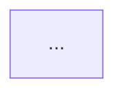

# <Title>

## 1. Summary

<Three to six sentences: the problem, the chosen shape in one clause, and the principal
trade-off accepted. A reader who reads only this should be able to name one thing the
design gives up.>

## 2. Context and scope

<Objective background. What exists today, what forces are acting, what is changing.
Provenance-marked: [verified: <source>] / [reported: <who>] / [assumed] / [unknown].
No solutions, no goals.>

## 3. Goals and non-goals

### Goals

- **G-1** <outcome, not a feature>
- **G-2**

### Non-goals

- **NG-1** <something that could reasonably have been a goal> — *not now because <reason>;
  revisit if <trigger>.*

## 4. Constraints and assumptions

### Constraints

| ID | Constraint | Source |
|---|---|---|
| C-1 | | |

### Assumptions

| ID | Assumption | Confidence | If false | How to verify |
|---|---|---|---|---|
| A-1 | | | | |

## 5. Quality attribute scenarios

| ID | Source | Stimulus | Environment | Response | Measure |
|---|---|---|---|---|---|
| QA-1 | | | | | |

## 6. Solution strategy

<The central organizing idea in one or two sentences. The two to four principles that
eliminated most of the solution space, and what each eliminated. The degree-of-constraint
mode: greenfield or boxed-in. Then an explicit mapping from each G-n to the strategic
move that serves it.>

## 7. Architecture views

### 7.1 System context

<Prose: the one claim this view makes.>

*Figure 1 — <the claim>.*

<Prose: what is notable or contested here.>

### 7.2 Building blocks

### 7.3 Runtime scenarios

<At least one showing a failure path.>

### 7.4 State model

### 7.5 Data model

### 7.6 Deployment

<Only if topology is a decision.>

## 8. Key design decisions

### D-1 — <title>

> In the context of <use case>, facing <concern>, we chose <option> over <rejected
> options>, to achieve <quality>, accepting <downside>, because <rationale>.

<Two to five sentences of elaboration, including the negative consequences.>

## 9. Alternatives considered

### ALT-1 — <name>

**What it is.** <Two or three sentences.>

**What it does better.** <Mandatory. Every real alternative wins on something.>

**What it costs.**

**Why rejected.** <Reference the specific G-n, C-n, or QA-n that ruled it out.>

### ALT-2 — <name>

<Two alternatives is the floor. Include "do nothing" or "extend the existing system"
whenever a system already exists — it is usually the strongest one.>

**What it is.**

**What it does better.**

**What it costs.**

**Why rejected.**

| Option | G-1 | G-2 | QA-1 | Cost | Reversibility |
|---|---|---|---|---|---|

## 10. Data lifecycle and ownership

<Source of truth per entity, who may write it, creation and destruction, retention and
deletion, consistency model and tolerable staleness, sensitive-field classification,
in-flight data during failure. No DDL.>

## 11. Failure modes and degradation

| ID | Failure | Trigger | Blast radius | Detection | Designed response | Residual risk |
|---|---|---|---|---|---|---|
| F-1 | | | | | | |

<Prose: what the system does when it cannot do its job — fail closed, fail open, degrade,
or queue — and why that is right for this domain.>

## 12. Cross-cutting concerns

### Security

### Privacy

### Observability

<The questions an on-call engineer needs answered at 3am, and the signal that answers each.>

### Operability

### Cost

### Compatibility

## 13. Rollout, migration, and backout

<The sequence of states production passes through, the compatibility guarantee at each,
the backout condition, and whether backout remains possible after each step.>

## 14. Risks and technical debt

| ID | Item | Type | Impact | Likelihood | Mitigation or repayment trigger |
|---|---|---|---|---|---|
| R-1 | | risk | | | |
| TD-1 | | debt | | | |

## 15. Validation

| ID | Claim | Evidence of success | Evidence of failure | Traces to |
|---|---|---|---|---|
| V-1 | | | | G-1 |

## 16. Open questions

| ID | Question | Blocking? | Resolved by |
|---|---|---|---|
| OQ-1 | | | |

## 17. Glossary

| Term | Definition |
|---|---|

## 18. References
