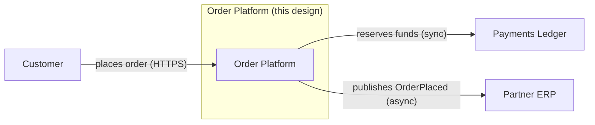
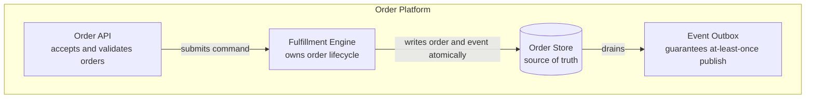
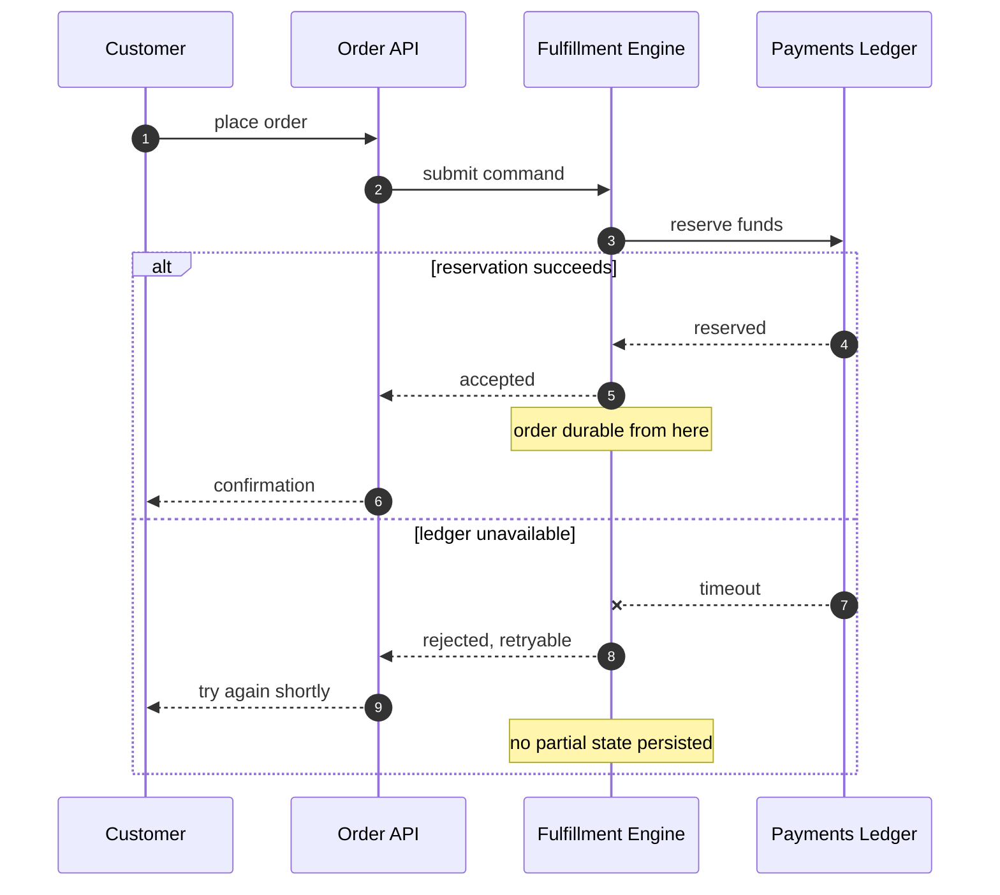
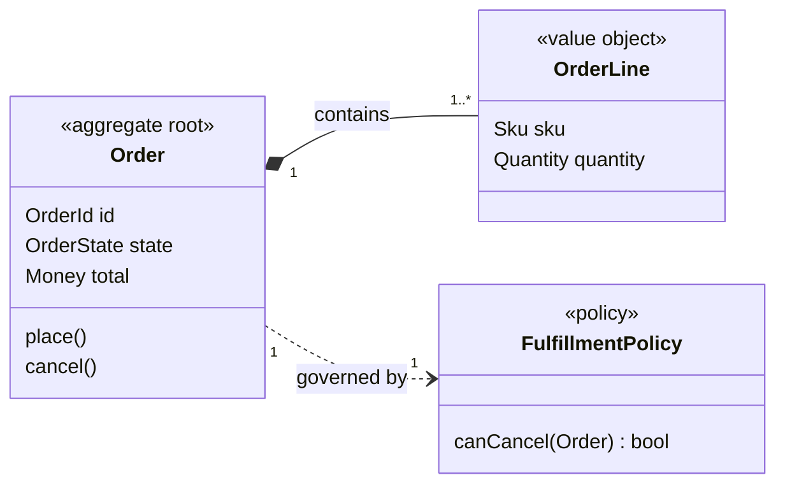
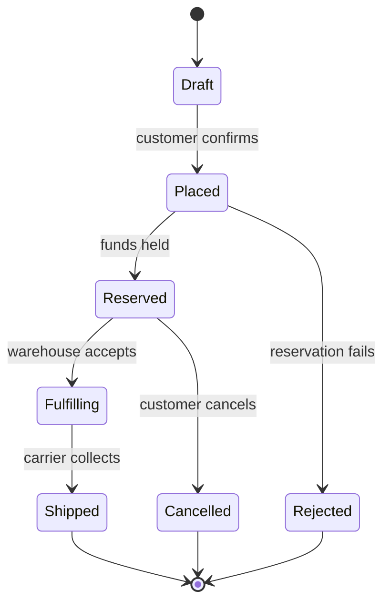
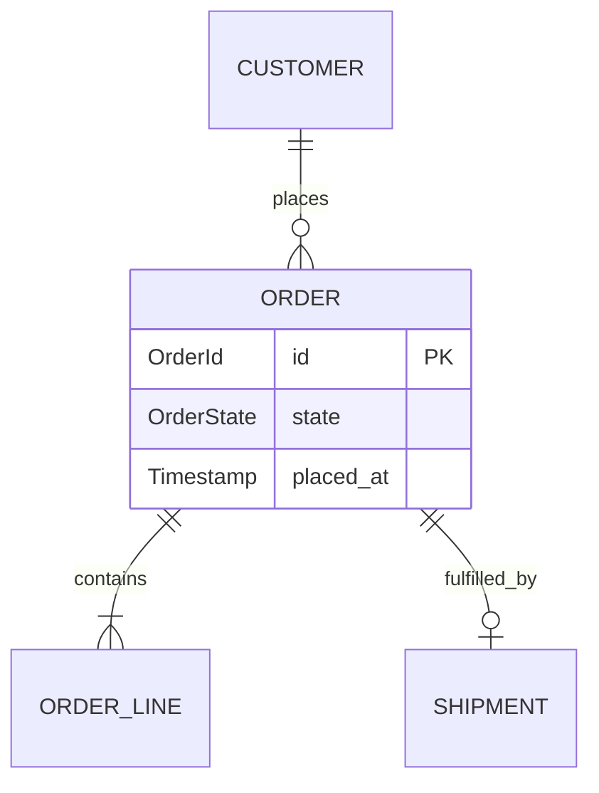

# Architectural Views

**Contents:** [View selection](#view-selection) · [Universal rules](#universal-rules) · [Size limits](#size-limits) · [Per-view guidance](#per-view-guidance) · [Mermaid hygiene](#mermaid-hygiene) · [Consistency invariants](#cross-artifact-consistency-invariants) · [Snippets](#reference-snippets)

## View selection

Choose by the *question* the reader has, not by variety. A doc containing one of each diagram type has usually been assembled rather than reasoned.

| Reader's question | View | Mermaid type |
|---|---|---|
| What is inside our boundary, who is outside, what crosses it? | System context | `flowchart` with a boundary subgraph, or `C4Context` |
| What are the separately deployable units and how do they talk? | Container / building block | `flowchart` with subgraphs, `block-beta`, `C4Container` |
| What are the responsibilities inside one unit? | Component | `flowchart`, `classDiagram` |
| Who talks to whom, in what order, and what happens when it fails? | Runtime scenario | `sequenceDiagram` |
| What are the domain concepts, their relationships and multiplicities? | Domain model | `classDiagram` |
| What can an entity be, and which transitions are legal? | State model | `stateDiagram-v2` |
| What is persisted, and how do records relate? | Data model | `erDiagram` |
| How does a request branch, and where does it exit? | Process flow | `flowchart` |
| Where does this run, across what boundaries? | Deployment | `flowchart` with subgraphs per zone |
| What order do capabilities land in? | Roadmap — use sparingly | `timeline` |
| How do the options compare? | **Not a diagram.** Use a table | — |

Prefer `flowchart` with subgraphs over `C4Context` / `C4Container` when renderer support is uncertain; the C4 types are less universally supported and a diagram that fails to render is worse than a plainer one that does.

## Universal rules

**Prose sandwiches every diagram.** Prose before stating the single claim it makes; prose after saying what is notable, surprising, or contested. A diagram should never be the sole carrier of a normative claim — a reader who cannot see it still needs the design, and a reviewer needs something to argue with in words.

**Caption every figure** as `Figure N — <the claim>`. Not "Figure 3 — Order states" but "Figure 3 — Order state transitions; cancellation is legal only before fulfillment starts." The caption states what the picture asserts.

**One diagram, one question.** If it answers two, split it.

**Name nodes by responsibility, not artifact.** `Order Ledger`, not `OrderServiceImpl` or `order_service.py`. Artifact names bind the design to a codebase that does not exist yet and go stale on the first rename.

**Label every edge** with what flows across it, and note synchronicity or protocol where it matters: `publishes OrderPlaced (async)`.

**Show at least one unhappy path** across the runtime views — timeout, rejection, partial failure, compensation. A design doc whose diagrams only show success has not been thought through.

**Never include** file paths, eventual class names, function names, or SQL. A node whose content is only a technology name is not a node: `Redis` alone says nothing; `Session Cache (Redis)` says something.

**Delete decorative diagrams.** If removing it loses no information, it was decoration.

## Size limits

Exceeding these means the view should be split, not shrunk.

| View | Limit |
|---|---|
| Context | 9 external actors and systems |
| Container / building block | 12 nodes |
| Sequence | 8 participants, 25 messages |
| State | 10 states |
| Class (domain) | 12 classes |
| ER | 12 entities |
| Flowchart | 20 nodes |

Also: 3–7 diagrams for a standard doc, and no more than roughly one per 500 words. Beyond that is diagram sprawl, where several views restate each other and the reader stops looking at any of them.

## Per-view guidance

### Context

Draw the boundary explicitly as a subgraph. Everything outside is a system or an actor, never an internal detail. The purpose is to let a reader who knows the landscape locate the new thing within it.

### Container / building block

Units that can be deployed, scaled, or fail independently. Annotate each with its responsibility in six words or fewer. Include technology only when the technology is a decision: `Event Log (Kafka)` earns its parenthetical because the choice matters; `Service (TypeScript)` is usually noise.

Show the direction of dependency — that arrow direction is frequently the real architectural claim, and reversing it would be a different design.

### Runtime scenario

Use for the two to four scenarios carrying the most design risk, not for every use case. Use `alt` / `opt` / `loop` fragments where branching is part of the design. Use `Note over` to mark invariants and commit points ("after this point the order is durable") — those notes are often the most valuable content in the whole diagram.

Participants must be a subset of the container view's nodes plus external actors from the context view.

### Class / domain model

**This models the domain, not the eventual code.** The most common corruption is a class diagram that is really a preview of the source tree.

Show: concept names, the two to five attributes carrying domain meaning, relationships with multiplicity and direction, and stereotypes for role — `<<aggregate root>>`, `<<value object>>`, `<<policy>>`, `<<port>>`.

Attribute types are domain types: `Money`, `EmailAddress`, `OrderId` — not `BigDecimal`, `string`, `uuid.UUID`.

Methods, if present, are three or fewer per class and named as domain responsibilities: `cancel()`, `settle()`. Never accessors, constructors, or framework hooks.

Leave out private fields, getters and setters, dependency injection wiring, annotations, framework base classes, and `Repository` / `Controller` / `DTO` suffixes.

Every inheritance arrow is a design claim. Justify it in prose or replace it with composition.

### State model

Use whenever an entity has a lifecycle with rules. One entity per diagram. Mark the initial state (`[*] -->`) and every terminal state.

**State in prose which transitions are deliberately absent, and why.** The forbidden transitions are usually the real content — that is where the domain rules live. A state diagram that shows only what is possible has documented half the design.

Guards belong on transitions as conditions in domain language, not as boolean expressions lifted from code.

### ER model

Entities, relationships, cardinality, and only the attributes carrying design meaning — keys, discriminators, temporal fields. No column types, indexes, or constraints. Pair it with prose on source of truth and consistency, which is where the actual decisions are.

### Deployment

Include only when topology is a decision: trust zones, regions, tenancy, network boundaries. Draw boundaries as subgraphs and label what crosses them.

## Mermaid hygiene

A diagram with a syntax error renders as nothing, which makes the surrounding argument incoherent. These are the recurring hazards:

- Fence with ` ```mermaid `.
- Quote any label containing punctuation, parentheses, colons, slashes, or commas: `A["Order API (v2)"]`.
- Node IDs are alphanumeric plus underscore. Avoid reserved words as IDs — `end`, `graph`, `class`, `state`, `subgraph`, `o`, `x`. Lowercase `end` is the classic silent breaker.
- One direction declaration per diagram, on the first line: `flowchart LR`.
- One diagram type per fence. No HTML in labels beyond `<br/>`.
- In `sequenceDiagram`, declare every `participant` explicitly at the top, in the order you want them drawn.
- In `classDiagram`, the relationship arrows carry meaning and get checked in review: `<|--` inheritance, `*--` composition, `o--` aggregation, `-->` association, `..>` dependency.
- Prefer the widely-supported core: `flowchart` (not legacy `graph`), `stateDiagram-v2` (not `stateDiagram`), `sequenceDiagram`, `classDiagram`, `erDiagram`. Treat `-beta` types (`architecture-beta`, `block-beta`, `packet-beta`) and `C4*` as optional enhancements — never make a required claim depend on one of them rendering.
- Keep each diagram under about 40 source lines. Longer usually means it should be split.

## Cross-artifact consistency invariants

Mechanically checkable. Verify before emitting; check all of them when reviewing. Most are caught by `scripts/lint_design_doc.py`, but confirm the semantic ones by reading.

1. Every sequence-diagram participant appears as a node in the container or component view, or as an external actor in the context view.
2. Every container-view node is exercised by some runtime view, or is explicitly noted as outside the doc's runtime scope.
3. Every state in a state diagram is reachable from the initial state, and every non-terminal state has at least one outgoing transition.
4. Every ER entity has an owner named in the data lifecycle section.
5. Every class relationship has a stated multiplicity, or an explicit note that it is 1:1.
6. Every external system in the context view appears in either a runtime view or the failure-mode table — external dependencies are failure sources.
7. Every term in a diagram label is self-evident or in the glossary, and is spelled identically everywhere.
8. Every `G-n` is served by at least one design decision; every `QA-n` is addressed by at least one decision or view.
9. Every quality word in the prose maps to a `QA-n`.
10. Every number has a unit and a provenance (measured, estimated, required, or TBD).

## Reference snippets

Minimal correct starting points. Adapt them; pasting verbatim produces generic diagrams that fail the disagreement test.

**System context**



**Building blocks**



**Runtime scenario with a failure path**



**Domain model**



**State model**



Accompanying prose would note the absent transitions: nothing returns to `Draft`, and `Fulfilling` has no cancellation edge — with a pointer to the decision that established it.

**Data model**


