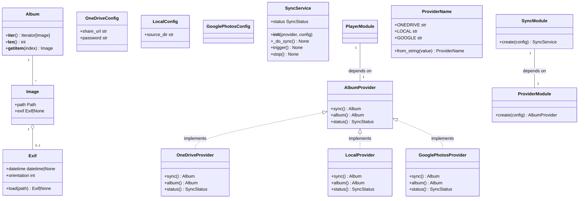

# Design: Album Provider Abstraction

## 1. Overview

Replace the hardcoded OneDrive sync in `SyncService` with a pluggable `AlbumProvider`
protocol so that multiple photo sources (OneDrive, local directory, Google Photos) can
be selected at configuration time and swapped without code changes.

Each provider manages its own file lifecycle and returns an `Album` — an iterable,
indexable collection of `Image` objects with lazy-loaded EXIF metadata. Consumers
(`SyncService`, `SlideshowPlayer`) iterate the collection instead of scanning directories.

---

## 2. High-Level Design

### 2.1 Package Layout

```
src/piframe/
├── images/                       # NEW package — domain types
│   ├── __init__.py               # re-exports Image, Exif, Album
│   ├── image.py                  # Image dataclass with lazy exif property
│   ├── exif.py                   # Exif dataclass with lazy loading
│   └── album.py                  # Album collection (iterable + indexable)
├── providers/                    # NEW package
│   ├── __init__.py               # re-exports AlbumProvider, ProviderName
│   ├── album_provider.py         # AlbumProvider Protocol
│   ├── onedrive.py               # OneDriveConfig + OneDriveProvider
│   ├── local.py                  # LocalConfig + LocalProvider
│   └── google.py                 # GooglePhotosConfig + GooglePhotosProvider (stub)
├── album_provider.py             # EXISTING — fixed import, renamed to DirectoryReader
├── sync_service.py               # MODIFIED — accepts AlbumProvider in constructor
├── config_store.py               # MODIFIED — _SyncCfg gains provider + _apply_env_overrides
├── slideshow_player.py           # MODIFIED — rescan() consumes provider album
├── modules/
│   ├── sync.py                   # MODIFIED — returns (SyncService, AlbumProvider)
│   └── player.py                 # MODIFIED — accepts AlbumProvider from sync module
├── types.py                      # UNCHANGED — SyncStatus stays here
└── app.py                        # MODIFIED — wires provider from SyncModule into PlayerModule
```

### 2.2 Data Flow

```
config.toml [sync]
  ├── provider = "onedrive" | "local" | "google"
  ├── interval_minutes = 60
  ├── [sync.onedrive] share_url, password
  ├── [sync.local]    source_dir
  └── [sync.google]   (future)

ConfigStore._SyncCfg
  ├── .provider           → ProviderName (new, default LOCAL)
  └── .interval_minutes   → int   (existing)

# Provider-specific config lives in sub-sections, read by provider config classes.

SyncModule.create(config)
  → reads config.sync.provider
  → constructs the correct provider with its config
  → wraps in SyncService(provider, config)

SyncService._do_sync()
  → self._provider.sync() → Album
  → len(album) → photo_count
  → self._provider.status() → SyncStatus

SlideshowPlayer.rescan()
  → self._provider.album() → Album
  → iterate album, extract image.path, apply shuffle/filter
```

### 2.3 Class Diagram



---

## 3. Low-Level Design

### 3.1 `src/piframe/images/image.py`

**Image — dataclass**

```python
from __future__ import annotations

from dataclasses import dataclass
from functools import cached_property
from pathlib import Path

from piframe.images.exif import Exif


@dataclass(frozen=True)
class Image:
    """A photo managed by an AlbumProvider.

    The *exif* property is lazy-loaded on first access and cached
    for the lifetime of the instance.
    """

    path: Path

    @cached_property
    def exif(self) -> Exif | None:
        return Exif.load(self.path)
```

Notes:
- `frozen=True` makes the instance immutable.
- `@cached_property` (stdlib, Python 3.8+) caches the result in the instance's
  `__dict__` on first access. When the `Image` instance is garbage-collected,
  the cached value is released with it. No unbounded memory retention.
- `@cached_property` works correctly with `frozen=True` on Python 3.13.

---

### 3.2 `src/piframe/images/exif.py`

**Exif — dataclass with lazy loading**

```python
from __future__ import annotations

import logging
from dataclasses import dataclass
from datetime import datetime
from pathlib import Path

from PIL import Image as PILImage
from PIL.ExifTags import Base, IFD


@dataclass
class Exif:
    """EXIF metadata reader. Reads the file on construction."""

    datetime: datetime | None = None
    orientation: int = 1

    @classmethod
    def load(cls, path: Path) -> "Exif | None":
        """Read EXIF from *path*, returning None on any error."""
        try:
            with PILImage.open(path) as img:
                exif = img.getexif()
                if exif is None:
                    return None
                instance = cls()
                instance._populate(exif)
                return instance
        except Exception as exc:
            # Log but don't crash — EXIF is optional metadata.
            # MemoryError is a subclass of Exception (and therefore of
            # BaseException), so it is caught here. On the Pi (512 MB), OOM
            # during PIL image open is rare but possible. We treat OOM as
            # "EXIF unavailable" because EXIF is optional metadata and a
            # partial read is not meaningfully better than no read. A genuine
            # OOM will typically kill the process anyway before reaching this
            # point. We log at warning to surface EXIF failures.
            logging.warning("Exif.load failed for %s: %s", path, exc)
            return None

    def _populate(self, exif: PILImage.Exif) -> None:
        # Orientation from base IFD
        self.orientation = exif.get(Base.Orientation, 1)

        # DateTime from ExifIFD.DateTimeOriginal or base IFD.DateTime
        # Note: get_ifd() behavior varies across Pillow versions: some raise
        # KeyError on missing IFD, others return None. The outer try/except in
        # load() catches any exception and returns None, so the overall behavior
        # is all-or-nothing (any failure discards all EXIF data). This is
        # acceptable: EXIF is optional metadata and a partial read is not
        # meaningfully better than no read.
        exif_ifd = exif.get_ifd(IFD.Exif)
        raw = exif_ifd.get(Base.DateTimeOriginal) if exif_ifd else None
        if not raw:
            raw = exif.get(Base.DateTime)
        if raw:
            self.datetime = datetime.strptime(raw, "%Y:%m:%d %H:%M:%S")
```

Notes:
- `load()` is a class method that returns `Exif | None` — never raises.
- `_populate()` reads only `datetime` and `orientation`. Additional tags
  are deferred to a follow-up issue.
- `PIL.Image.getexif()` is the modern public API (replaces deprecated `_getexif()`).

---

### 3.3 `src/piframe/images/album.py`

**Album — iterable, indexable collection**

```python
from __future__ import annotations

from collections.abc import Iterator
from typing import TYPE_CHECKING

if TYPE_CHECKING:
    from piframe.images.image import Image


class Album:
    """Collection of images from an album provider.

    Supports iteration (for sequential access) and indexed access
    (for shuffle and filtering).
    """

    def __init__(self, images: list["Image"]) -> None:
        self._images = list(images)  # defensive copy to isolate from caller mutation

    def __iter__(self) -> Iterator["Image"]:
        return iter(self._images)

    def __len__(self) -> int:
        return len(self._images)

    def __getitem__(self, index: int | slice) -> "Image | list[Image]":
        # Note: type: ignore used here because basedpyright cannot narrow the
        # return type based on whether index is int vs slice. Using @overload
        # would be more precise but adds boilerplate for a simple pass-through.
        return self._images[index]  # type: ignore[return-value]
```

Notes:
- Backing store is a `list[Image]` — supports random access for shuffle.
- No mutation after construction — consumers iterate freely.

---

### 3.4 `src/piframe/images/__init__.py`

```python
from piframe.images.album import Album
from piframe.images.exif import Exif
from piframe.images.image import Image

__all__ = ["Album", "Exif", "Image"]
```

---

### 3.5 `src/piframe/providers/album_provider.py` (Rewritten)

The existing `AlbumProvider` Protocol is **replaced** (not modified). The old
signature `sync(output_dir: Path) -> list[Path]` is replaced by `sync() -> Album`.
The `stop()` method is removed (providers don't need cleanup). A new `album()`
method is added to return the current album without re-syncing.

```python
from __future__ import annotations

from typing import Protocol

from piframe.images.album import Album
from piframe.types import SyncStatus


class AlbumProvider(Protocol):
    """Structural type for photo album providers."""

    def sync(self) -> Album:
        """Synchronize local cache with remote/source.

        Returns the full Album of available images.
        The provider is responsible for all file management
        (downloading, caching, cleanup).
        """
        ...

    def album(self) -> Album:
        """Return the current Album without triggering a sync.

        Used by SlideshowPlayer.rescan() to rebuild the playlist.
        """
        ...

    def status(self) -> SyncStatus:
        """Return the current sync status."""
        ...
```

Notes:
- `sync()` replaces the old `sync(output_dir)` — storage is provider-internal.
- `album()` returns current collection without triggering sync.
- `stop()` removed from protocol (no in-flight background work to cancel;
  sync is synchronous).
- `SyncStatus` imported from `piframe.types` (unchanged location).

---

### 3.6 `src/piframe/providers/onedrive.py`

**OneDriveConfig — ConfigStore wrapper**

```python
from __future__ import annotations

import copy
from datetime import datetime
from pathlib import Path
from typing import TYPE_CHECKING

from piframe.config_store import ConfigStore
from piframe.images import Album, Image
from piframe.types import SyncStatus

if TYPE_CHECKING:
    from piframe.providers.album_provider import AlbumProvider


class OneDriveConfig:
    """Typed view over ConfigStore for OneDrive-specific keys."""

    def __init__(self, config: ConfigStore) -> None:
        self._config = config

    @property
    def share_url(self) -> str:
        val = self._config._read_nested("sync", "onedrive", "share_url")
        return str(val) if val else ""

    @property
    def password(self) -> str:
        val = self._config._read_nested("sync", "onedrive", "password")
        return str(val) if val else ""

    @property
    def cache_dir(self) -> Path:
        raw = self._config._read_nested("sync", "onedrive", "cache_dir")
        if raw and str(raw).strip():
            return Path(raw).expanduser().resolve()
        return Path.home() / ".cache" / "piframe" / "onedrive"
```

**OneDriveProvider — class**

```python
from __future__ import annotations

import copy
from datetime import datetime
from pathlib import Path
from typing import TYPE_CHECKING

from piframe.config_store import ConfigStore
from piframe.images import Album, Image
from piframe.types import SyncStatus

if TYPE_CHECKING:
    from piframe.providers.album_provider import AlbumProvider


class OneDriveProvider:
    """OneDrive album provider using the Badger token API."""

    _EXTENSIONS: frozenset[str] = frozenset({".jpg", ".jpeg", ".png", ".gif"})

    def __init__(self, config: OneDriveConfig) -> None:
        self._config = config
        self._status = SyncStatus()
        self._album: Album = Album([])

    def sync(self) -> Album:
        self._album = self._do_sync()
        self._status.photo_count = len(self._album)
        self._status.last_sync_time = datetime.now()
        self._status.last_error = None
        return self._album

    def album(self) -> Album:
        return self._album

    def status(self) -> SyncStatus:
        return copy.copy(self._status)

    def _do_sync(self) -> Album:
        cache = self._config.cache_dir
        cache.mkdir(parents=True, exist_ok=True)
        if not cache.is_dir():
            raise RuntimeError(f"Cache path is not a directory: {cache}")
        token = self._get_badger_token()
        encoded = self._encode_url(self._config.share_url)
        self._validate_password(encoded, token)
        root = self._redeem_share(encoded, token)
        remote_files = self._list_folder(root, token)
        # Download new files
        for item in remote_files:
            dest = cache / item["name"]
            if not dest.exists() or dest.stat().st_mtime < item["modified"]:
                self._download(item, dest, token)
        # Destructive cleanup
        for local in cache.iterdir():
            if local.is_file() and not any(i["name"] == local.name for i in remote_files):
                local.unlink()
        # Build album from cache
        images = [Image(path=p) for p in sorted(cache.iterdir())
                   if p.is_file() and p.suffix.lower() in self._EXTENSIONS]]
        return Album(images)
```

Implementation details:
- Cache directory is `~/.cache/piframe/onedrive/` — provider-internal.
- `sync()` downloads new files, deletes stale files, returns `Album`, and
  updates `self._status` with `photo_count`, `last_sync_time`, and clears
  `last_error`. On HTTP errors inside `_do_sync()`, exceptions propagate to
  `SyncService._do_sync()` which catches them and sets `last_error`.
- `album()` returns the last sync result without re-syncing.
- `status()` returns `copy.copy(self._status)` to prevent external mutation.
- Private helpers (`_get_badger_token`, `_encode_url`, etc.) extracted from
  `framesync/framesync.py`.
- The `framesync/` directory is **removed** after extraction.
- Each provider module needs `import copy` for `copy.copy()` in `status()`.

---

### 3.7 `src/piframe/providers/local.py`

**LocalConfig — ConfigStore wrapper**

```python
from __future__ import annotations

import copy
from datetime import datetime
from pathlib import Path

from piframe.config_store import ConfigStore
from piframe.images import Album, Image
from piframe.types import SyncStatus


class LocalConfig:
    """Typed view over ConfigStore for local-provider-specific keys."""

    def __init__(self, config: ConfigStore) -> None:
        self._config = config

    @property
    def source_dir(self) -> Path:
        raw = self._config._read_nested("sync", "local", "source_dir")
        if raw and str(raw).strip():
            return Path(raw).expanduser().resolve()
        return Path.home() / "Pictures" / "slideshow"
```

**LocalProvider — class**

```python
from __future__ import annotations

import copy
from datetime import datetime
from pathlib import Path

from piframe.config_store import ConfigStore
from piframe.images import Album, Image
from piframe.types import SyncStatus


class LocalProvider:
    """Local directory album provider.

    Returns direct references to source files — no copying, no caching, no cleanup.
    """

    _EXTENSIONS: frozenset[str] = frozenset({".jpg", ".jpeg", ".png", ".gif"})

    def __init__(self, config: LocalConfig) -> None:
        self._config = config
        self._status = SyncStatus()
        self._album: Album = Album([])

    def sync(self) -> Album:
        self._album = self._scan()
        self._status.photo_count = len(self._album)
        self._status.last_sync_time = datetime.now()
        self._status.last_error = None
        return self._album

    def album(self) -> Album:
        return self._album

    def status(self) -> SyncStatus:
        return copy.copy(self._status)

    def _scan(self) -> Album:
        source = self._config.source_dir
        if not source.exists() or not source.is_dir():
            return Album([])
        images = [
            Image(path=p)
            for p in sorted(source.iterdir())
            if p.is_file() and p.suffix.lower() in self._EXTENSIONS
        ]
        return Album(images)
```

Implementation details:
- No file copying, no caching, no cleanup.
- `sync()` scans the directory via `_scan()`, stores result in `self._album`,
  and updates `self._status`. `album()` returns `self._album` (cached from last
  `sync()`) for consistency with the AlbumProvider contract.
- `status()` returns `copy.copy(self._status)` to prevent external mutation.
- `source_dir` defaults to `~/Pictures/slideshow` if not set in config.

---

### 3.8 `src/piframe/providers/google.py`

**GooglePhotosConfig — ConfigStore wrapper**

```python
from __future__ import annotations

import copy

from piframe.config_store import ConfigStore
from piframe.images import Album
from piframe.types import SyncStatus


class GooglePhotosConfig:
    """Typed view over ConfigStore for Google Photos keys (stub)."""

    def __init__(self, config: ConfigStore) -> None:
        self._config = config
```

**GooglePhotosProvider — class**

```python
from __future__ import annotations

import copy

from piframe.config_store import ConfigStore
from piframe.images import Album
from piframe.types import SyncStatus


class GooglePhotosProvider:
    """Google Photos album provider (stub)."""

    _NOT_IMPLEMENTED = "GooglePhotosProvider is not yet implemented"

    def __init__(self, config: GooglePhotosConfig) -> None:
        self._config = config
        self._status = SyncStatus()
        self._album: Album = Album([])

    def sync(self) -> Album:
        self._album = Album([])
        self._status.photo_count = 0
        self._status.last_sync_time = datetime.now()
        self._status.last_error = self._NOT_IMPLEMENTED
        return self._album

    def album(self) -> Album:
        # Stub: returns cached album (initialized in __init__).
        # When implemented, sync() populates self._album and album() returns it.
        return self._album

    def status(self) -> SyncStatus:
        return copy.copy(self._status)
```

---

### 3.9 `src/piframe/providers/__init__.py` (Modified)

The existing `ProviderName.from_string()` is changed from case-sensitive to
case-insensitive by adding `.lower()` to the input. This ensures config values
like `"Onedrive"` or `"LOCAL"` are accepted.

```python
from __future__ import annotations

from enum import StrEnum


class ProviderName(StrEnum):
    """Supported album provider names."""

    ONEDRIVE = "onedrive"
    LOCAL = "local"
    GOOGLE = "google"

    @classmethod
    def from_string(cls, value: str) -> "ProviderName":
        """Parse a provider name string, raising on unknown values.

        Input is lowercased for case-insensitive matching.
        """
        try:
            return cls(value.lower())
        except ValueError:
            valid = ", ".join(repr(m.value) for m in cls)
            raise ValueError(f"Unknown sync provider '{value}'. Valid: {valid}") from None


from piframe.providers.album_provider import AlbumProvider
from piframe.providers.google import GooglePhotosConfig, GooglePhotosProvider
from piframe.providers.local import LocalConfig, LocalProvider
from piframe.providers.onedrive import OneDriveConfig, OneDriveProvider

__all__ = [
    "AlbumProvider",
    "GooglePhotosConfig",
    "GooglePhotosProvider",
    "LocalConfig",
    "LocalProvider",
    "OneDriveConfig",
    "OneDriveProvider",
    "ProviderName",
]
```

---

### 3.10 `src/piframe/sync_service.py` (Modified)

**Constructor change:**

```python
class SyncService:
    def __init__(self, provider: AlbumProvider, config: ConfigStore) -> None:
        self._provider = provider
        self._config = config
        self._stop_event = threading.Event()
        self._trigger_event = threading.Event()
        self._status = SyncStatus()
        self._status_lock = threading.Lock()
        self._interval_s = config.sync.interval_minutes * 60
        self._thread = threading.Thread(target=self._run, daemon=True)
        self._thread.start()
```

**`_do_sync()` change:**

```python
def _do_sync(self) -> None:
    with self._status_lock:
        self._status.in_progress = True
        self._status.last_error = None
    try:
        album = self._provider.sync()
        provider_status = self._provider.status()
        with self._status_lock:
            self._status.last_sync_time = provider_status.last_sync_time
            self._status.photo_count = len(album)
            self._status.in_progress = False
            self._status.last_error = provider_status.last_error
        # ... post EVT_SYNC_COMPLETE (unchanged)
    except Exception as exc:
        with self._status_lock:
            self._status.in_progress = False
            self._status.last_error = str(exc)
            self._status.last_sync_time = datetime.now()
        logging.error("SyncService error: %s", exc)
        # ... post EVT_SYNC_COMPLETE (unchanged)
```

Notes:
- `output_dir` removed — provider manages its own storage.
- Photo count derived from `len(album)`.
- **Runtime sync failure retention:** On exception, the provider's cached album
  is untouched. The provider's `album()` continues returning the last-known-good
  collection. `SyncService` posts `EVT_SYNC_COMPLETE` regardless, so
  `SlideshowPlayer.rescan()` re-reads `provider.album()` and retains its existing
  playlist. The slideshow never blanks on a transient sync failure.
- The `framesync` import is removed entirely.

---

### 3.11 `src/piframe/modules/provider.py` (New)

```python
from __future__ import annotations

from piframe.config_store import ConfigStore
from piframe.di import DimModule
from piframe.providers import AlbumProvider, ProviderName
from piframe.providers.google import GooglePhotosConfig, GooglePhotosProvider
from piframe.providers.local import LocalConfig, LocalProvider
from piframe.providers.onedrive import OneDriveConfig, OneDriveProvider


class ProviderModule(DimModule[AlbumProvider]):
    def create(self, config: ConfigStore, **deps: object) -> AlbumProvider:
        provider_name = config.sync.provider  # ProviderName enum, validated
        return _resolve_provider(provider_name, config)


def _resolve_provider(name: ProviderName, config: ConfigStore) -> AlbumProvider:
    """Instantiate the correct provider from config."""
    match name:
        case ProviderName.ONEDRIVE:
            return OneDriveProvider(OneDriveConfig(config))
        case ProviderName.LOCAL:
            return LocalProvider(LocalConfig(config))
        case ProviderName.GOOGLE:
            return GooglePhotosProvider(GooglePhotosConfig(config))
```

Notes:
**`modules/__init__.py` change:**

Add `ProviderModule` to the exports:

```python
from piframe.modules.cache import CacheModule
from piframe.modules.player import PlayerModule
from piframe.modules.provider import ProviderModule
from piframe.modules.settings import SettingsModule
from piframe.modules.sync import SyncModule
from piframe.modules.wifi import WifiModule

__all__ = [
    "CacheModule",
    "PlayerModule",
    "ProviderModule",
    "SettingsModule",
    "SyncModule",
    "WifiModule",
]
```
- `ProviderModule` owns the provider instantiation logic. Both `SyncModule`
  and `PlayerModule` receive the `AlbumProvider` as a dependency via `deps["provider"]`.
- `_resolve_provider()` is the single point for provider construction.
- `DimModule[AlbumProvider]` works correctly: `DimModule` is a Protocol whose
  generic `T` is a type hint, not a runtime type check. The DI container passes
  dependencies via `**deps` dict, so structural typing of `AlbumProvider` is
  sufficient — no inheritance needed.
- **Error handling:** If provider construction fails (missing config, invalid
  URL, etc.), the exception propagates through `ProviderModule.create()` and
  the app aborts startup with a clear error. Provider-specific config validation
  is deferred to issue #51 (startup validation).

---

### 3.12 `src/piframe/modules/sync.py` (Modified)

```python
class SyncModule(DimModule[SyncService]):
    def create(self, config: ConfigStore, **deps: object) -> SyncService:
        provider = deps["provider"]  # AlbumProvider from ProviderModule
        return SyncService(provider, config)
```

Notes:
- `SyncModule` no longer constructs the provider. It receives it as a
  dependency from `ProviderModule`.
- `App.__init__` registers `ProviderModule` before `SyncModule`.

---

### 3.13 `src/piframe/modules/player.py` (Modified)

```python
from __future__ import annotations

from piframe.assets import Assets
from piframe.config_store import ConfigStore
from piframe.di import DimModule
from piframe.photo_cache import PhotoCache
from piframe.providers import AlbumProvider
from piframe.slideshow_player import SlideshowPlayer
from piframe.types import SCREEN_H, SCREEN_W


class PlayerModule(DimModule[SlideshowPlayer]):
    def create(self, config: ConfigStore, **deps: object) -> SlideshowPlayer:
        provider = deps["provider"]  # AlbumProvider from ProviderModule
        cache = deps["cache"]  # PhotoCache from CacheModule
        assets = deps.get("assets")  # Assets | None
        return SlideshowPlayer(
            config=config,
            cache=cache,
            provider=provider,
            screen_size=(SCREEN_W, SCREEN_H),
            assets=assets,
        )
```

Notes:
- `PlayerModule.create()` receives the `AlbumProvider` as a dependency from
  `ProviderModule`. The DI container wires `ProviderModule` first and passes
  its output to all downstream modules that request it.
- `App.__init__` registers `ProviderModule` before both `SyncModule` and
  `PlayerModule`. Both modules receive the same provider instance via `deps["provider"]`.

---

### 3.14 `src/piframe/slideshow_player.py` (Modified)

**Constructor change:**

```python
class SlideshowPlayer:
    def __init__(
        self,
        config: ConfigStore,
        cache: PhotoCache,
        provider: AlbumProvider,
        screen_size: tuple[int, int],
        assets: Assets | None = None,
    ):
        # Existing attributes (unchanged):
        self._config = config
        self._cache = cache
        self._assets = assets
        self._w, self._h = screen_size
        self._playlist: list[Path] = []
        self._index = 0
        self._current_surf: Surface | None = None
        self._next_surf: Surface | None = None
        self._elapsed = 0.0
        self._trans_t = 0.0
        self._in_transition = False
        self._trans_start = 0.0
        self._direction = 1
        self._paused = False
        self._slide_rect = Rect(0, 0, self._w, self._h)
        # New attribute:
        self._provider = provider
        # Build initial playlist from provider:
        self.rescan()
```

**`rescan()` change:**

```python
def rescan(self) -> None:
    album = self._provider.album()
    exts = {".jpg", ".jpeg", ".png", ".gif"}
    files = [img.path for img in album if img.path.suffix.lower() in exts]
    # Convert to list for shuffle/indexing
    self._playlist = list(files)
    if self._config.slideshow.shuffle:
        self._playlist = self._fisher_yates(self._playlist)
    self._index = 0
    if self._playlist:
        self._current_surf = self._cache.get(
            self._playlist[0],
            self._config.slideshow.fit_mode,
            self._w,
            self._h,
        )
    else:
        self._current_surf = None
```

Notes:
- Accepts `AlbumProvider` as a dependency.
- Iterates `album` to extract `image.path`, applies extension filter.
- The extension filter is **defense-in-depth**: providers already filter by
  extension, but `rescan()` verifies independently. This masks provider bugs
  (e.g. returning non-image files) and keeps the slideshow resilient.
- No directory scanning.
- **Startup sequence:** `SlideshowPlayer.__init__()` calls `self.rescan()`
  immediately, which reads `provider.album()`. For `OneDriveProvider`, the
  initial album is empty until the first sync completes. `SyncService` posts
  `EVT_SYNC_COMPLETE` after each sync (including the first). `SlideshowPlayer`
  listens for `EVT_SYNC_COMPLETE` and calls `rescan()` to rebuild the playlist.
  The slideshow shows a blank/loading screen until the first sync populates
  the playlist — this is the expected behavior for a device that syncs on boot.

---

### 3.15 `src/piframe/config_store.py` (Modified)

The circular import (`config_store.py` → `providers/__init__.py` →
`providers/local.py` → `config_store.py`) is broken by a lazy import
of `ProviderName` inside the `_SyncCfg.provider` property body. The
import occurs at runtime (when the property is accessed), not at module
load time, so the cycle is never triggered during import.

**`_SyncCfg` changes:**

```python
class _SyncCfg:
    def __init__(self, data: dict):
        self._d = data

    @property
    def provider(self) -> ProviderName:
        # Lazy import to break circular dependency:
        # config_store -> providers/__init__ -> providers/local -> config_store
        from piframe.providers import ProviderName as PN

        raw = str(self._d.get("provider", "local"))
        return PN.from_string(raw)

    @property
    def interval_minutes(self) -> int:
        return int(self._d.get("interval_minutes", 60))

    @property
    def cache_dir(self) -> str:
        return self._d.get("cache_dir", "")
```

`cache_dir` is retained in `_SyncCfg` for `PhotoCache` (surface cache). It is
independent of any provider's raw file cache. `PhotoCache` uses this for its
disk-backed surface cache, while providers manage their own raw file storage
(e.g. `OneDriveConfig.cache_dir` for downloaded images).

`output_dir`, `share_url`, `password` removed from `_SyncCfg`. Provider-specific
config (URL, password, cache dir) moves to provider sub-sections.

**Downstream impact:** `CacheModule.create()` continues to read `config.sync.cache_dir`
for the surface cache (unchanged). `settings_panel.py` currently reads
`config.sync.output_dir` for disk-usage display; after removal, it must be
updated to query the active provider's storage directory instead. This is a
required change to `settings_panel.py`.

**`_DEFAULTS` changes:**

```python
"sync": {
    "provider": "local",
    "interval_minutes": 60,
    "onedrive": {
        "share_url": "",
        "password": "",
    },
    "local": {
        "source_dir": "",
    },
    "google": {
        "credentials_file": "",
    },
},
```

Placeholder keys ensure env var overrides work without requiring the user to
pre-populate the TOML file. `_set_nested()` only overrides existing keys;
with placeholders present, `PIFRAME_SYNC__ONEDRIVE__SHARE_URL` can override
the empty string.

**`_PROTECTED` changes:**

```python
_PROTECTED = {
    ("sync", "onedrive", "share_url"),
    ("sync", "onedrive", "password"),
}
```

`("sync", "provider")` is **not** protected — the provider selection is not
a secret and should be overridable via environment variables (e.g.
`PIFRAME_SYNC__PROVIDER=onedrive`). Only actual credentials are protected
so that `flush_now()` restores them from disk and doesn't persist env-var
overrides to the config file.

`output_dir` and `share_url`/`password` removed from flat keys. Nested provider
secrets protected via 3-tuple entries so `flush_now()` restores them from disk
before writing.

**`flush_now()` adaptation:** The existing `flush_now()` iterates `_PROTECTED`
to restore secrets before writing. It must handle variable-length tuples
(both 2-tuples like `("sync", "provider")` and 3-tuples like
`("sync", "onedrive", "share_url")`).

```python
def flush_now(self) -> None:
    """Restore protected keys from disk, then write config.

    Walks variable-length tuples in _PROTECTED, restoring secrets from the
    on-disk TOML before persisting the in-memory tree (which may have
    env-var overrides that should not be persisted).
    """
    try:
        with open(self._path, "rb") as f:
            disk = tomllib.load(f)
    except (FileNotFoundError, ValueError):
        disk = {}

    # Store protected entries as (entry_tuple, disk_value) to avoid
    # reusing the `path` variable from the read loop in the restore loop.
    protected: list[tuple[tuple[str, ...], object]] = []
    for entry in _PROTECTED:
        entry_path, key = entry[:-1], entry[-1]

        # Walk path through on-disk dict to get the secret value
        node: object = disk
        for segment in entry_path:
            if isinstance(node, dict):
                node = node.get(segment)
            else:
                node = None
            if node is None:
                break
        if not isinstance(node, dict):
            continue  # intermediate segment missing or not a dict
        disk_value = node.get(key)
        if disk_value is None:
            continue  # key not present on disk
        protected.append((entry, disk_value))

    # Restore each protected key into in-memory config
    for entry, disk_value in protected:
        entry_path, key = entry[:-1], entry[-1]
        # Walk path through in-memory dict, creating intermediates as needed
        mem_node: dict = self._data
        for segment in entry_path:
            if segment not in mem_node:
                mem_node[segment] = {}
            mem_node = mem_node[segment]
        mem_node[key] = disk_value

    # Write via canonical write path
    self._write_toml(self._data)

This ensures that provider credentials injected via environment variables are
never persisted to disk, while still being available in the running config.

**`_read_nested()` helper (added as a `ConfigStore` method):**

```python
def _read_nested(
    self, *keys: str, default: object = None
) -> object:
    """Read a nested value from the config data.

    Returns *default* when any key in the path is missing.
    When default is None (the default), a missing key and a key with value None
    both return None. This is acceptable because TOML has no null type, so None
    values in config data are extremely rare in practice.
    Callers are responsible for type coercion.
    """
    node: object = self._data
    for key in keys:
        if isinstance(node, dict) and key in node:
            node = node[key]
        else:
            return default
    return node
```

**`_apply_env_overrides()` method:**

```python
import os

_ENV_PREFIX = "PIFRAME_"

def _apply_env_overrides(self) -> None:
    """Overlay PIFRAME_* env vars onto the config data.

    Convention: strip prefix, split remainder on __, and lowercase all segments.
    Env var names are uppercase by convention (e.g. PIFRAME_SYNC__ONEDRIVE__SHARE_URL)
    but config keys are lowercase from TOML parsing. The `.lower()` ensures they match.
    All segments except the last form the section path; the last is the key.
    E.g. PIFRAME_SYNC__ONEDRIVE__SHARE_URL -> sync.onedrive.share_url.

    Only keys that already exist in merged config are overridden.
    Unknown env vars silently ignored.
    """
    for name, value in os.environ.items():
        if not name.startswith(_ENV_PREFIX):
            continue
        parts = name[len(_ENV_PREFIX):].lower().split("__")
        if len(parts) < 2:
            continue
        section_path, key = parts[:-1], parts[-1]
        self._set_nested(section_path, key, value)
```

**`_set_nested()` method (sibling of `_apply_env_overrides()`):**

```python
    def _set_nested(self, path: list[str], key: str, value: str) -> None:
        """Set a value at a nested path in the config data.

        Only sets the key if every segment in *path* already exists
        as a dict AND the final *key* already exists in the target dict.
        Missing segments or unknown keys are silently skipped.

        Performs type coercion: if the existing value is int/float/bool,
        the string from the environment is coerced to match. For booleans,
        any non-false/non-zero/non-empty string coerces to True (e.g. 'yes',
        'no', 'on', 'off' all become True). This is a known limitation;
        users should use 'true'/'false' or '1'/'0' for boolean config keys.
        Coercion failures are logged and the key is skipped (no crash).
        """
        node: object = self._data
        for segment in path:
            if isinstance(node, dict) and isinstance(node.get(segment), dict):
                node = node[segment]
            else:
                return  # path does not exist — skip
        if not isinstance(node, dict):
            return
        if key not in node:
            return  # key does not exist — skip (only override existing keys)
        # Type coercion: match the existing value's type.
        # For booleans, any non-false/non-zero/non-empty string coerces to True.
        # This means 'yes', 'no', 'on', 'off' all become True. This is a known
        # limitation of the env-var overlay; users should use 'true'/'false' or
        # '1'/'0' for boolean config keys.
        existing = node[key]
        try:
            if isinstance(existing, bool):
                node[key] = value.lower() not in ("false", "0", "")
            elif isinstance(existing, int):
                node[key] = int(value)
            elif isinstance(existing, float):
                node[key] = float(value)
            else:
                node[key] = value
        except (ValueError, AttributeError):
            logging.warning(
                "Config env override: cannot coerce '%s' to type %s, skipping",
                value, type(existing).__name__,
            )
```

**Call site:** `_apply_env_overrides()` is called at the end of `_load()`, after
`self._data` has been populated (whether from file or defaults). This ensures
env vars overlay onto the fully-merged config tree in all cases.

The `_load()` method retains its existing merge-with-defaults semantics:
defaults are applied first (deep copy), then file data is merged on top via
`_merge()` (shallow merge at the section level, preserving keys within
sections that are not overridden by the file). Value clamping is applied
after merge via `_apply_clamping()`.

The existing `_merge()` method is retained — `dict.update()` is not sufficient
because it replaces nested dicts entirely, losing default sub-keys.

```python
def _load(self) -> None:
    try:
        self._data = deepcopy(_DEFAULTS)
        with open(self._path, "rb") as f:
            file_data = tomllib.load(f)
        self._merge(file_data)
        self._apply_clamping()
    except FileNotFoundError:
        self._data = deepcopy(_DEFAULTS)
    except Exception as exc:
        # Back up corrupted config before falling back to defaults
        try:
            self._path.rename(self._path.with_suffix(".bak"))
        except OSError:
            pass
        logging.error("Config load failed, backed up to .bak: %s", exc)
        self._data = deepcopy(_DEFAULTS)
    # Always apply env overrides, regardless of load path
    self._apply_env_overrides()
```

**`_apply_clamping()` method:**

Iterates the `_CLAMP` dict and applies min/max bounds to config values.
This is extracted from the existing `_merge()` method for clarity.

```python
_CLAMP = {
    ("display", "brightness"): (0, 100),
    ("slideshow", "interval"): (1.0, 3600.0),
    ("sync", "interval_minutes"): (1, 1440),
}
```

**`_write_toml()` replacement:**

`_write_toml()` is the canonical write path. `flush_now()` calls
`_write_toml()` after restoring protected keys. Both use `tomli_w.dump()`
with binary mode for consistency.

```python
import tomli_w

def _write_toml(self, data: dict) -> None:
    with open(self._path, "wb") as f:
        tomli_w.dump(data, f)
```

Notes:
- `tomli_w` is a new runtime dependency (single-file, zero transitive deps).
  It is the official write companion to stdlib `tomllib`.
- Add `tomli-w` to `pyproject.toml` dependencies.
- NFR-4 (Minimal Footprint) is relaxed by one lightweight dependency;
  hand-rolling a TOML writer is error-prone and not worth the risk.

---

### 3.16 `src/piframe/app.py` (Modified)

`App.__init__` constructs `ProviderModule` first, then passes its output
to both `SyncModule` and `PlayerModule`:

```python
provider = ProviderModule().create(self._config)
self._sync_service = SyncModule().create(self._config, provider=provider)
self._player = PlayerModule().create(
    self._config, provider=provider, cache=self._cache, assets=self._assets
)
```

The provider instance is shared between `SyncService` (for sync) and
`SlideshowPlayer` (for playlist building).

**`settings_panel.py` note:** The settings panel reads `config.sync.output_dir`
for disk-usage display. After `output_dir` is removed from `_SyncCfg`,
`settings_panel.py` must be updated to query the active provider's
storage directory instead (e.g. `OneDriveConfig.cache_dir` or
`LocalConfig.source_dir`). This is a required change.

---

### 3.17 `src/piframe/album_provider.py` (Fixed)

Drop the broken `AlbumProvider` import. Rename `DirectoryAlbumProvider` to
`DirectoryReader` as a standalone class.

`DirectoryReader` is a utility for scanning a directory for image files and
returning them as an `Album`. It is **not** an `AlbumProvider` — it has no
`sync()` or `status()` methods. `LocalProvider._scan()` implements the same
logic inline (no need to delegate to `DirectoryReader`).

**Migration note:** The existing `DirectoryReader` is only used internally
by `SyncService` (now replaced by `SyncModule` + `ProviderModule`). No
external consumers exist. The API change from instance-based to static is
safe with no backward-compatibility shim needed.

```python
class DirectoryReader:
    """Scan a directory for image files and return an Album.

    Not an AlbumProvider — no sync, no status, no caching.
    """

    _EXTENSIONS: frozenset[str] = frozenset({".jpg", ".jpeg", ".png", ".gif"})

    @staticmethod
    def read(directory: Path) -> Album:
        if not directory.exists():
            return Album([])
        images = [
            Image(path=p)
            for p in sorted(directory.iterdir())
            if p.is_file() and p.suffix.lower() in DirectoryReader._EXTENSIONS
        ]
        return Album(images)
```

---

### 3.18 `config.toml.example` (Updated)

```toml
[sync]
provider         = "local"
interval_minutes = 60

[sync.onedrive]
share_url = "https://1drv.ms/f/YOUR_SHARE_URL_HERE"
password  = ""
cache_dir  = "~/.cache/piframe/onedrive"

[sync.local]
source_dir = "/home/frame/Pictures/slideshow"

[sync.google]
# Not yet implemented
```

**`pyproject.toml` change:** Add `tomli-w` to `[project.dependencies]`.

---

### 3.19 `config.devcontainer.toml` (New)

```toml
[sync]
provider         = "local"
interval_minutes = 60

[sync.onedrive]
share_url = ""
password  = ""
cache_dir  = "~/.cache/piframe/onedrive"

[sync.local]
source_dir = "./test-images"

[sync.google]
# Not yet implemented
```

Devcontainer-appropriate defaults:
- `provider = "local"` — no network needed.
- `source_dir = "./test-images"` — relative path; `LocalConfig.source_dir`
  applies `.expanduser().resolve()` to convert to absolute path.
- Secrets (`share_url`, `password`) left empty; supplied via `.env` overrides.

---

### 3.20 `.env.example` (Updated)

```bash
# OneDrive credentials (override config.toml values)
PIFRAME_SYNC__ONEDRIVE__SHARE_URL=https://1drv.ms/f/YOUR_SHARE_URL_HERE
PIFRAME_SYNC__ONEDRIVE__PASSWORD=your_password_here
```

Placeholder entries for secrets that should be injected via environment variables.
Users copy to `.env` and fill in real values. The `_apply_env_overrides()` method
reads these at startup and overlays them onto the loaded TOML config.

---

## 4. Testing Strategy

### 4.1 Images Module Tests (`test_images.py`)

- `test_image_exif_lazy_load` — `Image.exif` returns None until first access,
  then returns Exif instance, caches on subsequent access.
- `test_image_exif_missing_file` — `Image.exif` returns None for non-existent path.
- `test_image_exif_corrupt_file` — `Image.exif` returns None for non-image file.
- `test_album_iterable` — `for img in album` yields Image instances.
- `test_album_indexable` — `album[0]` returns first Image.
- `test_album_len` — `len(album)` returns count.
- `test_album_empty` — empty album has len 0, iteration yields nothing.

### 4.2 Provider Resolution Tests (`test_modules.py`)

- `test_sync_module_resolves_onedrive` — `provider = "onedrive"` produces `OneDriveProvider`.
- `test_sync_module_resolves_local` — `provider = "local"` produces `LocalProvider`.
- `test_sync_module_resolves_google` — `provider = "google"` produces `GooglePhotosProvider`.
- `test_sync_module_rejects_unknown` — `provider = "unknown"` raises `ValueError`.
- `test_sync_module_defaults_to_local` — missing `provider` defaults to `LocalProvider`.

### 4.3 OneDriveProvider Tests (`test_providers.py`)

- `test_onedrive_sync_downloads_new` — mock HTTP returns folder listing; new files downloaded to cache.
- `test_onedrive_sync_destructive_cleanup` — stale cache files deleted.
- `test_onedrive_album_returns_cached` — `album()` returns Album from last sync.
- `test_onedrive_status_after_sync` — `status()` returns correct photo count.

### 4.4 LocalProvider Tests (`test_providers.py`)

- `test_local_sync_scans_directory` — returns Album with Image(path=source_file).
- `test_local_sync_no_copy` — no files copied to output directory.
- `test_local_sync_empty_source` — missing source dir returns empty Album.
- `test_local_album_cached` — `album()` returns `self._album` from last `sync()`.

### 4.5 GooglePhotosProvider Tests (`test_providers.py`)

- `test_google_sync_returns_empty` — `sync()` returns empty `Album` and sets `last_error`.
- `test_google_album_empty` — `album()` returns empty Album.
- `test_google_status_has_error` — `status()` returns `last_error` set.

### 4.6 SyncService with Mock Provider (`test_sync_service.py`)

- `test_sync_service_delegates_sync` — mock provider receives `sync()` call.
- `test_sync_service_counts_from_album` — photo_count = `len(album)`.
- `test_sync_service_catches_error` — provider exception caught, `last_error` set.
- `test_sync_service_posts_event` — `EVT_SYNC_COMPLETE` posted on success and failure.

### 4.7 SlideshowPlayer Tests (`test_slideshow_player.py`)

- `test_rescan_from_provider` — playlist built from `provider.album()`.
- `test_rescan_filters_extensions` — non-image files excluded.
- `test_rescan_shuffles` — shuffle applied when config enabled.
- `test_rescan_empty_album` — no crash on empty album.

### 4.8 ConfigStore Tests (`test_config_store.py`)

- `test_sync_provider_default` — default is `"local"`.
- `test_sync_provider_from_file` — `provider = "onedrive"` in TOML is read.
- `test_read_nested_success` — `_read_nested("sync", "onedrive", "share_url")` returns value.
- `test_read_nested_missing` — missing keys return default.
- `test_env_override_simple` — `PIFRAME_DISPLAY__BRIGHTNESS=50` overrides brightness.
- `test_env_override_nested` — `PIFRAME_SYNC__ONEDRIVE__SHARE_URL=...` overrides nested key.
- `test_env_override_unknown_ignored` — unknown env vars silently ignored.
- `test_env_override_type_coercion` — values coerced to existing Python type.
- `test_write_toml_nested` — `tomli_w.dump()` writes nested dicts as
  `[section.sub]` headers. Round-trip: write then `tomllib.load()` reads
  back equivalent structure.

---

## 5. Non-Functional Requirements Coverage

| NFR | Coverage |
|-----|----------|
| **NFR-1: Clean Config** | `config.toml.example` updated with provider and sub-sections. |
| **NFR-1b: No Backward Compatibility** | No migration logic. Users update config on next deploy. |
| **NFR-2: Type Safety** | `AlbumProvider` is a `Protocol`. `Image`, `Exif`, `Album` are typed. basedpyright verifies structural conformance. |
| **NFR-3: Testability** | Each provider independently testable. `SyncService` accepts mock `AlbumProvider`. EXIF testable with temp files. |
| **NFR-4: Minimal Footprint** | One new dependency: `tomli-w` (single-file, zero transitive deps). Official write companion to stdlib `tomllib`. All other deps existing: `requests` (OneDrive), `PIL` (EXIF), `pathlib`/`threading` (stdlib). |
| **NFR-5: Thread Safety** | `SyncService` retains `_status_lock`. Provider sync is synchronous — no background I/O during sync. |
| **NFR-6: Lazy EXIF Performance** | `Image.exif` loads on first access. Provider sync and playlist construction never trigger EXIF reads. |

---

## 6. Risks and Mitigations

| Risk | Mitigation |
|------|-----------|
| `framesync/` removal | Sync logic extracted into `OneDriveProvider` before removal. Systemd timer updated. |
| Config writer TOML serialization | `tomli_w.dump()` handles nested dicts natively. No hand-rolled formatter. Covered by round-trip test. |
| `DirectoryReader` rename + import fix | Drop broken `AlbumProvider` import. Update all references to `DirectoryReader`. |
| SlideshowPlayer DI change | `SlideshowPlayer` gains `provider` parameter. `App.__init__` wires it through. |
| EXIF read on slow storage | Lazy loading defers I/O to first access. Sync and playlist build are unaffected. |