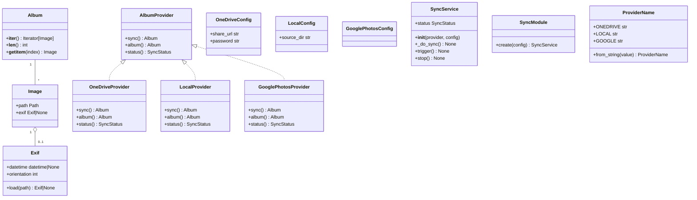

# Design: Album Provider Abstraction

## 1. Overview

Replace the hardcoded OneDrive sync in `SyncService` with a pluggable `AlbumProvider`
protocol so that multiple photo sources (OneDrive, local directory, Google Photos) can
be selected at configuration time and swapped without code changes.

Each provider manages its own file lifecycle and returns an `Album` — an iterable,
indexable collection of `Image` objects with lazy-loaded EXIF metadata. Consumers
(`SyncService`, `SlideshowPlayer`) iterate the collection instead of scanning directories.

---

## 2. High-Level Design

### 2.1 Package Layout

```
src/piframe/
├── images/                       # NEW package — domain types
│   ├── __init__.py               # re-exports Image, Exif, Album
│   ├── image.py                  # Image dataclass with lazy exif property
│   ├── exif.py                   # Exif dataclass with lazy loading
│   └── album.py                  # Album collection (iterable + indexable)
├── providers/                    # NEW package
│   ├── __init__.py               # re-exports AlbumProvider, ProviderName
│   ├── album_provider.py         # AlbumProvider Protocol
│   ├── onedrive.py               # OneDriveConfig + OneDriveProvider
│   ├── local.py                  # LocalConfig + LocalProvider
│   └── google.py                 # GooglePhotosConfig + GooglePhotosProvider (stub)
├── album_provider.py             # EXISTING — fixed import, renamed to DirectoryReader
├── sync_service.py               # MODIFIED — accepts AlbumProvider in constructor
├── config_store.py               # MODIFIED — _SyncCfg gains provider + _apply_env_overrides
├── slideshow_player.py           # MODIFIED — rescan() consumes provider album
├── modules/
│   └── sync.py                   # MODIFIED — resolves provider by name from config
├── types.py                      # UNCHANGED — SyncStatus stays here
└── app.py                        # UNCHANGED — no new wiring needed
```

### 2.2 Data Flow

```
config.toml [sync]
  ├── provider = "onedrive" | "local" | "google"
  ├── interval_minutes = 60
  ├── [sync.onedrive] share_url, password
  ├── [sync.local]    source_dir
  └── [sync.google]   (future)

ConfigStore._SyncCfg
  ├── .provider           → ProviderName (new, default LOCAL)
  └── .interval_minutes   → int   (existing)

# Provider-specific config lives in sub-sections, read by provider config classes.

SyncModule.create(config)
  → reads config.sync.provider
  → constructs the correct provider with its config
  → wraps in SyncService(provider, config)

SyncService._do_sync()
  → self._provider.sync() → Album
  → len(album) → photo_count
  → self._provider.status() → SyncStatus

SlideshowPlayer.rescan()
  → self._provider.album() → Album
  → iterate album, extract image.path, apply shuffle/filter
```

### 2.3 Class Diagram



---

## 3. Low-Level Design

### 3.1 `src/piframe/images/image.py`

**Image — dataclass**

```python
from __future__ import annotations

from dataclasses import dataclass
from functools import cache
from pathlib import Path

from piframe.images.exif import Exif


@dataclass(frozen=True)
class Image:
    """A photo managed by an AlbumProvider.

    The *exif* property is lazy-loaded on first access and cached
    for the lifetime of the instance.
    """

    path: Path

    @property
    @cache
    def exif(self) -> Exif | None:
        return Exif.load(self.path)
```

Notes:
- `frozen=True` makes the instance immutable (hashable, so `@cache` works).
- `@property` stacked on `@cache` is the idiomatic approach for lazy caching
  on frozen dataclasses (which use `__slots__` and are incompatible with
  `@cached_property`). The `@cache` decorator keys by the bound method
  (instance identity), so each `Image` gets its own cached `Exif` value.
  See [bpo-42127](https://bugs.python.org/issue42127).

---

### 3.2 `src/piframe/images/exif.py`

**Exif — dataclass with lazy loading**

```python
from __future__ import annotations

from dataclasses import dataclass
from datetime import datetime
from pathlib import Path

from PIL import Image as PILImage
from PIL.ExifTags import Base, IFD


@dataclass
class Exif:
    """EXIF metadata reader. Reads the file on construction."""

    datetime: datetime | None = None
    orientation: int = 1

    @classmethod
    def load(cls, path: Path) -> "Exif | None":
        """Read EXIF from *path*, returning None on any error."""
        try:
            with PILImage.open(path) as img:
                exif = img.getexif()
                if exif is None:
                    return None
                instance = cls()
                instance._populate(exif)
                return instance
        except Exception:
            return None

    def _populate(self, exif) -> None:
        # Orientation from base IFD
        self.orientation = exif.get(Base.Orientation, 1)

        # DateTime from ExifIFD.DateTimeOriginal or base IFD.DateTime
        exif_ifd = exif.get_ifd(IFD.Exif)
        raw = exif_ifd.get(Base.DateTimeOriginal) if exif_ifd else None
        if not raw:
            raw = exif.get(Base.DateTime)
        if raw:
            self.datetime = datetime.strptime(raw, "%Y:%m:%d %H:%M:%S")
```

Notes:
- `load()` is a class method that returns `Exif | None` — never raises.
- `_populate()` reads only `datetime` and `orientation`. Additional tags
  are deferred to a follow-up issue.
- `PIL.Image.getexif()` is the modern public API (replaces deprecated `_getexif()`).

---

### 3.3 `src/piframe/images/album.py`

**Album — iterable, indexable collection**

```python
from __future__ import annotations

from collections.abc import Iterator
from typing import TYPE_CHECKING

if TYPE_CHECKING:
    from piframe.images.image import Image


class Album:
    """Collection of images from an album provider.

    Supports iteration (for sequential access) and indexed access
    (for shuffle and filtering).
    """

    def __init__(self, images: list["Image"]) -> None:
        self._images = images

    def __iter__(self) -> Iterator["Image"]:
        return iter(self._images)

    def __len__(self) -> int:
        return len(self._images)

    def __getitem__(self, index: int) -> "Image":
        return self._images[index]
```

Notes:
- Backing store is a `list[Image]` — supports random access for shuffle.
- No mutation after construction — consumers iterate freely.

---

### 3.4 `src/piframe/images/__init__.py`

```python
from piframe.images.album import Album
from piframe.images.exif import Exif
from piframe.images.image import Image

__all__ = ["Album", "Exif", "Image"]
```

---

### 3.5 `src/piframe/providers/album_provider.py`

**AlbumProvider — Protocol**

```python
from __future__ import annotations

from typing import Protocol

from piframe.images.album import Album
from piframe.types import SyncStatus


class AlbumProvider(Protocol):
    """Structural type for photo album providers."""

    def sync(self) -> Album:
        """Synchronize local cache with remote/source.

        Returns the full Album of available images.
        The provider is responsible for all file management
        (downloading, caching, cleanup).
        """
        ...

    def album(self) -> Album:
        """Return the current Album without triggering a sync.

        Used by SlideshowPlayer.rescan() to rebuild the playlist.
        """
        ...

    def status(self) -> SyncStatus:
        """Return the current sync status."""
        ...
```

Notes:
- `sync()` replaces the old `sync(output_dir)` — storage is provider-internal.
- `album()` returns current collection without triggering sync.
- `stop()` removed from protocol (no in-flight background work to cancel;
  sync is synchronous).
- `SyncStatus` imported from `piframe.types` (unchanged location).

---

### 3.6 `src/piframe/providers/onedrive.py`

**OneDriveConfig — ConfigStore wrapper**

```python
class OneDriveConfig:
    """Typed view over ConfigStore for OneDrive-specific keys."""

    def __init__(self, config: ConfigStore) -> None:
        self._config = config

    @property
    def share_url(self) -> str:
        return str(self._config._read_nested("sync", "onedrive", "share_url"))

    @property
    def password(self) -> str:
        return str(self._config._read_nested("sync", "onedrive", "password"))

    @property
    def cache_dir(self) -> Path:
        raw = self._config._read_nested("sync", "onedrive", "cache_dir")
        return Path(raw) if raw else Path.home() / ".cache" / "piframe" / "onedrive"
```

**OneDriveProvider — class**

```python
class OneDriveProvider:
    """OneDrive album provider using the Badger token API."""

    def __init__(self, config: OneDriveConfig) -> None:
        self._config = config
        self._status = SyncStatus()
        self._album: Album = Album([])

    def sync(self) -> Album:
        self._album = self._do_sync()
        return self._album

    def album(self) -> Album:
        return self._album

    def status(self) -> SyncStatus:
        return copy.copy(self._status)

    def _do_sync(self) -> Album:
        cache = self._config.cache_dir
        cache.mkdir(parents=True, exist_ok=True)
        token = self._get_badger_token()
        encoded = self._encode_url(self._config.share_url)
        self._validate_password(encoded, token)
        root = self._redeem_share(encoded, token)
        remote_files = self._list_folder(root, token)
        # Download new files
        for item in remote_files:
            dest = cache / item["name"]
            if not dest.exists() or dest.stat().st_mtime < item["modified"]:
                self._download(item, dest, token)
        # Destructive cleanup
        for local in cache.iterdir():
            if local.is_file() and not any(i["name"] == local.name for i in remote_files):
                local.unlink()
        # Build album from cache
        images = [Image(path=p) for p in sorted(cache.iterdir())
                   if p.is_file() and p.suffix.lower() in _EXTENSIONS]
        return Album(images)
```

Implementation details:
- Cache directory is `~/.cache/piframe/onedrive/` — provider-internal.
- `sync()` downloads new files, deletes stale files, returns `Album`.
- `album()` returns the last sync result without re-syncing.
- Private helpers (`_get_badger_token`, `_encode_url`, etc.) extracted from
  `framesync/framesync.py`.
- The `framesync/` directory is **removed** after extraction.

---

### 3.7 `src/piframe/providers/local.py`

**LocalConfig — ConfigStore wrapper**

```python
class LocalConfig:
    """Typed view over ConfigStore for local-provider-specific keys."""

    def __init__(self, config: ConfigStore) -> None:
        self._config = config

    @property
    def source_dir(self) -> Path:
        raw = self._config._read_nested("sync", "local", "source_dir")
        return Path(raw) if raw else Path.home() / "Pictures" / "slideshow"
```

**LocalProvider — class**

```python
class LocalProvider:
    """Local directory album provider.

    Returns direct references to source files — no copying, no caching, no cleanup.
    """

    _EXTENSIONS: frozenset[str] = frozenset({".jpg", ".jpeg", ".png", ".gif"})

    def __init__(self, config: LocalConfig) -> None:
        self._config = config
        self._status = SyncStatus()

    def sync(self) -> Album:
        return self._scan()

    def album(self) -> Album:
        return self._scan()

    def status(self) -> SyncStatus:
        album = self._scan()
        self._status.photo_count = len(album)
        self._status.last_sync_time = datetime.now()
        return copy.copy(self._status)

    def _scan(self) -> Album:
        source = self._config.source_dir
        if not source.exists():
            return Album([])
        images = [
            Image(path=p)
            for p in sorted(source.iterdir())
            if p.is_file() and p.suffix.lower() in self._EXTENSIONS
        ]
        return Album(images)
```

Implementation details:
- No file copying, no caching, no cleanup.
- `sync()` and `album()` both scan the directory (rescans on each call).
- `source_dir` defaults to `~/Pictures/slideshow` if not set in config.
- The returned `Album` is a **snapshot**, not a live view. Each call produces a
  fresh `list[Image]` from whatever is on disk at that moment. Consumers that
  hold a reference (e.g. `SlideshowPlayer._playlist`) see a point-in-time view;

---

### 3.8 `src/piframe/providers/google.py`

**GooglePhotosConfig — ConfigStore wrapper**

```python
class GooglePhotosConfig:
    """Typed view over ConfigStore for Google Photos keys (stub)."""

    def __init__(self, config: ConfigStore) -> None:
        self._config = config
```

**GooglePhotosProvider — class**

```python
class GooglePhotosProvider:
    """Google Photos album provider (stub)."""

    _NOT_IMPLEMENTED = "GooglePhotosProvider is not yet implemented"

    def __init__(self, config: GooglePhotosConfig) -> None:
        self._config = config
        self._status = SyncStatus(last_error=self._NOT_IMPLEMENTED)

    def sync(self) -> Album:
        self._status.last_error = self._NOT_IMPLEMENTED
        return Album([])

    def album(self) -> Album:
        return Album([])

    def status(self) -> SyncStatus:
        return copy.copy(self._status)
```

---

### 3.9 `src/piframe/providers/__init__.py`

```python
from enum import StrEnum


class ProviderName(StrEnum):
    """Supported album provider names."""

    ONEDRIVE = "onedrive"
    LOCAL = "local"
    GOOGLE = "google"

    @classmethod
    def from_string(cls, value: str) -> "ProviderName":
        """Parse a provider name string, raising on unknown values."""
        try:
            return cls(value)
        except ValueError:
            valid = ", ".join(repr(m.value) for m in cls)
            raise ValueError(f"Unknown sync provider '{value}'. Valid: {valid}") from None


from piframe.providers.album_provider import AlbumProvider
from piframe.providers.google import GooglePhotosConfig, GooglePhotosProvider
from piframe.providers.local import LocalConfig, LocalProvider
from piframe.providers.onedrive import OneDriveConfig, OneDriveProvider

__all__ = [
    "AlbumProvider",
    "GooglePhotosConfig",
    "GooglePhotosProvider",
    "LocalConfig",
    "LocalProvider",
    "OneDriveConfig",
    "OneDriveProvider",
    "ProviderName",
]
```

---

### 3.10 `src/piframe/sync_service.py` (Modified)

**Constructor change:**

```python
class SyncService:
    def __init__(self, provider: AlbumProvider, config: ConfigStore) -> None:
        self._provider = provider
        self._config = config
        self._stop_event = threading.Event()
        self._trigger_event = threading.Event()
        self._status = SyncStatus()
        self._status_lock = threading.Lock()
        self._interval_s = config.sync.interval_minutes * 60
        self._thread = threading.Thread(target=self._run, daemon=True)
        self._thread.start()
```

**`_do_sync()` change:**

```python
def _do_sync(self) -> None:
    with self._status_lock:
        self._status.in_progress = True
        self._status.last_error = None
    try:
        album = self._provider.sync()
        provider_status = self._provider.status()
        with self._status_lock:
            self._status.last_sync_time = provider_status.last_sync_time
            self._status.photo_count = len(album)
            self._status.in_progress = False
            self._status.last_error = provider_status.last_error
        # ... post EVT_SYNC_COMPLETE (unchanged)
    except Exception as exc:
        with self._status_lock:
            self._status.in_progress = False
            self._status.last_error = str(exc)
            self._status.last_sync_time = datetime.now()
        logging.error("SyncService error: %s", exc)
        # ... post EVT_SYNC_COMPLETE (unchanged)
```

Notes:
- `output_dir` removed — provider manages its own storage.
- Photo count derived from `len(album)`.
- **Runtime sync failure retention:** On exception, the provider's cached album
  is untouched. The provider's `album()` continues returning the last-known-good
  collection. `SyncService` posts `EVT_SYNC_COMPLETE` regardless, so
  `SlideshowPlayer.rescan()` re-reads `provider.album()` and retains its existing
  playlist. The slideshow never blanks on a transient sync failure.
- The `framesync` import is removed entirely.

---

### 3.11 `src/piframe/modules/sync.py` (Modified)

```python
class SyncModule(DimModule[SyncService]):
    def create(self, config: ConfigStore, **deps: object) -> SyncService:
        provider_name = config.sync.provider  # ProviderName enum, validated
        provider_instance = _resolve_provider(provider_name, config)
        return SyncService(provider_instance, config)


def _resolve_provider(name: ProviderName, config: ConfigStore) -> AlbumProvider:
    """Instantiate the correct provider from config."""
    match name:
        case ProviderName.ONEDRIVE:
            return OneDriveProvider(OneDriveConfig(config))
        case ProviderName.LOCAL:
            return LocalProvider(LocalConfig(config))
        case ProviderName.GOOGLE:
            return GooglePhotosProvider(GooglePhotosConfig(config))
```

---

### 3.12 `src/piframe/slideshow_player.py` (Modified)

**Constructor change:**

```python
class SlideshowPlayer:
    def __init__(
        self,
        config: ConfigStore,
        cache: PhotoCache,
        provider: AlbumProvider,
        screen_size: tuple[int, int],
        assets: Assets | None = None,
    ):
        self._config = config
        self._cache = cache
        self._provider = provider
        self._assets = assets
        self._w, self._h = screen_size
        # ... existing fields
        self.rescan()
```

**`rescan()` change:**

```python
def rescan(self) -> None:
    album = self._provider.album()
    exts = {".jpg", ".jpeg", ".png", ".gif"}
    files = [img.path for img in album if img.path.suffix.lower() in exts]
    # Convert to list for shuffle/indexing
    self._playlist = list(files)
    if self._config.slideshow.shuffle:
        self._playlist = self._fisher_yates(self._playlist)
    self._index = 0
    if self._playlist:
        self._current_surf = self._cache.get(
            self._playlist[0],
            self._config.slideshow.fit_mode,
            self._w,
            self._h,
        )
    else:
        self._current_surf = None
```

Notes:
- Accepts `AlbumProvider` as a dependency.
- Iterates `album` to extract `image.path`, applies extension filter.
- No directory scanning.

---

### 3.13 `src/piframe/config_store.py` (Modified)

**`_SyncCfg` changes:**

```python
class _SyncCfg:
    def __init__(self, data: dict):
        self._d = data

    @property
    def provider(self) -> ProviderName:
        raw = str(self._d.get("provider", "local"))
        return ProviderName.from_string(raw)

    @property
    def cache_dir(self) -> str:
        return str(self._d.get("cache_dir", "/home/frame/.cache/framesync"))

    @property
    def interval_minutes(self) -> int:
        return int(self._d.get("interval_minutes", 60))
```

`output_dir`, `share_url`, `password` removed from `_SyncCfg`.

**`_DEFAULTS` changes:**

```python
"sync": {
    "provider": "local",
    "cache_dir": "/home/frame/.cache/framesync",
    "interval_minutes": 60,
},
```

**`_PROTECTED` changes:**

```python
_PROTECTED = {
    ("sync", "cache_dir"),
    ("sync", "provider"),
}
```

`output_dir` and `share_url`/`password` removed. Nested provider keys are
protected via `_PROTECTED` extension to support 3-tuples
(`("sync", "onedrive", "share_url")`).

**`_read_nested()` helper:**

```python
def _read_nested(
    self, *keys: str, default: str | int | float | bool = ""
) -> str | int | float | bool:
    """Read a nested value from the config data."""
    node: object = self._data
    for key in keys:
        if isinstance(node, dict):
            node = node.get(key, default)
        else:
            return default
    return node if node is not None else default
```

**`_apply_env_overrides()` method:**

```python
_ENV_PREFIX = "PIFRAME_"

def _apply_env_overrides(self) -> None:
    """Overlay PIFRAME_* env vars onto the config data.

    Convention: strip prefix, split remainder on __.
    All segments except the last form the section path; the last is the key.
    E.g. PIFRAME_SYNC__ONEDRIVE__SHARE_URL -> sync.onedrive.share_url.

    Only keys that already exist in merged config are overridden.
    Unknown env vars silently ignored.
    """
    for name, value in os.environ.items():
        if not name.startswith(self._ENV_PREFIX):
            continue
        parts = name[len(self._ENV_PREFIX):].split("__")
        if len(parts) < 2:
            continue
        section_path, key = parts[:-1], parts[-1]
        self._set_nested(section_path, key, value)
```

**`_write_toml()` modification:**

Detects nested dicts and emits `[section.sub]` TOML headers:

```python
def _write_toml(self, data: dict) -> None:
    lines = []
    for section, values in data.items():
        self._write_section(lines, section, values, prefix=section)
    self._path.write_text("\n".join(lines))

def _write_section(self, lines: list[str], section: str, values: dict, prefix: str) -> None:
    for k, v in values.items():
        if isinstance(v, dict):
            sub_prefix = f"{prefix}.{k}"
            self._write_section(lines, k, v, prefix=sub_prefix)
        else:
            # ... existing scalar write logic
```

---

### 3.14 `src/piframe/album_provider.py` (Fixed)

Drop the broken `AlbumProvider` import. Rename `DirectoryAlbumProvider` to
`DirectoryReader` as a standalone class.

---

### 3.15 `config.toml.example` (Updated)

```toml
[sync]
provider         = "local"
cache_dir        = "/home/frame/.cache/framesync"
interval_minutes = 60

[sync.onedrive]
share_url = "https://1drv.ms/f/YOUR_SHARE_URL_HERE"
password  = ""
cache_dir  = "~/.cache/piframe/onedrive"

[sync.local]
source_dir = "/home/frame/Pictures/slideshow"

[sync.google]
# Not yet implemented
```

---

### 3.16 `config.devcontainer.toml` (New)

```toml
[sync]
provider         = "local"
cache_dir        = "/tmp/piframe-cache"
interval_minutes = 60

[sync.onedrive]
share_url = ""
password  = ""
cache_dir  = "~/.cache/piframe/onedrive"

[sync.local]
source_dir = "./test-images"

[sync.google]
# Not yet implemented
```

Devcontainer-appropriate defaults:
- `provider = "local"` — no network needed.
- `cache_dir = "/tmp/piframe-cache"` — writable temp path inside container.
- `source_dir = "./test-images"` — relative path for local test fixtures.
- Secrets (`share_url`, `password`) left empty; supplied via `.env` overrides.

---

### 3.17 `.env.example` (Updated)

```bash
# OneDrive credentials (override config.toml values)
PIFRAME_SYNC__ONEDRIVE__SHARE_URL=https://1drv.ms/f/YOUR_SHARE_URL_HERE
PIFRAME_SYNC__ONEDRIVE__PASSWORD=your_password_here
```

Placeholder entries for secrets that should be injected via environment variables.
Users copy to `.env` and fill in real values. The `_apply_env_overrides()` method
reads these at startup and overlays them onto the loaded TOML config.

---

## 4. Testing Strategy

### 4.1 Images Module Tests (`test_images.py`)

- `test_image_exif_lazy_load` — `Image.exif` returns None until first access,
  then returns Exif instance, caches on subsequent access.
- `test_image_exif_missing_file` — `Image.exif` returns None for non-existent path.
- `test_image_exif_corrupt_file` — `Image.exif` returns None for non-image file.
- `test_album_iterable` — `for img in album` yields Image instances.
- `test_album_indexable` — `album[0]` returns first Image.
- `test_album_len` — `len(album)` returns count.
- `test_album_empty` — empty album has len 0, iteration yields nothing.

### 4.2 Provider Resolution Tests (`test_modules.py`)

- `test_sync_module_resolves_onedrive` — `provider = "onedrive"` produces `OneDriveProvider`.
- `test_sync_module_resolves_local` — `provider = "local"` produces `LocalProvider`.
- `test_sync_module_resolves_google` — `provider = "google"` produces `GooglePhotosProvider`.
- `test_sync_module_rejects_unknown` — `provider = "unknown"` raises `ValueError`.
- `test_sync_module_defaults_to_local` — missing `provider` defaults to `LocalProvider`.

### 4.3 OneDriveProvider Tests (`test_providers.py`)

- `test_onedrive_sync_downloads_new` — mock HTTP returns folder listing; new files downloaded to cache.
- `test_onedrive_sync_destructive_cleanup` — stale cache files deleted.
- `test_onedrive_album_returns_cached` — `album()` returns Album from last sync.
- `test_onedrive_status_after_sync` — `status()` returns correct photo count.

### 4.4 LocalProvider Tests (`test_providers.py`)

- `test_local_sync_scans_directory` — returns Album with Image(path=source_file).
- `test_local_sync_no_copy` — no files copied to output directory.
- `test_local_sync_empty_source` — missing source dir returns empty Album.
- `test_local_album_rescans` — `album()` rescans on each call.

### 4.5 GooglePhotosProvider Tests (`test_providers.py`)

- `test_google_sync_returns_empty` — `sync()` returns empty `Album` and sets `last_error`.
- `test_google_album_empty` — `album()` returns empty Album.
- `test_google_status_has_error` — `status()` returns `last_error` set.

### 4.6 SyncService with Mock Provider (`test_sync_service.py`)

- `test_sync_service_delegates_sync` — mock provider receives `sync()` call.
- `test_sync_service_counts_from_album` — photo_count = `len(album)`.
- `test_sync_service_catches_error` — provider exception caught, `last_error` set.
- `test_sync_service_posts_event` — `EVT_SYNC_COMPLETE` posted on success and failure.

### 4.7 SlideshowPlayer Tests (`test_slideshow_player.py`)

- `test_rescan_from_provider` — playlist built from `provider.album()`.
- `test_rescan_filters_extensions` — non-image files excluded.
- `test_rescan_shuffles` — shuffle applied when config enabled.
- `test_rescan_empty_album` — no crash on empty album.

### 4.8 ConfigStore Tests (`test_config_store.py`)

- `test_sync_provider_default` — default is `"local"`.
- `test_sync_provider_from_file` — `provider = "onedrive"` in TOML is read.
- `test_read_nested_success` — `_read_nested("sync", "onedrive", "share_url")` returns value.
- `test_read_nested_missing` — missing keys return default.
- `test_env_override_simple` — `PIFRAME_DISPLAY__BRIGHTNESS=50` overrides brightness.
- `test_env_override_nested` — `PIFRAME_SYNC__ONEDRIVE__SHARE_URL=...` overrides nested key.
- `test_env_override_unknown_ignored` — unknown env vars silently ignored.
- `test_env_override_type_coercion` — values coerced to existing Python type.
- `test_write_toml_nested` — nested dicts written as `[section.sub]` headers.

---

## 5. Non-Functional Requirements Coverage

| NFR | Coverage |
|-----|----------|
| **NFR-1: Clean Config** | `config.toml.example` updated with provider and sub-sections. |
| **NFR-1b: No Backward Compatibility** | No migration logic. Users update config on next deploy. |
| **NFR-2: Type Safety** | `AlbumProvider` is a `Protocol`. `Image`, `Exif`, `Album` are typed. basedpyright verifies structural conformance. |
| **NFR-3: Testability** | Each provider independently testable. `SyncService` accepts mock `AlbumProvider`. EXIF testable with temp files. |
| **NFR-4: Minimal Footprint** | No new dependencies. `requests` (OneDrive), `PIL` (EXIF), `pathlib`/`threading` (stdlib). |
| **NFR-5: Thread Safety** | `SyncService` retains `_status_lock`. Provider sync is synchronous — no background I/O during sync. |
| **NFR-6: Lazy EXIF Performance** | `Image.exif` loads on first access. Provider sync and playlist construction never trigger EXIF reads. |

---

## 6. Risks and Mitigations

| Risk | Mitigation |
|------|-----------|
| `framesync/` removal | Sync logic extracted into `OneDriveProvider` before removal. Systemd timer updated. |
| Config writer nested sections | `_write_toml()` handles dict recursion. Covered by tests. |
| `DirectoryReader` rename + import fix | Drop broken `AlbumProvider` import. Update all references to `DirectoryReader`. |
| SlideshowPlayer DI change | `SlideshowPlayer` gains `provider` parameter. `App.__init__` wires it through. |
| EXIF read on slow storage | Lazy loading defers I/O to first access. Sync and playlist build are unaffected. |