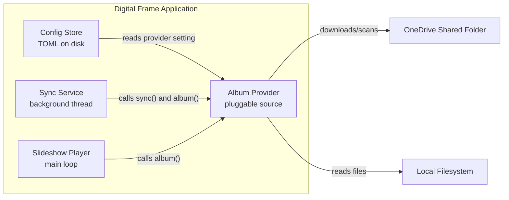
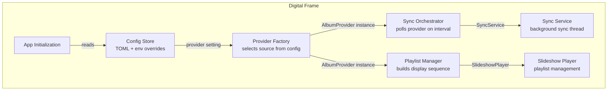
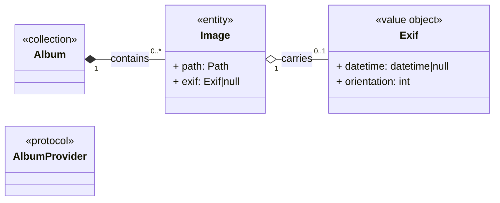

## 1. Summary

The slideshow currently sources photos from OneDrive through a hardcoded sync script embedded in the sync service. This design introduces a new album provider protocol that replaces the existing one, decoupling *where* photos come from from *how* they are consumed, enabling multiple sources (OneDrive, local directory, future cloud services) to be selected at configuration time and swapped without code changes. The chosen approach is boxed-in: the existing DI container, config store, and event-driven sync loop constrain the available moves. We accept a lazy import of the provider name enum in the config accessor, a one-time automatic config migration for legacy OneDrive files, and a replacement of the existing album provider protocol in exchange for a clean provider boundary that eliminates the framesync dependency and makes every provider independently testable.

## 2. Context and scope

The digital frame runs on a Raspberry Pi 3A+ with 512 MB RAM [verified: project AGENTS.md]. Photos are sourced from a OneDrive shared folder via the Badger token API (not OAuth) [verified: framesync sync script]. The sync runs as a background thread on a configurable interval, downloading images to a local directory [verified: sync service source]. The player rescans that directory on each cycle to pick up new images [verified: slideshow player source].

The sync service imports the framesync module at runtime via path manipulation [verified: sync service source], which couples the application to a specific sync implementation and makes it impossible to test without network access. The directory reader is a simple directory scanner [verified: album provider source] with no provider abstraction. A providers package exists with the album provider protocol and provider name enum [verified: providers package init], but these are not yet wired into the sync or player pipelines.

The goal is to make the photo source pluggable so that additional providers can be added in the future without modifying the core sync or player code.

## 3. Goals and non-goals

### Goals

- **G-1** Decouple photo sourcing from the sync service so that multiple providers can be selected at configuration time without code changes.
- **G-2** Eliminate the framesync import and path manipulation from the sync service, making the sync pipeline testable in isolation.
- **G-3** Enable each provider to manage its own file lifecycle (download, cache, cleanup) without leaking implementation details to consumers.
- **G-4** Preserve the existing slideshow behavior — new images appear after sync without requiring a restart.

### Non-goals

- **NG-1** Implementing the Google Photos provider — a stub is sufficient for the protocol; full implementation is deferred. *Not now because it requires OAuth research and credential management outside this change's scope. Revisit when a user requests it.*
- **NG-2** Supporting multiple providers simultaneously (e.g., merging OneDrive and local). *Not now because the slideshow playlist is a single ordered collection; merging introduces deduplication, ordering, and conflict-resolution questions that belong in a separate design. Revisit if a user asks for it.*
- **NG-3** Incremental sync or delta detection. *Not now because the current destructive sync is adequate for the expected photo volume (tens to low hundreds of images). Revisit if sync times become user-visible.*

## 4. Constraints and assumptions

### Constraints

| ID | Constraint | Source |
|---|---|---|
| C-1 | The existing album provider protocol is **replaced** (not extended). The new protocol (sync returns Album, album returns Album, status returns SyncStatus) differs from the existing one (sync takes output directory and returns path list, status, stop). | Existing album provider source |
| C-2 | Provider selection is a single value in sync config, not a list. | Existing provider name enum design |
| C-3 | The DI container passes dependencies via a dict; modules implement the dim module protocol with a create method taking config and keyword dependencies. | Existing DI and modules pattern |
| C-4 | Config store uses TOML for persistence and supports environment variable overrides via the PIFRAME prefix convention. | Existing config store |
| C-5 | The sync service runs in a daemon thread with a configurable interval; it must not block the main thread. | Existing sync service |
| C-6 | No backward compatibility: the old config format is not supported as a format. A one-time automatic migration moves legacy OneDrive keys into the new layout on first load (section 13). | Project convention |

### Assumptions

| ID | Assumption | Confidence | If false | How to verify |
|---|---|---|---|---|
| A-1 | Photo collections fit in memory as a list of image objects (path plus lazy EXIF). Typical collections are tens to low hundreds of images [assumed]. | High | Provider must paginate or stream; album contract changes. | Check actual photo counts from deployed devices. |
| A-2 | OneDrive Badger token API remains functional for the foreseeable future. | Medium | OneDrive provider breaks; users affected until migration path exists. | Monitor Microsoft API deprecation notices. |
| A-3 | EXIF data is optional metadata; its absence does not block slideshow operation. | High | If EXIF is required for ordering, lazy loading becomes a blocking concern. | Confirm with existing behavior — slideshow works without EXIF. |
| A-4 | Legacy OneDrive configs are auto-migrated on first load (no manual edit needed); unmigratable files fall back to the local provider with a log hint. | Medium | If the migration mis-maps a user's directories, photos appear to vanish until the config is fixed. | Migration is covered by unit tests; legacy keys are preserved in the file so a rollback to the old code still works. |

## 5. Quality attribute scenarios

| ID | Source | Stimulus | Environment | Response | Measure |
|---|---|---|---|---|---|
| QA-1 | End user | Changes provider in config from local to onedrive | Device at rest, reboot | New provider active on next boot; sync runs and populates photos | Slideshow shows photos within one sync interval (less than 60 minutes [verified: existing config default]) |
| QA-2 | Sync thread | Provider sync raises an exception (network error, auth failure) | Running normally | Exception caught by sync service; last-known-good album retained; slideshow continues | Slideshow never blanks; error logged |
| QA-3 | On-call engineer | Needs to know why sync is failing at 3am | Running on Pi | Log line identifies provider and error; status accessible via settings | Error identifiable within 5 minutes [assumed: based on current log volume and settings panel responsiveness] |
| QA-4 | Developer | Adds a new provider implementation | Development environment | New provider testable in isolation with mocked dependencies; no changes to sync service or slideshow player | Provider unit tests pass without network access |

## 6. Solution strategy

The central organizing idea: **treat the album as a materialized collection owned by the provider, and expose it through a stable structural protocol.** The album provider protocol defines four operations — sync to refresh, album to read the current collection, status to report health, and close to release resources — plus a read-only storage directory property for UI display (None when the provider has no local storage), and every provider, regardless of source, conforms to this shape.

**Protocol contract:**

| Operation | Purpose | Returns | Pre/post conditions |
|---|---|---|---|
| sync | Refresh local cache with source | Album | Post: album reflects current source state; status updated |
| album | Read current cached collection | Album (defensive copy) | Pre: sync has been called at least once; returns empty album before first sync |
| status | Report sync health | SyncStatus (defensive copy) | Always returns a snapshot; never raises |
| close | Release held resources | None | Idempotent; safe to call multiple times; no further sync/album calls after close |

The existing stop method from the old protocol is removed. Close replaces it for resource cleanup, independent of cancellation.

Three principles eliminated most of the solution space:

1. **Provider owns its storage.** Each provider decides where files live, how they are downloaded, and when they are cleaned up. Consumers never touch the filesystem directly. This eliminated approaches where the sync service manages a shared output directory.
2. **Sync is synchronous from the provider's perspective.** The provider's sync method runs to completion in the sync thread. This eliminated async or callback-based designs and kept the existing sync service thread model intact.
3. **Album is a snapshot, not a live view.** The album method returns the last sync result, not a lazy directory scan. This eliminated approaches where the player rescans the filesystem on every cycle.

This is a **boxed-in** design: the existing DI container, config store, event loop, and thread model constrain the available moves. The chosen combination is least-bad within those constraints.

**Goal mapping:**

- G-1 is served by the album provider protocol and provider module factory.
- G-2 is served by extracting OneDrive sync logic into the OneDrive provider and removing the framesync import.
- G-3 is served by making each provider manage its own cache directory and file lifecycle.
- G-4 is served by the album method returning a cached snapshot and the player's rescan reading from the provider.

## 7. Architecture views

### 7.1 System context

The album provider abstraction sits inside the digital frame application. It replaces the direct dependency on the OneDrive sync script with a pluggable protocol. External systems are the photo source (OneDrive shared folder, local filesystem, or future cloud services) and the config store on disk.



*Figure 1 — The album provider sits between the sync service / player and the external photo sources. The config store determines which provider is active.*

The notable aspect is that both the sync service and the slideshow player depend on the same provider instance — they share state through the provider's cached album, not through a file system convention.

### 7.2 Building blocks

The application constructs the provider through the DI container. The provider module reads the config, instantiates the correct provider, and passes it to both the sync module and player module.



*Figure 2 — ProviderModule creates the AlbumProvider from config; both SyncModule and PlayerModule receive the same instance. Direction of dependency flows from config through the factory to the consumers.*

The dependency direction is the real architectural claim: the sync service and slideshow player depend on the album provider protocol, not on any concrete provider or on the config store for photo paths.

### 7.3 Runtime scenario: sync with failure

The sync thread calls the provider's sync method on each interval. On success, the album is refreshed and the player is notified. On failure, the exception is caught, the last-known-good album is retained, and the player continues with stale data.

```mermaid
sequenceDiagram
  autonumber
  participant SS as SyncService
  participant P as AlbumProvider
  participant PL as SlideshowPlayer
  SS->>P: sync() (on interval)
  alt sync succeeds
    P-->>SS: Album (refreshed)
    SS->>SS: update status, post EVT_SYNC_COMPLETE
    PL->>P: album() (on event)
    P-->>PL: Album
    PL->>PL: rebuild playlist
  else sync fails
    Note over P: provider sets last_error before raising
    P--xSS: exception
    SS->>SS: post EVT_SYNC_COMPLETE
    PL->>P: album() (on event)
    P-->>PL: Album (last-known-good)
    Note over PL: playlist unchanged; slideshow continues
  end
```

*Figure 3 — Sync failure is handled by retaining the last-known-good album. The slideshow never blanks on a transient error.*

The failure path is the key design property: because the provider caches its album internally, a failed sync does not destroy the playlist. The slideshow player reads the same cached album and continues operating.

### 7.4 Domain model

The domain concepts are Image (a photo with a path and optional lazy-loaded EXIF), Album (an immutable collection of images), and Exif (read-only metadata).



*Figure 4 — Domain model showing the album as a collection of images with optional EXIF metadata. AlbumProvider is the protocol boundary, including close for resource cleanup.*

The image's EXIF property is lazy-loaded — it defers the I/O cost of reading EXIF data until the value is actually accessed. This keeps the sync and playlist-building paths fast. The album is immutable in membership (which images it contains does not change), though individual image objects may lazily populate their EXIF data on first access. This is safe because the album snapshot is isolated from the provider after the sync completes — the player iterates a stable collection even if EXIF reads occur during iteration.

### 7.5 Data model

Two categories of data are involved: the config (TOML on disk, with env-var overrides) and the provider cache (files managed by each provider).

```mermaid
erDiagram
  CONFIG ||--o{ PROVIDER_SECTION : contains
  PROVIDER_SECTION ||--o{ PROVIDER_KEY : defines
  PROVIDER ||--o{ CACHED_FILE : stores
  CONFIG {
    provider
    interval_minutes
  }
  PROVIDER_SECTION {
    name
  }
  PROVIDER_KEY {
    key
    value
  }
  PROVIDER {
    type
    cache_dir
  }
  CACHED_FILE {
    name
    path
  }
```

*Figure 5 — Data relationships: config selects the active provider; each provider manages its own cached files and reports sync status.*

The config is the source of truth for provider selection. Each provider owns its cached files. The sync status is a transient snapshot, not persisted.

## 8. Key design decisions

### D-1 — Provider owns its storage

> In the context of multi-provider support, facing the question of where downloaded files live, we chose provider-owned storage over a shared output directory, to achieve clean separation of concerns, accepting that each provider needs its own cache directory configuration, because a shared directory creates coupling between providers and makes destructive cleanup ambiguous.

Previously, the sync service passed an output directory to the sync function, and the slideshow scanned that directory. With multiple providers, a shared directory would require coordination: which provider deletes which files? Which provider's files take priority? By making each provider own its storage, these questions disappear. The downside is that each provider needs a cache directory or source directory configuration key, increasing the config surface area.

### D-2 — Album is a snapshot, not a live view

> In the context of playlist building, facing the question of how the player discovers new images, we chose a cached snapshot over a live directory scan, to achieve decoupling between the player and the filesystem, accepting that there is a brief window between sync and playlist rebuild where the player sees stale data, because a live scan would require the player to know about the provider's storage location.

The album method returns an empty album (zero images) before the first sync has run, and continues returning the last sync result on subsequent calls. This means the player's initial rescan before any sync has occurred produces an empty playlist — the player shows a blank/loading screen until the first sync populates the album. This is the expected behavior for a device that syncs on boot.

**Thread-safety note.** The provider instance is shared between the sync service (daemon thread) and the slideshow player (main thread). Both the album and status methods return defensive copies of internal state, so callers cannot mutate the provider's cached state. The album class stores its images in a private field, so a shallow copy of the album object does not expose the internal list to callers. The provider creates new album and sync status objects during sync and assigns them atomically. The GIL protects the reference swap. If the player iterates the album while sync runs, the worst case is a stale playlist that is corrected on the next event — the player does not crash. The trade-off is that if files are added externally (not through the provider), the player does not see them until the next sync. This is acceptable because the expected usage is that all photos arrive through the provider.

### D-3 — Sync is synchronous in the provider

> In the context of the existing sync thread model, facing the question of whether sync should be async, we chose synchronous sync over async, to achieve simplicity and reuse of the existing thread, accepting that a slow provider blocks the sync thread until it completes, because adding async support would require restructuring the entire sync loop and event posting.

The sync method runs to completion in the sync service background thread. This keeps the existing thread model intact and avoids introducing async/await into a codebase that is otherwise synchronous. The downside is that a slow provider blocks the sync thread. This is acceptable because the sync interval is configurable and the expected photo volume is small.

### D-4 — Provider name lives in its own module in the providers package

> In the context of reading the provider setting from config, facing the question of where the provider name enum lives, we chose a dedicated module inside the providers package over the shared types module, to achieve one logical concept per file (the project's type-placement convention) and keep the config layer free of a module-level dependency on the providers package, accepting a lazy import in the config accessor, because the import is confined to one property getter and the dependency direction (config → providers) is otherwise one-way.

The provider name enum lives in its own module inside the providers package, following the one-concept-per-file convention. The config sync provider property imports it lazily inside the getter, so the config layer has no module-level import of the providers package. The providers package re-exports the provider name for the convenience of existing import paths. The downside is a lazy import in one property getter, but it is localized and the import graph stays acyclic.

### D-5 — Protected config keys use variable-length tuples

> In the context of protecting provider credentials in config, facing the need to support nested keys, we chose variable-length tuples in the protected keys set over a flat key list, to achieve support for arbitrary nesting depth, accepting that the config persistence layer must handle nested dicts, because the existing flat tuple format cannot express nested paths and a flat encoding would lose the hierarchical structure that providers need.

Variable-length tuples let the protected keys set express paths of any depth without requiring a new data structure. The config writer and flush method are adapted accordingly — the writer recurses into nested dicts and the flush method walks variable-length paths.

The new config TOML structure nests provider-specific keys under provider-named sub-sections: the onedrive sub-section contains share URL, password, cache directory; the local sub-section contains source directory; the google sub-section is reserved for future use. The top-level sync section retains only the provider name and interval minutes settings. The sync config accessor class retains only those two flat properties; provider-specific keys are read through the config store's nested read method from provider config wrapper classes.

This is a breaking change for existing OneDrive users: flat sync keys (share URL, password, output directory) must migrate to provider-specific sub-sections. The rollout plan in section 13 handles this with a three-state migration. The downside is increased complexity in both methods, but the change is localized and covered by round-trip tests.

### D-6 — Player rescan reads from provider, not filesystem

> In the context of playlist building, facing the question of how the player discovers images, we chose to have the player's rescan call the provider's album method over retaining the directory scan, to achieve full decoupling from the filesystem, accepting that the player gains a new provider constructor parameter, because a directory scan requires the player to know about the config output directory which is eliminated by this design.

The player constructor gains a provider parameter alongside the existing config, cache, screen size, and assets parameters. The config parameter remains because the player still reads slideshow interval, fit mode, shuffle, and transition settings from it. The rescan method is rewritten to call the provider's album method and iterate the album to extract image paths, replacing the directory scan. The provider guarantees that its album contains only valid image files (filtered by extension during sync). The player applies an independent extension filter as defense-in-depth — this masks provider bugs and keeps the player resilient if a provider ever returns non-image paths. The sync module's create method gains a provider from its dependencies; both the sync module and player module receive the same provider instance from the provider module.

The rendered-surface cache (PhotoCache) is a player implementation detail, not provider storage: its location (~/.cache/piframe/surfaces) is deliberately not config-driven, so the config surface keeps only provider-owned storage keys. A stale surface cache is harmless — it is re-rendered on demand — so no migration is needed when the cache location changes.

### D-7 — Domain types each live in their own module

> In the context of introducing Album, Image, and Exif domain types, facing the question of where they live, we chose one module per type over the shared types module, to achieve one logical concept per file and keep the types module limited to its existing shared status types, accepting three small new modules, because a second location for domain types would be inconsistent with the one-concept-per-file convention.

Album, Image, and Exif each live in their own top-level module (album.py, image.py, exif.py), while the existing types module retains SyncStatus, WifiStatus, and the other shared status types. The three modules form a small acyclic chain: album imports image, image imports exif. The album provider protocol and the player import from these modules directly. No new package is created.

### D-8 — Provider module follows dim module pattern with inline factory

> In the context of DI wiring, facing the question of how the provider is constructed, we chose the provider module following the existing dim module pattern with an inline conditional factory over a registry-based approach, to achieve simplicity and consistency with the module system, accepting that adding a new provider requires modifying the provider module, because the provider set is small and stable (three providers, with one deferred), and a registry adds indirection with no immediate benefit.

The provider module implements the dim module protocol and reads the config provider setting to determine which provider to instantiate, constructing the appropriate provider with its config wrapper. The provider module is added to the modules package alongside the existing cache, player, settings, sync, and wifi modules. The app initialization registers the provider module before both the sync module and player module, so the DI container resolves the provider first and passes it to both consumers through their dependencies. A registry-based approach was considered but rejected: with three providers (one deferred), the indirection of a registry does not earn its keep. If a fourth provider is added, the match statement is extended — the cost is one additional case. "Pluggable" here means selection-time configurability among a known set of providers, not open extensibility via plugin registration. Adding a new provider requires a code change to add a case to the factory and register the provider name.

### D-9 — Album provider protocol includes close for resource cleanup

> In the context of provider lifecycle, facing the question of how providers release resources, we chose to add a close method to the protocol over deferring cleanup to garbage collection, to achieve deterministic resource release, accepting one additional method on the protocol, because providers may hold file handles or HTTP connections that should be released promptly.

The new protocol includes a close method for resource cleanup (consistent with Python's context manager protocol). The sync service releases the provider during shutdown, calling close after signaling the daemon thread to halt. Close is idempotent — calling it multiple times is safe. The shutdown sequence is: the main loop is halted first (stopping all update and rescan calls), then the app cleanup releases the sync service which closes the provider. No live caller accesses the provider after it is closed. The existing stop method from the old protocol is omitted because sync is synchronous — there is no background I/O to cancel. Close handles resource cleanup (closing file handles, releasing HTTP connections) independently of cancellation.

### D-10 — Status returns a defensive copy

> In the context of exposing sync status to callers, facing the question of whether the status method returns a reference or a copy, we chose a defensive copy over a reference, to achieve encapsulation of the provider's internal state, accepting a small allocation cost per call, because sync status is a mutable dataclass and callers must not be able to corrupt the provider's state.

The provider's status method returns a defensive copy, matching the existing sync service status contract. This prevents callers (e.g., the settings panel) from mutating the provider's internal state. The allocation cost is negligible — sync status is a small dataclass with four fields.

## 9. Alternatives considered

### ALT-1 — Extend the existing directory reader with a source parameter

**What it is.** Add a source parameter to the directory reader that selects between OneDrive sync and local scan, keeping the existing path list return type.

**What it does better.** Simpler — no new protocol, no new domain types, no config restructuring. The change is localized to the directory reader and sync service.

**What it costs.** The directory reader becomes a multiplexer that knows about all providers, violating the open-closed principle. Adding a new provider requires modifying the directory reader. The slideshow player still scans a directory, so the provider cannot control the file lifecycle independently.

**Why rejected.** Fails G-1 (no clean provider boundary) and G-3 (provider cannot manage its own lifecycle). The existing directory reader is already a thin wrapper; extending it into a multiplexer creates the same coupling problem we are trying to solve.

### ALT-2 — Keep framesync as an external process, add a local-directory fallback

**What it is.** Retain framesync as a subprocess (or keep the path import) and add a config option to skip it and use a local directory instead.

**What it does better.** Minimal changes — the OneDrive sync path is untouched. The local directory fallback is a simple addition.

**What it costs.** The path manipulation remains, making testing difficult. The sync service still has a hard dependency on OneDrive sync logic. Adding a new provider requires modifying the sync service again. The config structure is flat and cannot express provider-specific settings cleanly.

**Why rejected.** Fails G-1 (no provider abstraction) and G-2 (framesync import remains). This is the "extend the existing system" alternative, and it is the strongest counter-argument — it requires fewer changes. It is rejected because the goal is not merely to add a local directory fallback but to establish a provider architecture that supports future providers without touching the sync service.

### ALT-3 — Full async provider with event-driven sync

**What it is.** Make the album provider async, with sync returning a future or coroutine, and the sync service using asyncio for the sync loop.

**What it does better.** Better responsiveness — a slow provider does not block the sync thread. More scalable for large photo collections or slow networks.

**What it costs.** Requires introducing asyncio into a codebase that is entirely synchronous (pygame main loop, threading-based sync). The sync service thread model must be replaced. All existing code must be adapted. The complexity increase is significant for a device that handles at most a few hundred photos.

**Why rejected.** Fails C-5 (existing sync thread model) and the cost outweighs the benefit for the expected workload. Revisit if photo volumes or sync times become problematic.

| Option | G-1 | G-2 | G-3 | G-4 | QA-4 | Cost | Reversibility |
|---|---|---|---|---|---|---|---|
| Chosen (album provider protocol) | ✓ | ✓ | ✓ | ✓ | ✓ | Medium | High — config migration, but code is additive |
| ALT-1 (extend directory reader) | ✗ | ✗ | ✗ | ✓ | ✗ | Low | High — small change |
| ALT-2 (keep framesync + fallback) | ✗ | ✗ | ✗ | ✓ | ✗ | Low | High — minimal change |
| ALT-3 (async provider) | ✓ | ✓ | ✓ | ✓ | ✓ | High | Low — asyncio migration is hard to reverse |

## 10. Data lifecycle and ownership

**Config data.** The TOML file on disk is the source of truth for all settings. Environment variables overlay specific keys at startup but are not persisted. The flush method restores protected keys (credentials) from disk before writing, preventing env-var-injected secrets from being persisted. Config data is owned by the config store and written by the settings panel.

**Provider cache.** Each provider owns its cached files. The OneDrive provider downloads to a configurable cache directory. The local provider references files directly in a source directory with no copying. The provider is responsible for creating the cache directory, downloading new files, and deleting stale files during sync.

**Album data.** The album object is an in-memory snapshot created by the provider during sync. It is not persisted. When the provider is replaced (config change, reboot), the new provider creates a fresh album on its first sync.

**Sync status ownership.** Sync status is owned entirely by the provider. The provider sets all four fields (in progress, photo count, last sync time, last error) during sync. The sync service's status property returns the provider's status directly with no composition. This gives the provider full ownership and eliminates coupling between two status sources. The provider sets last error on itself before raising from sync, so the sync service only catches the exception and posts the event.

## 11. Failure modes and degradation

| ID | Failure | Trigger | Blast radius | Detection | Designed response | Residual risk |
|---|---|---|---|---|---|---|
| F-1 | Provider sync throws exception | Network error, auth failure, invalid config | Sync fails; album not refreshed | Provider sets last error before raising; sync service catches exception and posts event | Last-known-good album retained; slideshow continues with stale data | If cache is corrupted or empty, slideshow shows blank until next successful sync |
| F-2 | Provider construction fails | Missing config keys, invalid URL | App fails to start | Provider module create raises exception | Exception propagates; app aborts with error message | User must fix config before app starts; no graceful degradation at startup |
| F-3 | Config file corrupt or missing | Disk error, manual edit error | Config falls back to defaults | Config store load catches exception, backs up file | Defaults used; provider defaults to local | If local source dir does not exist, slideshow is empty until config is fixed |
| F-4 | OneDrive API unavailable | Microsoft service outage, network partition | OneDrive sync fails | HTTP error from Badger API | Provider sets last error; slideshow continues with cached photos | Cache becomes stale until service recovers; no automatic retry beyond sync interval |
| F-5 | EXIF read fails | Corrupt image, OOM on Pi | Individual image has no EXIF data | EXIF load catches exception, returns None | Image included in album without EXIF; slideshow continues | Image may not be sorted correctly if EXIF-based ordering is used |

The system degrades gracefully: when a provider cannot sync, the slideshow continues with the last-known-good album. The only hard failure is at startup when the provider cannot be constructed — in that case, the app cannot proceed without valid config.

## 12. Cross-cutting concerns

### Security

Provider credentials (share URL, password) are stored in the config file and protected by the protected keys mechanism — they are restored from disk on each flush call to prevent env-var overrides from being persisted. Credentials should not be logged in plaintext. The OneDrive provider passes credentials to HTTP requests over HTTPS. The config file is written with mode 0600 (owner read/write only) and the provider cache directories are created with mode 0700 (owner-only access) during initialization, owned by the frame user.

### Privacy

Photos are personal data. The provider cache on disk contains the user's photos. The cache directory is created with mode 0700 (owner-only access) during initialization, owned by the frame user. No photo data is transmitted outside the device except to the configured photo source.

### Observability

An on-call engineer needs to answer: (1) Is sync running? — check sync status in progress and last sync time. (2) Why is sync failing? — check sync status last error in logs. (3) How many photos are available? — check sync status photo count. (4) Which provider is active? — check the config provider setting. These signals are available through the existing logging and status reporting.

### Operability

Provider selection is a config change followed by a reboot. There is no runtime provider switch. The sync interval is configurable. Cache directories are configurable per provider.

### Cost

One new runtime dependency: tomli-w for TOML writing (the existing config store uses a hand-rolled writer). This is a single-file package with zero transitive dependencies. All other dependencies (PIL, requests) are already present.

### Compatibility

The config file format changes: the sync section gains a provider key and provider-specific sub-sections. A one-time automatic migration handles existing OneDrive files: on load, a file with flat legacy keys and a non-empty `share_url` is moved (in memory) to the new layout — `provider` becomes `onedrive`, the credentials move to `[sync.onedrive]`, and the old `output_dir` (where the photos live) becomes the provider's `cache_dir` so existing downloads are reused. The legacy keys are preserved in the file, so a rollback to the old code still works, and the migration re-applies on every load until the file is rewritten in the new format. A file without a `share_url` but with an `output_dir` is migrated by seeding the local provider's `source_dir` from it (the user's directory becomes the local source); files with neither key are left unmigrated, and a warning tells the user what to set (per C-6).

## 13. Rollout, migration, and backout

The change passes through three states:

1. **Old config, new code.** On load, the new code detects a legacy file (flat `[sync]` keys, no `provider`) and, when a legacy `share_url` is present, auto-migrates it: `provider` becomes `onedrive`, the credentials move to `[sync.onedrive]`, and the old `output_dir` becomes the provider's `cache_dir` — existing photos are reused instead of re-downloaded. The legacy keys are preserved in the file, so a rollback to the old code still works. Files without a `share_url` but with an `output_dir` are migrated by seeding the local provider's `source_dir` from it; files with neither key are left unmigrated, and a warning tells the user what to set. The backout condition is: if the migration mis-maps a user's directories, revert the deployment — the user's file is still readable by the old code.

2. **New config, new code.** The provider is active and sync runs normally. Backout is still possible while the legacy keys remain in the file — the old code reads them. Backout becomes irreversible only if the user rewrites the file in the new format without the legacy keys.

3. **Stable.** The framesync directory is removed. The old sync service code path is deleted. The directory reader class is retained — the issue's exit criteria require it to keep working — although it is no longer used by the application; the local provider supersedes it for any new use. Backout is no longer possible without restoring the removed code from version control.

The irreversibility point is when the framesync directory is removed. Until then, the old code can be reverted (though users must also revert their config). The rollout strategy is: deploy with both code paths present, verify with users, then remove the framesync directory in a follow-up deployment.

## 14. Risks and technical debt

| ID | Item | Type | Impact | Likelihood | Mitigation or repayment trigger |
|---|---|---|---|---|---|
| R-1 | Config migration errors cause users to lose photo access | Risk | Users cannot view photos until config is fixed | Low | Automatic migration on load (legacy `share_url` → onedrive); unmigratable files log a hint and default to the local provider; covered by unit tests; legacy keys preserved for rollback |
| R-2 | tomli-w dependency adds a write-time requirement | Debt | If tomli-w is not installed, config writes fail | Low | Ensure the install script includes it in uv sync |
| TD-1 | Flush method variable-length tuple logic is complex | Debt | Future maintainers may break the path-walking logic | Medium | Add comprehensive tests for nested protected keys; repay if config structure changes again |
| TD-2 | Google Photos stub is incomplete | Debt | Config can select google provider but it returns empty results | Low | Repay when Google Photos implementation is needed |

## 15. Validation

| ID | Claim | Evidence of success | Evidence of failure | Traces to |
|---|---|---|---|---|
| V-1 | Provider selection works from config | Config provider set to onedrive results in OneDrive provider instance | Provider module create returns wrong type or raises | G-1 |
| V-2 | Sync failure does not blank the slideshow | After injecting a sync error, slideshow player continues showing previous images | Slideshow goes blank or crashes | QA-2 |
| V-3 | Each provider is testable in isolation | Provider unit tests pass with mocked dependencies, no network | Tests require network access or framesync import | QA-4 |
| V-4 | Config credentials are not persisted from env vars | After setting the password env var and calling flush, the password is not in the written TOML | Password appears in the written config file | D-5 |
| V-5 | Album snapshot is consistent | Album method returns the same collection until the next sync | Album method returns different results between calls without sync | D-2 |

## 16. Open questions

| ID | Question | Blocking? | Resolved by |
|---|---|---|---|
| OQ-1 | Should provider-specific config keys be exposed through the flat sync accessor, or only through nested reads? | No | Resolved: the sync accessor retains only `provider` and `interval_minutes` as flat properties; provider config wrapper classes read their own keys via a nested read method (the OneDrive wrapper reads share URL, password, and cache dir from the onedrive sub-section; the local wrapper reads source dir from the local sub-section) |
| OQ-2 | What is the expected photo volume per user, and does it validate the in-memory album assumption? | No | Operational data from deployed devices |
| OQ-3 | Should the settings panel show the active provider name and its cache directory for debugging? | No | UX decision; can be added in a follow-up |
| OQ-4 | How should provider-specific errors be surfaced to the user (beyond logs)? | No | UX decision; tied to settings panel redesign |
| OQ-5 | Is the one-time config migration acceptable, or do we need a migration script? | No | Resolved: the migration is automatic on first load (section 13); no script is needed. |

## 17. Glossary

| Term | Definition |
|---|---|
| Album | An in-memory collection of image objects representing the current set of photos available for display. Created by a provider during sync. |
| Album Provider | A structural protocol defining the interface for photo sources: sync, album, status, close, plus a read-only storage directory property. |
| Badger token API | Microsoft's authentication API for accessing OneDrive shared folders without OAuth. Used by the existing framesync script. |
| Config Store | The TOML-based configuration system that reads from disk, merges defaults, applies env-var overrides, and protects secrets. |
| Provider | A concrete implementation of the album provider protocol that sources photos from a specific location (OneDrive, local filesystem, etc.). |
| Provider Module | A DI module that reads the config and constructs the appropriate provider instance. |
| Sync Service | A background thread that calls the provider's sync on an interval and posts sync complete events. |
| Sync Status | A transient object reporting photo count, last sync time, last error, and in-progress state. |

## 18. References

- sync service source — existing sync service implementation, in the sync service module
- album provider source — existing directory reader, in the album provider module
- providers package init — existing album provider protocol and provider name enum, in the providers package
- config store source — existing config store implementation, in the config store module
- slideshow player source — existing slideshow player implementation, in the slideshow player module
- sync module source — existing sync module, in the modules package
- player module source — existing player module, in the modules package
- framesync sync script — existing OneDrive sync script, in the framesync directory
- UX requirements document — UX requirements (NFR references), in the docs directory