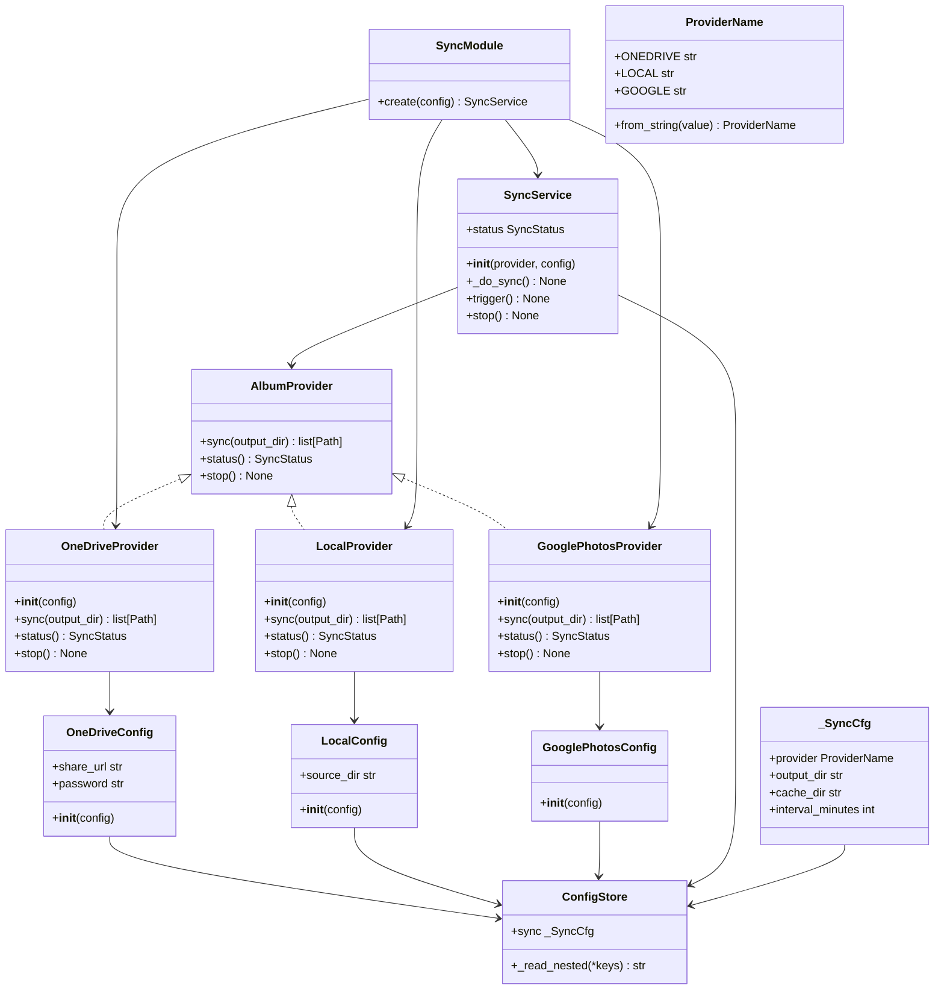

# Design: Album Provider Abstraction

## 1. Overview

Replace the hardcoded OneDrive sync in `SyncService` with a pluggable `AlbumProvider`
protocol so that multiple photo sources (OneDrive, local directory, Google Photos) can
be selected at configuration time and swapped without code changes.

The design introduces a new `piframe.providers` package containing the protocol and
three provider implementations. `SyncService` accepts an `AlbumProvider` via its
constructor instead of importing `framesync` directly. `SyncModule` resolves the
concrete provider by name from `config.sync.provider`. `ConfigStore._SyncCfg` gains
a `provider` property with provider-specific sub-sections.

---

## 2. High-Level Design

### 2.1 Package Layout

```
src/piframe/
├── providers/                    # NEW package
│   ├── __init__.py               # re-exports AlbumProvider, ProviderName
│   ├── album_provider.py         # AlbumProvider Protocol
│   ├── onedrive.py               # OneDriveConfig + OneDriveProvider
│   ├── local.py                  # LocalConfig + LocalProvider
│   └── google.py                 # GooglePhotosConfig + GooglePhotosProvider (stub)
├── album_provider.py             # EXISTING — fixed import, renamed to DirectoryReader
├── sync_service.py               # MODIFIED — accepts AlbumProvider in constructor
├── config_store.py               # MODIFIED — _SyncCfg gains provider + _apply_env_overrides
├── config.devcontainer.toml      # NEW — devcontainer defaults
├── modules/
│   └── sync.py                   # MODIFIED — resolves provider by name from config
├── types.py                      # UNCHANGED — SyncStatus stays here
└── app.py                       # UNCHANGED — no new wiring needed
```

### 2.2 Data Flow

```
config.toml [sync]
  ├── provider = "onedrive" | "local" | "google"
  ├── [sync.onedrive] share_url, password
  ├── [sync.local]    source_dir
  └── [sync.google]   (future)

ConfigStore._SyncCfg
  ├── .provider           → ProviderName (new, default LOCAL)
  ├── .output_dir         → str   (existing, protected)
  ├── .cache_dir          → str   (existing, protected)
  └── .interval_minutes   → int   (existing)

# Provider-specific config is NOT on _SyncCfg. Each provider config class
# wraps ConfigStore and reads its own TOML sub-section internally.

OneDriveConfig(config_store)
  ├── .share_url  → reads [sync.onedrive].share_url from config_store
  └── .password   → reads [sync.onedrive].password from config_store

LocalConfig(config_store)
  └── .source_dir → reads [sync.local].source_dir from config_store

GooglePhotosConfig(config_store)
  └── (no fields yet)

SyncModule.create(config)
  → reads config.sync.provider
  → constructs the correct provider config class (wraps config)
  → instantiates the correct AlbumProvider with that config
  → wraps in SyncService(provider)

SyncService._do_sync()
  → self._provider.sync(output_dir)
  → self._provider.status() → SyncStatus
```

### 2.3 Class Diagram



---

## 3. Low-Level Design

### 3.1 `src/piframe/providers/album_provider.py`

**AlbumProvider — Protocol**

```python
class AlbumProvider(Protocol):
    """Structural type for photo album providers."""

    def sync(self, output_dir: Path) -> list[Path]:
        """Download new photos into output_dir.

        Perform destructive cleanup (delete local files not present remotely).
        Return the list of newly created files.
        """
        ...

    def status(self) -> SyncStatus:
        """Return the current sync status."""
        ...

    def stop(self) -> None:
        """Gracefully halt any in-flight sync work."""
        ...
```

Notes:
- `SyncStatus` is imported from `piframe.types` (unchanged location).
- `Path` is imported from `pathlib`.
- This is a `typing.Protocol` (structural type) — no inheritance needed.

---

### 3.2 `src/piframe/providers/onedrive.py`

**OneDriveConfig — ConfigStore wrapper**

```python
class OneDriveConfig:
    """Typed view over ConfigStore for OneDrive-specific keys."""

    def __init__(self, config: ConfigStore) -> None:
        self._config = config

    @property
    def share_url(self) -> str:
        return str(self._config._read_nested("sync", "onedrive", "share_url"))

    @property
    def password(self) -> str:
        return str(self._config._read_nested("sync", "onedrive", "password"))
```

**OneDriveProvider — class**

```python
class OneDriveProvider:
    """OneDrive album provider using the Badger token API."""

    def __init__(self, config: OneDriveConfig) -> None:
        ...

    def sync(self, output_dir: Path) -> list[Path]:
        ...

    def status(self) -> SyncStatus:
        ...

    def stop(self) -> None:
        ...
```

Implementation details:

- The existing functions from `framesync/framesync.py` are extracted into
  private methods on `OneDriveProvider`:

```python
class OneDriveProvider:
    """OneDrive album provider using the Badger token API."""

    _API_V2 = "https://my.microsoftpersonalcontent.com/_api/v2.0"
    _API_V21 = "https://my.microsoftpersonalcontent.com/_api/v2.1"
    _APP_ID = "00000000-0000-0000-0000-0000481710a4"

    def __init__(self, config: OneDriveConfig) -> None:
        self._config = config
        self._status = SyncStatus()
        self._stop_event = threading.Event()

    def sync(self, output_dir: Path) -> list[Path]:
        token = self._get_badger_token()
        encoded = self._encode_url(self._config.share_url)
        self._validate_password(encoded, token)
        root = self._redeem_share(encoded, token)
        # ... dispatch to _sync_folder or _download_single
        ...

    def status(self) -> SyncStatus:
        return copy.copy(self._status)

    def stop(self) -> None:
        self._stop_event.set()

    # -- private helpers (extracted from framesync.py) --

    def _get_badger_token(self) -> str:
        """Obtain a Badger authentication token from Microsoft."""
        ...

    def _encode_url(self, url: str) -> str:
        """Base64-encode a share URL for the Badger API."""
        ...

    def _validate_password(self, encoded_url: str, token: str) -> None:
        """Validate the share password with the Badger API."""
        ...

    def _redeem_share(self, encoded_url: str, token: str) -> dict:
        """Redeem a share URL to get the drive item details."""
        ...

    def _sync_folder(self, drive_id: str, folder_id: str, token: str, dest: Path) -> list[Path]:
        """Sync a remote OneDrive folder into dest. Returns list of newly downloaded files."""
        ...

    def _download_single(self, item: dict, dest: Path) -> Path:
        """Download a single file from OneDrive."""
        ...
```

- `sync()` orchestrates: `_get_badger_token()` → `_encode_url()` →
  `_validate_password()` → `_redeem_share()` → `_sync_folder()` or
  `_download_single()`.
- `status()` returns a copy of the internal `SyncStatus` tracking
  `last_sync_time`, `photo_count`, `in_progress`, `last_error`.
- `stop()` sets a `threading.Event` checked between page fetches in
  `_sync_folder()`.
- The `framesync/` directory is **removed** after the sync logic is extracted
  into `OneDriveProvider`. The provider is the sole owner of the OneDrive
  sync logic.
- `photo_count` is computed by scanning `output_dir` after sync completes,
  matching the existing `SyncService._do_sync()` behaviour.

---

### 3.3 `src/piframe/providers/local.py`

**LocalConfig — ConfigStore wrapper**

```python
class LocalConfig:
    """Typed view over ConfigStore for local-provider-specific keys."""

    def __init__(self, config: ConfigStore) -> None:
        self._config = config

    @property
    def source_dir(self) -> str:
        return str(self._config._read_nested("sync", "local", "source_dir"))
```

When `source_dir` is empty, the provider falls back to `output_dir` (read
from `SyncService` / `ConfigStore` directly, not from this config class).

**LocalProvider — class**

```python
class LocalProvider:
    """Local directory album provider."""

    _EXTENSIONS: frozenset[str] = frozenset({".jpg", ".jpeg", ".png", ".gif"})

    def __init__(self, config: LocalConfig) -> None:
        ...

    def sync(self, output_dir: Path) -> list[Path]:
        ...

    def status(self) -> SyncStatus:
        ...

    def stop(self) -> None:
        ...
```

Implementation details:

- `sync(output_dir)`:
  - If `source_dir` is empty or does not exist, return empty list with
    `photo_count = 0`.
  - If `source_dir` and `output_dir` are the same path (after resolution),
    scan `output_dir` directly — no copy needed.
  - Otherwise, copy files from `source_dir` to `output_dir` that are not
    already present (using `shutil.copy2` to preserve metadata). Perform
    destructive cleanup: delete files in `output_dir` not present in
    `source_dir`.
  - Return list of newly copied files.
- `status()`: scan `output_dir` for photo count, return with last sync time.
- `stop()`: no-op (no background work).

---

### 3.4 `src/piframe/providers/google.py`

**GooglePhotosConfig — ConfigStore wrapper**

```python
class GooglePhotosConfig:
    """Typed view over ConfigStore for Google Photos keys (stub)."""

    def __init__(self, config: ConfigStore) -> None:
        self._config = config
```

No properties needed yet — the provider is a stub. Properties are added
when the implementation is added.

**GooglePhotosProvider — class**

```python
class GooglePhotosProvider:
    """Google Photos album provider (stub)."""

    _NOT_IMPLEMENTED = "GooglePhotosProvider is not yet implemented"

    def __init__(self, config: GooglePhotosConfig) -> None:
        ...

    def sync(self, output_dir: Path) -> list[Path]:
        raise NotImplementedError(self._NOT_IMPLEMENTED)

    def status(self) -> SyncStatus:
        return SyncStatus(last_error=self._NOT_IMPLEMENTED)

    def stop(self) -> None:
        pass
```

---

### 3.5 `src/piframe/providers/__init__.py`

```python
from enum import StrEnum


class ProviderName(StrEnum):
    """Supported album provider names."""

    ONEDRIVE = "onedrive"
    LOCAL = "local"
    GOOGLE = "google"

    @classmethod
    def from_string(cls, value: str) -> "ProviderName":
        """Parse a provider name string, raising on unknown values."""
        try:
            return cls(value)
        except ValueError:
            valid = ", ".join(repr(m.value) for m in cls)
            raise ValueError(f"Unknown sync provider '{value}'. Valid: {valid}") from None


from piframe.providers.album_provider import AlbumProvider
from piframe.providers.google import GooglePhotosConfig, GooglePhotosProvider
from piframe.providers.local import LocalConfig, LocalProvider
from piframe.providers.onedrive import OneDriveConfig, OneDriveProvider

__all__ = [
    "AlbumProvider",
    "GooglePhotosConfig",
    "GooglePhotosProvider",
    "LocalConfig",
    "LocalProvider",
    "OneDriveConfig",
    "OneDriveProvider",
    "ProviderName",
]
```


---

### 3.6 `src/piframe/sync_service.py` (Modified)

**Constructor change:**

```python
class SyncService:
    def __init__(self, provider: AlbumProvider, config: ConfigStore) -> None:
        self._provider = provider
        self._config = config
        self._stop_event = threading.Event()
        self._trigger_event = threading.Event()
        self._status = SyncStatus()
        self._status_lock = threading.Lock()
        self._interval_s = config.sync.interval_minutes * 60
        self._thread = threading.Thread(target=self._run, daemon=True)
        self._thread.start()
```

**`_do_sync()` change:**

The method delegates to `self._provider.sync(output_dir)` and reads status
from `self._provider.status()`. The pygame event posting and lock handling
remain the same. The `framesync` import is removed entirely.

```python
def _do_sync(self) -> None:
    with self._status_lock:
        self._status.in_progress = True
        self._status.last_error = None
    try:
        output_dir = Path(self._config.sync.output_dir)
        new_files = self._provider.sync(output_dir)
        self._status = self._provider.status()
        # ... post EVT_SYNC_COMPLETE (unchanged)
    except Exception as exc:
        # ... existing error handling (unchanged)
```

**`stop()` change:**

Calls `self._provider.stop()` in addition to setting the stop event.

```python
def stop(self) -> None:
    self._stop_event.set()
    self._trigger_event.set()
    self._provider.stop()
```

---

### 3.7 `src/piframe/modules/sync.py` (Modified)

```python
class SyncModule(DimModule[SyncService]):
    def create(self, config: ConfigStore, **deps: object) -> SyncService:
        provider = config.sync.provider  # ProviderName enum, validated
        provider_instance = _resolve_provider(provider, config)
        return SyncService(provider_instance, config)
```

**`_resolve_provider()` helper:**

```python
from piframe.providers import ProviderName


def _resolve_provider(name: ProviderName, config: ConfigStore) -> AlbumProvider:
    """Instantiate the correct provider from config."""
    match name:
        case ProviderName.ONEDRIVE:
            return OneDriveProvider(OneDriveConfig(config))
        case ProviderName.LOCAL:
            return LocalProvider(LocalConfig(config))
        case ProviderName.GOOGLE:
            return GooglePhotosProvider(GooglePhotosConfig(config))
```

---

### 3.8 `src/piframe/config_store.py` (Modified)

**`_SyncCfg` additions:**

Only one new property — `provider`. No provider-specific keys are added;
those live in the provider config classes which read nested TOML sections
directly.

```python
class _SyncCfg:
    def __init__(self, data: dict):
        self._d = data
        ...

    @property
    def provider(self) -> ProviderName:
        raw = str(self._d.get("provider", "local"))
        return ProviderName.from_string(raw)

    # existing properties: output_dir, cache_dir, interval_minutes
```

**`_read_nested()` helper:**

A new protected method on `ConfigStore` lets provider config classes read
arbitrary nested keys from the raw TOML data without exposing the internal
`_data` dict:

```python
class ConfigStore:
    def _read_nested(self, *keys: str, default: str | int | float | bool = "") -> str | int | float | bool:
        """Read a nested value from the config data.

        Example: _read_nested("sync", "onedrive", "share_url") reads
        the value at [sync.onedrive].share_url from the loaded TOML.
        """
        node: object = self._data
        for key in keys:
            if isinstance(node, dict):
                node = node.get(key, default)
            else:
                return default
        return node if node is not None else default
```

The provider config classes call `self._config._read_nested(...)` to fetch
their values. This keeps the provider config classes thin — they are purely
a typed view over the config store, with no parsing or validation logic.

**`_DEFAULTS` changes:**

```python
"sync": {
    "provider": "local",
    "output_dir": "/home/frame/Pictures/slideshow",
    "cache_dir": "/home/frame/.cache/framesync",
    "interval_minutes": 60,
},
```

`share_url` and `password` are removed from the flat `[sync]` section.
Provider-specific config lives in sub-sections.

**`_PROTECTED` changes:**

```python
_PROTECTED = {
    ("sync", "output_dir"),
    ("sync", "cache_dir"),
    ("sync", "provider"),
}
```

`share_url` and `password` are removed from `_PROTECTED` since they no
longer live in the flat `[sync]` section.

**Config structure handling:**

The `_merge()` method already handles nested dicts via `tomllib` — when the
TOML contains `[sync.onedrive]`, `tomllib` produces
`{"sync": {"onedrive": {"share_url": "...", "password": "..."}}}`.
The `_SyncCfg` accessor reads `self._d.get("onedrive", {})` from the sync
section dict.

**`_apply_env_overrides()` method:**

After TOML is loaded and merged with defaults, env var overrides are applied.

```python
class ConfigStore:
    _ENV_PREFIX = "PIFRAME__"

    def _apply_env_overrides(self) -> None:
        """Overlay PIFRAME__* env vars onto the config data.

        Convention: strip the PIFRAME__ prefix, split the remainder on __.
        All segments except the last form the dotted section path; the last
        segment is the key. E.g. PIFRAME__SYNC__ONEDRIVE__SHARE_URL maps to
        self._data["sync"]["onedrive"]["share_url"].

        Only keys that already exist in the merged config are overridden.
        Unknown env vars are silently ignored.
        """
        for name, value in os.environ.items():
            if not name.startswith(self._ENV_PREFIX):
                continue
            parts = name[len(self._ENV_PREFIX):].split("__")
            if len(parts) < 2:
                continue  # need at least section + key
            section_path, key = parts[:-1], parts[-1]
            if not self._set_nested(section_path, key, value):
                continue  # key doesn't exist, skip silently
```

`_set_nested()` walks `self._data` along `section_path`, checking that the
key exists at the leaf. If it does, the value is set (coerced to the same
Python type as the existing value — bool, int, float, or str).

Called from `_load()` after TOML is loaded and merged with defaults.

**`_write_toml()` modification:**

The existing `_write_toml()` writes flat key-value pairs per section. To
support sub-sections, it needs to detect nested dicts and emit `[section.sub]`
headers. The modification is minimal — when a value is a `dict`, recurse and
write a sub-section header.

---

### 3.9 `src/piframe/album_provider.py` (Renamed + Fixed)

The existing file imports `AlbumProvider` from `piframe.types`, but that
class does not exist in `types.py`. The class itself (`DirectoryAlbumProvider`)
has `get_album() -> list[Path]` — it is **not** an `AlbumProvider` and should
not inherit from one. Two changes:

1. **Drop the broken import** — remove the `AlbumProvider` import entirely.
   `DirectoryReader` is a standalone class with no protocol inheritance.

2. **Rename `DirectoryAlbumProvider` → `DirectoryReader`** — the old name
   collides with the new `AlbumProvider` protocol. The class is a read-only
   directory scanner (`get_album() -> list[Path]`) used by the slideshow
   player's `rescan()` path.

```python
from __future__ import annotations

from pathlib import Path


class DirectoryReader:
    """Read supported image files from a directory via ``Path.iterdir()``.

    Non-recursive; matches the existing ``rescan()`` behaviour.
    """

    _EXTENSIONS: frozenset[str] = frozenset({".jpg", ".jpeg", ".png", ".gif"})

    def __init__(self, directory: str | Path) -> None:
        self._directory = Path(directory)

    def get_album(self) -> list[Path]:
        ...
```

Any references to `DirectoryAlbumProvider` elsewhere in the codebase (e.g.
`slideshow_player.py`) are updated to `DirectoryReader`.

---

### 3.10 `config.toml.example` (Updated)

```toml
[sync]
provider         = "local"
output_dir       = "/home/frame/Pictures/slideshow"
cache_dir        = "/home/frame/.cache/framesync"
interval_minutes = 60

[sync.onedrive]
share_url = "https://1drv.ms/f/YOUR_SHARE_URL_HERE"
password  = ""

[sync.local]
source_dir = "/home/frame/Pictures/slideshow"

[sync.google]
# Not yet implemented
```

---

## 4. Testing Strategy

### 4.1 Provider Resolution Tests (`test_modules.py`)

- `test_sync_module_resolves_onedrive` — config with `provider = "onedrive"`
  produces `OneDriveProvider` instance.
- `test_sync_module_resolves_local` — config with `provider = "local"`
  produces `LocalProvider` instance.
- `test_sync_module_resolves_google` — config with `provider = "google"`
  produces `GooglePhotosProvider` instance.
- `test_sync_module_rejects_unknown` — config with `provider = "unknown"`
  raises `ValueError` with descriptive message.
- `test_sync_module_defaults_to_local` — no `provider` field defaults to
  `LocalProvider`.

### 4.2 OneDriveProvider Tests (`test_providers.py`)

- `test_onedrive_sync_happy_path` — mock `requests.post/get` to return
  valid token, password validation, share redemption, and folder listing.
  Verify files are downloaded to `output_dir`.
- `test_onedrive_sync_destructive_cleanup` — local file not in remote listing
  is deleted.
- `test_onedrive_sync_single_file` — share points to a single file (not folder).
- `test_onedrive_status_after_sync` — `status()` returns correct photo count
  and `last_sync_time`.
- `test_onedrive_stop` — `stop()` sets internal stop event.

### 4.3 LocalProvider Tests (`test_providers.py`)

- `test_local_sync_same_dir` — `source_dir == output_dir`, no copies, just scan.
- `test_local_sync_copies_new_files` — new files in source are copied to output.
- `test_local_sync_destructive_cleanup` — files in output not in source are deleted.
- `test_local_sync_empty_source` — missing source dir returns empty list.
- `test_local_status` — returns correct photo count.
- `test_local_stop_noop` — `stop()` does nothing.

### 4.4 GooglePhotosProvider Tests (`test_providers.py`)

- `test_google_sync_raises` — `sync()` raises `NotImplementedError`.
- `test_google_status_has_error` — `status()` returns `last_error` set.
- `test_google_stop_noop` — `stop()` does nothing.

### 4.5 SyncService with Mock Provider (`test_sync_service.py` or in `test_modules.py`)

- `test_sync_service_delegates_to_provider` — mock `AlbumProvider` receives
  `sync()` call with correct `output_dir`.
- `test_sync_service_posts_event_on_success` — `EVT_SYNC_COMPLETE` posted.
- `test_sync_service_catches_provider_error` — exception from provider is
  caught, `last_error` set.
- `test_sync_service_stop_calls_provider_stop` — `stop()` calls
  `provider.stop()`.

### 4.6 Provider Config Tests (`test_providers.py`)

- `test_onedrive_config_reads_nested` — `OneDriveConfig(config).share_url`
  reads `[sync.onedrive].share_url` from the TOML.
- `test_local_config_reads_nested` — `LocalConfig(config).source_dir`
  reads `[sync.local].source_dir` from the TOML.
- `test_google_config_instantiates` — `GooglePhotosConfig(config)` creates
  without error.

### 4.7 ConfigStore Tests (`test_config_store.py`)

- `test_sync_provider_default` — default is `"local"`.
- `test_sync_provider_from_file` — `provider = "onedrive"` in TOML is read.
- `test_sync_provider_protected` — `provider` is in `_PROTECTED` set.
- `test_read_nested_success` — `_read_nested("sync", "onedrive", "share_url")`
  returns the correct value.
- `test_read_nested_missing` — `_read_nested()` with missing keys returns
  the default.
- `test_env_override_simple` — `PIFRAME__DISPLAY__BRIGHTNESS=50` overrides
  `display.brightness`.
- `test_env_override_nested` — `PIFRAME__SYNC__ONEDRIVE__SHARE_URL=...` overrides
  nested `sync.onedrive.share_url`.
- `test_env_override_unknown_ignored` — `PIFRAME__FAKE__KEY=x` is silently
  ignored (key doesn't exist in config).
- `test_env_override_type_coercion` — env var values are coerced to match
  the existing Python type (bool, int, float, str).

---

## 5. Config Migration

### 5.1 Existing OneDrive Users

The flat `[sync] share_url` / `password` keys are removed from `_SyncCfg`.
Users who switch to the provider update their config to use the `[sync.onedrive]`
sub-section on next deploy.

### 5.2 Existing Local Users

Default `provider = "local"` means users who never configured OneDrive get
the local provider by default. `LocalProvider` with empty `source_dir` simply
scans `output_dir` directly, matching the existing behaviour where the
slideshow reads from the output directory.

---

## 6. Non-Functional Requirements Coverage

| NFR | Coverage |
|-----|----------|
| **NFR-1: Clean Config** | `config.toml.example` updated with `[sync]`, `[sync.onedrive]`, `[sync.local]`, `[sync.google]` sections. |
| **NFR-2: No Behaviour Change for OneDrive** | `OneDriveProvider` uses the exact same Badger API calls as the current implementation. Same token acquisition, password validation, share redemption, folder sync, and destructive cleanup. |
| **NFR-3: Type Safety** | `AlbumProvider` is a `Protocol`. All providers are concrete classes. `SyncService` typed as `AlbumProvider`. basedpyright can verify structural conformance. |
| **NFR-4: Testability** | Each provider is independently testable with mocked I/O. `SyncService` accepts any `AlbumProvider` (mock). No network calls in tests. |
| **NFR-5: Minimal Footprint** | No new dependencies. `requests` already in `pyproject.toml` for OneDrive. `pathlib`, `shutil`, `threading` from stdlib. |
| **NFR-6: Thread Safety** | `SyncService` retains its `_status_lock`. Providers do not hold the lock during I/O — `sync()` returns, then `status()` is called under the lock. |

---

## 7. Migration Path

1. `config.toml.example` is updated with the new structure.
2. Existing `config.toml` files are **not** migrated (per NFR-1). Users
   update their config on next deploy.
4. `DirectoryReader` (renamed from `DirectoryAlbumProvider`) in `album_provider.py`
   is retained for the slideshow player's `rescan()` path. It is not replaced
   by `LocalProvider`.

---

## 8. Risks and Mitigations

| Risk | Mitigation |
|------|-----------|
| `framesync/` removal | The `framesync/` directory is removed after the sync logic is extracted into `OneDriveProvider`. The systemd timer is updated to use the new entry point. |
| Config migration confusion | Default `provider = "local"` is safe. No migration logic — users update config on next deploy. |
| `_write_toml()` nested dict handling | The TOML writer needs to handle sub-sections. This is a small change with tests. |
| `DirectoryReader` rename + import fix | Drop the broken `AlbumProvider` import entirely. Rename `DirectoryAlbumProvider` to `DirectoryReader` as a standalone class. Update all references. |