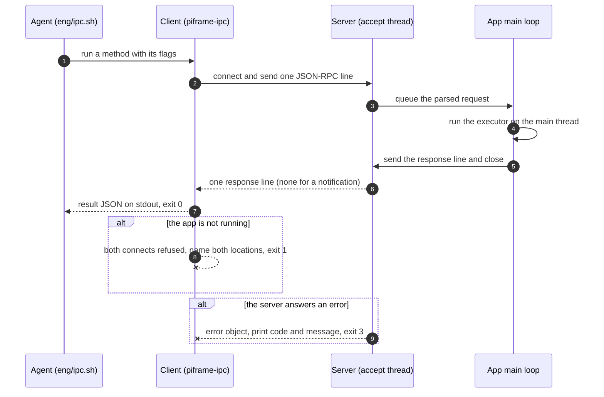
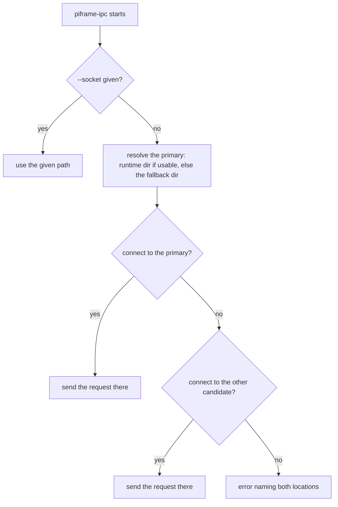

# IPC client for coding agents, documented JSON-RPC API, and runtime-artifact reporting

## 1. Summary

The app's JSON-RPC 2.0 command API (issue 60) has no client and no user-facing
documentation: an agent that wants to screenshot, tap, or quit the app must
hand-roll a socket client every session, and the agent's entry point
(eng/run.sh) does not say where the socket or PID file live. This design adds a
small client module with a `piframe-ipc` console script (wrapped by
`eng/ipc.sh`), a `docs/ipc.md` documenting the protocol and full method set, a
pointer in AGENTS.md (a Debugging-section line and a Commands-block entry for
the new script), and a run.sh success report naming the PID file, the
socket (or a note that it is absent), and the client command. The client and the app
share one candidate-set function in the runtime_paths module, so a bare SSH
session finds the socket the labwc session bound. The trade-off is a small
refactor of the app's startup path (its inline cross-location probe moves onto
the shared function) and a tested method table: docs/ipc.md's table becomes a
contract that must move with the method-name constant the app module exposes.

## 2. Context and scope

The app runs a JSON-RPC 2.0 command server on a Unix socket [verified: the ipc
module]: newline-delimited, one request per connection, the server closing the
connection after the response (none for a notification). Ten methods are
registered in the app's dispatch table [verified: the app module] — state, tap,
swipe, play_pause, prev, next, screenshot, quit (a notification), set_config,
trigger_sync — with the standard error codes -32700 (parse) through -32603
(internal) [verified: the ipc module]. The socket is `piframe.sock` (0600) in
the per-user runtime dir — `$XDG_RUNTIME_DIR` when usable, else the
user-creatable `~/.local/piframe` (0700) — enabled by `[ipc] enabled`
(default false, overridable by `PIFRAME_IPC__ENABLED`), which the
devcontainer template turns on [verified: the runtime_paths module, the config
store, config.devcontainer.toml].

Commands execute on the main thread (the pygame constraint) via a queue drained
each main-loop iteration at 30 FPS [verified: the app module, the types
module], so a response normally arrives within a frame; the slowest executor,
swipe, is bounded to 60 s [verified: the app module].

In the devcontainer the app and the agent run as the same user with no
XDG_RUNTIME_DIR, so both resolve the fallback dir. On the Pi
the app runs in the labwc session (XDG_RUNTIME_DIR=/run/user/1000), but an
agent reaching the Pi over plain SSH may lack XDG_RUNTIME_DIR [assumed:
standard sshd behavior; the app's cross-location lock probe exists for exactly
this asymmetry — verified: the app module]. The agent's entry point,
eng/run.sh, prints the PID and the log path but not the socket or PID-file
paths [verified: eng/run.sh].

No client exists for the protocol: an agent must hand-roll a socket client per
session, and the issue 53 integration tests will need a reusable one.

## 3. Goals and non-goals

### Goals

- **G-1** An agent can drive the app (screenshot, tap, state, quit, and the
  rest) with one documented command, with no knowledge of uv, sockets, or
  JSON-RPC.
- **G-2** The wire protocol and the full method set are documented for users and
  agents in docs/ipc.md, and the doc cannot silently drift from the code.
- **G-3** The agent's entry point (eng/run.sh) reports everything needed to work
  with a running app: the PID, the PID-file path, the socket path (or a note
  that it is absent), and the client command.
- **G-4** The client is unit-testable without the app (no display, no running
  slideshow) and lands inside the existing 90% diff-coverage gate.

### Non-goals

- **NG-1** A client that sends batches or holds a multi-request session — *the
  server's one-line-per-connection framing is the contract (issue 60); revisit
  if a use case needs atomic multi-op calls.*
- **NG-2** Authentication or a second trust boundary on the socket — *the
  per-user 0700 dir is the boundary (issue 60's non-goal on authentication);
  revisit if a multi-user host without logind becomes a target.*
- **NG-3** Changes to the server's protocol or executor behavior — *this issue
  adds a client around the existing protocol; revisit if the client's needs
  outgrow it.*

## 4. Constraints and assumptions

### Constraints

| ID | Constraint | Source |
|---|---|---|
| C-1 | One line per connection (a line may be a batch); the server closes after the response, so the client cannot hold a session | Verified: the ipc module |
| C-2 | The socket is 0600 in a 0700 dir: only the app's user can connect, so the client must run as that user | Verified: the runtime_paths module |
| C-3 | The client must be importable and unit-testable without a display or a running app | The codebase's module idiom (the ipc module never imports the app) |
| C-4 | The client's default socket path must equal the app's resolved path in every environment, including a bare SSH session to the Pi | Issue 59; enforced structurally by the shared candidate-set function (D-1) |

### Assumptions

| ID | Assumption | Confidence | If false | How to verify |
|---|---|---|---|---|
| A-1 | A bare SSH session to the Pi lacks XDG_RUNTIME_DIR while the labwc session has it | High (the codebase already handles this class of session asymmetry; on Debian-family systems pam_systemd, not sshd, exports the var for login sessions) | The two-location probe is unnecessary but harmless | Check the Pi's session environment at deploy time |
| A-2 | A response to any command arrives within 90 s (the slowest executor, swipe, is bounded to 60 s) | High (verified: the app module) | The default read timeout is too short for that command; the `--timeout` flag covers it | The swipe bound in the app module |

## 5. Quality attribute scenarios

| ID | Source | Stimulus | Environment | Response | Measure |
|---|---|---|---|---|---|
| QA-1 | Agent | Runs `bash eng/ipc.sh state` against a running app | Devcontainer, app in its main loop | Result JSON on stdout, exit 0 | Under 1 s (one frame is ~33 ms) |
| QA-2 | Agent | Runs any command while the app is not running | Any | A clear error naming both locations, non-zero exit | Under 1 s (one connect per location, no retry) |
| QA-3 | Agent | Sends a command whose params the server rejects | Any | The server's error message, exit 3 (distinct from transport failure, exit 1) | Under 1 s |

## 6. Solution strategy

**The client is a thin, typed wrapper over the existing wire protocol, and
every surface that names a runtime artifact (the client's default path, the
run.sh report, the doc) is derived from the same resolution logic the app
already uses.** The design is boxed-in: issue 60 fixed the protocol, the
paths, and the trust boundary; the open choices were the client's shape, its
CLI surface, its failure semantics, and how the doc stays honest.

Three principles eliminate most of the space. First, *one line per
connection, no session* (C-1): this kills pooling and streaming — the client
is connect, send one line, read one line (or none), close — and it chooses
not to send batches, which the server would accept. Second,
*one shared source of truth for where the artifacts live* (C-4): this kills a
second, independent path implementation — the client and the app call the same
candidate-set function — so an SSH session finds the labwc-bound socket and the
rule cannot drift in two places. Third, *the doc is a contract, not a
description*: a test pins the method table in docs/ipc.md to the method-name
constant, so the doc cannot silently drift (G-2).

Each goal traces to a decision: G-1 to D-1, D-2, D-3, and D-4; G-2 to D-5;
G-3 to D-6; G-4 to the client's module boundary (C-3) and the fake-socket
tests of V-5.

## 7. Architecture views

### 7.1 A command round trip, with its failure paths

The view below traces one `piframe-ipc` invocation end to end, including its
two failure paths: the app absent, and the server answering an error.

*Figure 1 — One invocation is one connection: request and response share a
connection the server closes, and the two failure paths (no app, protocol
error) are fast and exit-code-distinct.*

The failure paths are asymmetric: a missing app is a transport failure (exit
1) detected around the connect, while a protocol error is the server's verdict
(exit 3) delivered over the wire. An agent script can branch on the two
without parsing prose.

### 7.2 Where the client looks for the socket

The client's default path is not a single location: the app's session and the
client's session can resolve different dirs (the labwc session has a runtime
dir, a bare SSH session may not).

*Figure 2 — The client tries the primary location and, on refusal, the other
candidate — the same two locations the app's lock probe checks — so the socket
is found regardless of which session the client runs in.*

The fallback dir is created 0700 by the resolution logic if absent [verified:
the runtime_paths module]; the client accepts that side effect because it is
idempotent and matches what the app does on its next start. The other
candidate follows the app's cross-location rule [verified: the app module]:
the fallback dir when the primary is the runtime dir, and /run/user/{uid} when
the primary is the fallback dir. In the devcontainer the second location does
not exist, so the probe finds nothing there; on the Pi it is how a bare SSH
session reaches the labwc-bound socket.

## 8. Key design decisions

### D-1 — The client and the app share one candidate-set function in runtime_paths

> In the context of resolving the default socket path, facing a client session
> (bare SSH) that may lack XDG_RUNTIME_DIR, we chose a shared candidate-set
> function in the runtime_paths module — the primary location and the other
> candidate, used by both the app's lock probe and the client's socket probe —
> over a client-local copy of the probe or a required `--socket` override, to
> achieve one source of truth for the two-location rule (C-4), accepting a
> small refactor of the app's startup path, because the location rule already
> lives in three places — the runtime_paths module's primary resolution, the
> app's inline two-location probe, the run script's bash variant — and a
> client-local copy would be a fourth, the drift this design exists to
> prevent.

The other candidate follows the app's cross-location rule: the fallback dir
when the primary is the runtime dir, and /run/user/{uid} when the primary is
the fallback dir. The run script keeps its own, weaker bash variant of the
location rule (it accepts a set XDG_RUNTIME_DIR without the ownership and mode
checks, and never probes /run/user/{uid}); the two agree in the devcontainer,
where only the fallback dir is live. The `--socket` flag remains for explicit
override (the issue's "overridable" requirement).

### D-2 — One line per connection; the client adds no session, no batching, no retry

> In the context of the client's transport, facing the server's
> one-line-per-connection framing, we chose a connect-send-read-close per
> call over a persistent session or a batched connection, to achieve a client
> that mirrors the protocol exactly, accepting per-call connection setup (a few
> milliseconds), because the server closes after each response, a session is
> impossible, and a retry would mask a stalled app.

### D-3 — The client is a typed method per command, and the CLI is one subcommand per method

> In the context of the piframe-ipc console script, facing the ten
> heterogeneous methods, we chose one typed method per command in the module
> and argparse subcommands with typed flags in the CLI (for example
> `screenshot --path`, `swipe --x --y --dx --dy [--ms]`) over a generic
> `method --key value` form, to achieve per-method help and parse-time type
> checking, accepting that a new method needs a new subcommand, because the
> issue's worked example is per-method flags, discoverability is the point for
> an agent audience, and the generic call() core remains for forward
> compatibility.

Flag values are parsed as JSON scalars with a string fallback, so `--x 100` is
an integer and `--path /tmp/view.png` a string, without a second encoding
scheme.

### D-4 — Exit codes: 0 success, 1 transport, 2 usage, 3 protocol error

> In the context of agent scripting against the client, facing two distinct
> failure classes, we chose distinct exit codes (0 result; 1 connect, timeout,
> or malformed response; 2 the argument parser's usage error; 3 a JSON-RPC
> error response) over a single non-zero exit, to achieve branchable failures
> without parsing prose, accepting a fourth exit code, because the spec
> defines no exit-code semantics and an agent should not have to parse stderr
> to branch.

On success the result is printed as one line of JSON on stdout (an empty
object for commands with no result); quit is a notification, so the client
prints nothing and the app's exit is the confirmation.

### D-5 — docs/ipc.md is a tested contract pinned to a module-level method-name constant

> In the context of documenting the method set, facing the drift between a
> prose table and a code dispatch table, we chose a pinning test over a doc
> that is merely written: the method names live in a module-level constant in
> the app module (importable without instantiating the app, which the table
> itself is not), and the test — which instantiates the app the way the
> existing app tests do, under a dummy display driver — checks the dispatch
> table's keys, the names parsed from docs/ipc.md, and the client's subcommand
> set against it, to achieve a doc that cannot silently lie, accepting a small
> format constraint on the doc's table, because the doc's value to an agent
> is its truth.

### D-6 — run.sh reports the artifacts by observation, not by config parsing

> In the context of the run script's success output, facing the question of
> whether the API is on, we chose checking for the socket file after a short
> bounded wait — and reporting the PID-file path and a pointer to the client —
> over parsing the config file from bash, to achieve a report that matches
> what the client will find, accepting a wait of a few seconds in the rare case
> the app binds its socket slowly, because the socket's presence is the ground
> truth the client needs, and a bash TOML parser would be a second,
> drift-prone config reader.

The socket check looks in the dir run.sh already resolved for the PID file —
the two artifacts always share a location. The app logs one warning-level
line at startup keyed on the server's actual state — bound at the resolved
path, disabled by config, or bind failed (the app has no logging
configuration, so only warning and above reach the log) — so the report's
absence note and the log together name the cause without ever asserting a path
that does not exist; that log line is part of this change.

## 9. Alternatives considered

### ALT-1 — Documented one-liners only (no client code)

**What it is.** docs/ipc.md teaches the agent to talk to the socket with an
inline Python or socat one-liner per command; no new module, no console script.

**What it does better.** Zero new code to maintain, zero new surface to review,
and the doc is the only artifact that can drift.

**What it costs.** Every agent session re-derives framing, timeouts, and error
handling from prose; the issue 53 integration tests still need a reusable
client, so the work is deferred, not avoided.

**Why rejected.** G-1 requires a one-command workflow with no protocol
knowledge; a one-liner still requires protocol knowledge.

### ALT-2 — A generic `piframe-ipc <method> --key value` CLI

**What it is.** One flag-only form: the method name as a positional, params as
free-form flags, values JSON-parsed.

**What it does better.** It is future-proof: a new method needs no CLI change,
and the surface is smaller to review.

**What it costs.** No per-method help, no parse-time type checking, and an
agent must learn param names from the doc for every call — the discoverability
the issue asks for.

**Why rejected.** D-3's subcommands win on the issue's actual audience; the
generic form survives as the module's call() core, so the future-proofing is
not lost.

### ALT-3 — A third-party JSON-RPC client library

**What it is.** Depend on a maintained JSON-RPC client package instead of a
hundred lines of socket-plus-JSON.

**What it does better.** Spec compliance comes for free, and the client's code
is smaller.

**What it costs.** A dependency on the Pi for a dev/ops convenience; issue 60
already surveyed the candidates and found them dormant or
transport-mismatched, and the client's needs (one line in, one line out) are a
subset of what the in-repo protocol layer already proves.

**Why rejected.** C-3 and the issue 60 survey; the client stays
zero-dependency, like the rest of the app.

### ALT-4 — A client-local copy of the two-location probe (no app refactor)

**What it is.** The client carries its own copy of the two-location rule; the
app's inline probe stays where it is.

**What it does better.** A smaller diff: the app's startup path — the
single-instance lock, the most safety-critical behavior — is untouched, so the
change carries no risk to it.

**What it costs.** A fourth copy of the location rule (the client's own, beside
the runtime_paths module's primary resolution, the app's inline two-location
probe, and the run script's bash variant), the exact drift C-4 and the D-1
rationale exist to prevent.

**Why rejected.** C-4 requires the client's path to equal the app's in every
environment; a shared function makes that structural instead of conventional,
and the refactor is behavior-preserving, pinned by the existing lock-probe
tests.

| Option | G-1 | G-2 | G-3 | G-4 | Cost | Reversibility |
|---|---|---|---|---|---|---|
| Chosen (D-1 to D-6) | yes | yes | yes | yes | one new module, one test, a small app refactor, doc upkeep | full (revert) |
| ALT-1 | no | partial | yes | no | none | — |
| ALT-2 | partial | yes | yes | yes | smaller CLI, weaker help | full |
| ALT-3 | yes | yes | yes | partial | a dependency on the Pi | full |
| ALT-4 | yes | yes | yes | yes | a fourth copy of the rule | full (revert) |

## 10. Data lifecycle and ownership

The client stores nothing: the only file it causes to be written is the
screenshot, which the app writes to a path the caller names. Resolution may
create the fallback dir (0700) as a side effect; that dir is the app's,
created identically by the app itself.

## 11. Failure modes and degradation

| ID | Failure | Trigger | Blast radius | Detection | Designed response | Residual risk |
|---|---|---|---|---|---|---|
| F-1 | App not running (or IPC disabled) | Both connects are refused (no socket, or the app is down) | The one command | The connect attempts | Error naming both locations; exit 1 | The client's message cannot distinguish the causes; the app's startup log names which (disabled by config, a bind failure, or a crash) |
| F-2 | App alive but slow to answer (long swipe, busy main loop) | The executor runs past the read timeout | The one command | The client's read timeout (default 90 s, `--timeout`) | Timeout error, exit 1; the app is unharmed and finishes within its own 60 s swipe bound | A command timed out by the client may still execute in the app |
| F-3 | Protocol error (bad params, unknown method) | The server answers an error object | The one command | The error object | Code and message to stderr; exit 3 | None — the server is the authority |
| F-4 | The client's session cannot reach either location | A degenerate session (for example a different user) | The one command | Both connects fail | Error naming both locations; the `--socket` override is documented | A cross-user caller cannot use the API (by design, C-2) |

The posture is fail-loud: the client never retries, never waits past its
timeout, and never mutates app state beyond what the named command does.

## 12. Cross-cutting concerns

### Security

No new trust boundary: the client connects to the same 0600 socket in the
same 0700 dir, as the app's user (C-2). The only new surface is the `--socket`
override, which lets a user point the client at any socket they can read.

### Observability

At 3 a.m., the questions are: *why did the agent's command fail?* — the exit
code says which class (1 transport, 3 protocol), and stderr carries the
server's own message in the protocol case; *is the app even up?* — the PID
file's lock (the run script's existing probe) answers it; *is the API on?* —
the startup log names the socket path or the disabled state.

### Operability

`eng/ipc.sh` is the documented entry point, so the agent never needs uv; the
console script is the same code on the Pi after the next deploy (the install
script's frozen sync picks up the new script entry; the lockfile records the
project's dependencies, not its script table, so no re-lock is needed)
[verified: eng/install.sh; uv lock --check against the modified pyproject.toml].

### Compatibility

The change is additive: the server, the protocol, and the existing run.sh
behavior are untouched; the success output gains lines.

## 13. Rollout, migration, and backout

One atomic PR: the client module plus its tests, the console-script entry,
eng/ipc.sh, docs/ipc.md, the AGENTS.md changes (a Debugging-section pointer
and a Commands-block line for the new script), the run.sh report, the shared
candidate-set function in runtime_paths (with the app's inline probe
refactored onto it), the method-name constant in the app module, and the
app's one-line API-state log. Nothing in flight migrates; the old behavior is
a strict subset of the new. Backout is a revert; the only published artifact
that could need a migration is docs/ipc.md's method table, and the pinning
test (D-5) makes any such drift a test failure, not a surprise.

## 14. Risks and technical debt

| ID | Item | Type | Impact | Likelihood | Mitigation or repayment trigger |
|---|---|---|---|---|---|
| R-1 | The doc's method table drifts from the method-name constant | risk | The doc misleads agents | Medium (several places to update per method) | The D-5 pinning test fails the build on drift |
| R-2 | The 90 s default read timeout is a guess | risk | A future slow method times out clients | Low (the slowest bound today is 60 s) | The `--timeout` flag; revisit when a method exceeds 90 s |
| TD-1 | The CLI's subcommands and the doc's table duplicate the method-name constant | debt | A new method touches three places (constant, subcommand, doc) | Certain, per new method | The pinning test forces all three to move together; generate the CLI from the constant if the set grows past ~15 methods |

## 15. Validation

| ID | Claim | Evidence of success | Evidence of failure | Traces to |
|---|---|---|---|---|
| V-1 | The agent workflow is one command | `bash eng/ipc.sh state` against a running devcontainer app prints the state JSON and exits 0; `screenshot --path` writes a file; `quit` exits the app | Any of them needs a flag the doc does not show | G-1 |
| V-2 | Failures are branchable | With no app, exit 1 and a message naming both locations; with a bad param, exit 3 and the server's message | One exit code for both classes | G-1, QA-2, QA-3 |
| V-3 | The doc is a true contract | The pinning test passes: the doc's method set, the dispatch table's keys, and the CLI's subcommands all equal the method-name constant | The test is absent or skips the doc | G-2 |
| V-4 | The entry point reports the artifacts | run.sh's success output names the PID-file path, the socket path (or a note that it is absent), and the client command | The agent still has to guess where the socket is | G-3 |
| V-5 | The client is testable without the app | The client's tests run against a fake server socket with no display and no app; the diff-coverage gate passes | The tests need a running app | G-4 |

V-1, V-2, and V-4 were verified manually in the devcontainer: the repo has no
shell-test infrastructure, and run.sh's own behavior is untested by project
convention, so the report branches are not covered by an automated check.
V-3 and V-5 are pinned by automated tests.

## 16. Open questions

| ID | Question | Blocking? | Resolved by |
|---|---|---|---|
| OQ-1 | Should the pinning test also compare param names, rather than only method names? | No — method names mislead an agent most; param names are covered by the per-method tests | Revisit when the first method gains a param |
| OQ-2 | Should the client expose batch requests (the server accepts them)? | No — no use case needs atomic multi-op calls yet | Issue 53's integration tests, if they do |

## 17. References

- Issue 59 (this work); issue 60 (the config-driven IPC API and runtime paths —
  docs/design/ipc-runtime-dir.md); issue 53 (integration tests that will use
  this client)
- The ipc, runtime_paths, and app modules; the config store; eng/run.sh;
  eng/install.sh; config.devcontainer.toml
- JSON-RPC 2.0 specification (jsonrpc.org)
