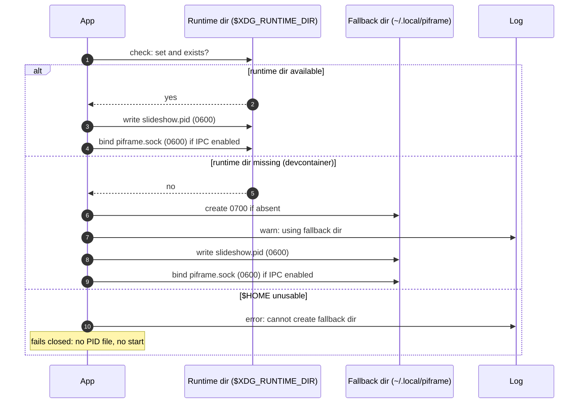
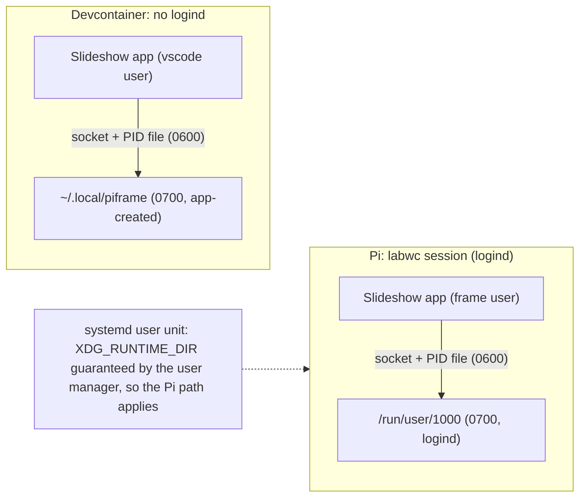

# Config-driven IPC API and per-user runtime paths

## 1. Summary

The app's IPC socket and PID file sit in world-writable /tmp behind a `--test-harness`
CLI flag that is an artifact of the integration tests it came from (issue 60). This design
makes the IPC API a config-driven feature (`[ipc] enabled`, overridable by environment),
moves both artifacts into the per-user 0700 runtime dir with 0600 files, and —
because a low-privileged user cannot create the runtime dir when it is absent
(verified: /run is root-owned) — falls back to a user-creatable `~/.local/piframe`
instead of the issue's proposed /tmp, retiring /tmp entirely. The app keeps binding its
own socket; a systemd `.socket` unit is rejected as a mismatch for an always-on GUI app.
The wire protocol becomes standard JSON-RPC 2.0 (newline-delimited), implemented as a
small zero-dependency protocol layer pinned by conformance tests instead of an ad-hoc
envelope.
The trade-off: the devcontainer's file locations move (the run script and one-liners are
updated in the same change), and a read-only $HOME makes the app fail closed at startup.

## 2. Context and scope

The app is a pygame slideshow that runs fullscreen under labwc as the `frame` user
(uid 1000) on a Raspberry Pi 3A+ [verified: docs/hardware.md]. A Unix-socket command
server — the "harness" — accepts one-line JSON commands (state, tap, swipe, play/pause,
prev, next, screenshot, quit, set-config, trigger-sync) and executes them on the main thread
via a queue drained in the main loop [verified: the harness methods in the app module]. The
wire format is an ad-hoc envelope — a `cmd` field in, an `ok`/`error` pair out — with no
version marker, no standard error semantics, no notifications, and no batching. It is
enabled by the `--test-harness` flag and binds a hardcoded /tmp/piframe_test.sock,
created unlink-then-bind with the umask mode (0755 observed in the devcontainer)
[reported: issue 60; verified: the app module]. The PID file /tmp/slideshow.pid is
opened 0644 and flock-locked for the process lifetime; the lock state is the liveness
oracle the run script probes [verified: the app module, eng/run.sh].

Configuration is TOML with typed sections and `PIFRAME_`-prefixed environment overrides
[verified: the config store module; the prefix was renamed from a double underscore in
issue 61]. The issue's `PIFRAME__IPC__ENABLED` example predates that rename; the
variable this design uses is `PIFRAME_IPC__ENABLED`.

Two environments matter. On the Pi, logind creates /run/user/1000 (0700, owned by the
user) at login and the labwc session exports XDG_RUNTIME_DIR [reported: issue 60; the
existing self-restart code already assumes it]. In the devcontainer there is no logind:
XDG_RUNTIME_DIR is unset, /run/user/1000 does not exist, and /run is root-owned 0755,
so the app's user cannot create the runtime dir (verified in the devcontainer on
2026-08-18: creating /run/user fails with EACCES). The same user can create
`~/.local/piframe` at 0700 and write 0600 files into it (verified, same session).

Related work: issue 59 (an IPC client for coding agents; its default socket path follows
this change) and issue 53 (integration tests that would enable the API via the config
flag instead of a CLI flag). Neither is in this repo yet [reported: issue 60].

## 3. Goals and non-goals

### Goals

- **G-1** The IPC API is a documented, config-driven capability (config flag plus
  environment override), not a hidden test artifact.
- **G-2** The IPC socket and PID file are unreadable and unredirectable by other local
  users, in both the runtime dir and the fallback dir.
- **G-3** The app works in environments without a per-user runtime dir (the
  devcontainer) with no privileged setup step.
- **G-4** No dangling references: every script, doc, and one-liner that names the old
  paths is updated in the same change.

### Non-goals

- **NG-1** An IPC client for coding agents — *issue 59 owns it; its default socket path
  follows this design. Revisit if the client needs a path override.*
- **NG-2** Rewriting the integration tests to drive the app via the API — *issue 53 owns
  it; the tests are not in the repo yet. Revisit when they land.*
- **NG-3** Moving the app log — *the issue scopes the move to the socket and PID file;
  the log stays where the run script puts it. Revisit if log rotation becomes a concern.*
- **NG-4** Authentication on the IPC socket — *the per-user 0700 directory is the trust
  boundary; revisit if a multi-user host without logind becomes a target.*
- **NG-5** A systemd unit file for the app — *provisioning is a separate workstream; this
  change only has to be compatible with it (D-3). Revisit when the unit is written.*

## 4. Constraints and assumptions

### Constraints

| ID | Constraint | Source |
|---|---|---|
| C-1 | The devcontainer has no logind: XDG_RUNTIME_DIR is unset, /run/user/<uid> is absent, and /run is root-owned 0755, so the app's user cannot create the runtime dir | Verified in the devcontainer, 2026-08-18 |
| C-2 | pygame must run on the main thread, so IPC commands must execute on the main thread (the existing queue-drain design is the mechanism) | Verified: the harness design in the app module |
| C-3 | On the Pi the app runs as the frame user (uid 1000) in a labwc session; logind creates /run/user/1000 at 0700 at login | Reported: issue 60; docs/hardware.md |
| C-4 | config.toml holds secrets and is never committed; the [ipc] section is not a secret, so it may appear in the tracked example | AGENTS.md |
| C-5 | A systemd user manager refuses to start without XDG_RUNTIME_DIR and passes its own environment to every user unit, so under a user unit the runtime dir is always present | Verified: systemd source, core main and core manager modules |

### Assumptions

| ID | Assumption | Confidence | If false | How to verify |
|---|---|---|---|---|
| A-1 | XDG_RUNTIME_DIR is set in the labwc session environment on the Pi | High (the existing self-restart code already assumes it) | The app uses the fallback dir; the /run/user/1000 one-liners in the docs break | Check the environment on the Pi at deploy time |
| A-2 | $HOME is set and writable in every environment where the app runs | High | The app cannot create the fallback dir, cannot write the PID file, and fails to start with a clear error (fail-closed, same as today's unwritable-/tmp case) | Holds in both known environments |
| A-3 | No external consumer of the /tmp socket or PID paths exists yet | Medium (the issue 59 client is not landed) | The path move breaks that consumer | The PR body names the new locations |

## 5. Quality attribute scenarios

| ID | Source | Stimulus | Environment | Response | Measure |
|---|---|---|---|---|---|
| QA-1 | Another local user | Attempts to read or connect to the IPC socket or the PID file | Pi, app running, artifacts in the runtime dir | EACCES on both files | 0 successful accesses by a non-owner |
| QA-2 | The app | Starts in an environment without a runtime dir | Devcontainer, XDG_RUNTIME_DIR unset | Reaches the main loop; fallback dir created 0700; one warning names the fallback | Startup succeeds; exactly one warning line |
| QA-3 | The app | Starts with a pre-change config file (no [ipc] section) | Any environment | IPC API off; behavior as before except artifact locations | No crash; no socket present |
| QA-4 | The app | Starts where the fallback dir already holds a stale socket from a crashed run | Fallback environment | The stale socket is unlinked and re-bound; no cross-user planting possible (dir is 0700) | The new instance's socket is functional |

## 6. Solution strategy

The organizing idea: **the per-user runtime dir is the app's home for runtime
artifacts, and any fallback must be a place the app's own user can create.** Two
principles eliminate most of the solution space. First, *the user can create it or it
does not qualify*: this kills /run/user/<uid> as a self-created location (C-1) and, by
the same logic, kills /tmp as a fallback, because the issue's own threat model (another
local user) is exactly what a world-writable directory invites — the fallback becomes
`~/.local/piframe`, created 0700 by the app. Second, *the app binds its own socket*:
this kills systemd `.socket` activation, which suits on-demand daemons, not an
always-on GUI app that must also run where no systemd exists at all (C-2, D-3). The
degree of constraint is boxed-in: the issue fixes the config-flag shape and the
runtime dir target; the open choices were the fallback location, the module boundary,
and the systemd interaction.

Mapping: G-1 is served by D-1, D-6, and D-7; G-2 by D-2; G-3 by D-2's fallback and D-5;
G-4 by D-6's script-and-doc sweep.

## 7. Architecture views

### 7.1 Startup path resolution

The single contested behavior is where the artifacts land when the runtime dir is
missing; the view below shows both branches and the one failure path that is a real
design choice (fail-closed when $HOME is unusable).

*Figure 1 — Path resolution at startup: the runtime dir is preferred, the user-creatable
fallback is the only non-fatal alternative, and an unusable $HOME fails the start.*

The notable point is the asymmetry: a missing runtime dir degrades with a warning, but
an unusable $HOME is fatal, because the PID file (the single-instance lock) has nowhere
else to go.

### 7.2 Deployment environments

The same code runs in two environments with different trust boundaries; the view fixes
where the artifacts land in each.

*Figure 2 — Both environments end in a per-user 0700 directory; a systemd user unit
reduces to the Pi path because the user manager guarantees the runtime dir (C-5).*

The contested claim: a future systemd provisioning needs no unit-specific directory
settings for the app to work — the unit merely runs the app, and the runtime dir is
already there.

## 8. Key design decisions

### D-1 — The IPC API is config-driven; the CLI flag is removed

> In the context of enabling the IPC API, facing a test-artifact CLI flag, we chose a
> config section (`[ipc] enabled`, default false) plus the standard environment override
> (`PIFRAME_IPC__ENABLED`) over keeping the flag or a deprecated alias, to achieve a
> documented, persistent capability, accepting that scripts passing the old flag break at
> startup, because config-plus-override is the codebase's established idiom for app
> behavior and the flag was never a documented surface.

The environment variable name follows the current `PIFRAME_` prefix (renamed from a
double underscore in issue 61); the issue's example predates that rename. The in-repo
references to the flag are a comment in the run script and a test fixture that mocks
the parsed arguments; both are updated in the same change.

### D-2 — Artifacts move to the runtime dir; the fallback is a user-creatable directory, not /tmp

> In the context of placing the socket and PID file, facing a world-writable /tmp
> location, we chose the per-user 0700 runtime dir with 0600 files over the
> issue's proposed /tmp fallback, to achieve per-user isolation in every environment,
> accepting that the devcontainer's file locations move, because the container test (C-1)
> shows the fallback must be user-creatable, and /tmp would keep the exact vulnerability
> class the issue exists to fix.

Both files are chmod'd 0600 after creation (deterministic regardless of umask or a
pre-existing file). The runtime dir is accepted only if it is private (no group or
other permission bits) and owned by the app's user; the fallback dir's mode is
enforced to 0700 — created 0700 if absent, tightened if present, since a looser
pre-existing mode would let other local users plant files in the artifact dir. The
socket name is normalized to `piframe.sock` in both locations as part of the
harness-to-IPC rename; the "test" name was an artifact of the origin.

### D-3 — The app binds its own socket; no systemd .socket unit

> In the context of future systemd provisioning, facing the socket-activation option, we
> chose the app binding its own socket over a .socket unit, to achieve one code path that
> works with or without systemd, accepting that we forgo systemd's socket supervision,
> because socket activation suits on-demand daemons: the app must run continuously, a
> .socket unit on the same path would conflict with the app's own bind, and the
> fd-passing code path it requires would never be used in the primary deployment.

Under a systemd user unit the design works as-is (C-5): the unit can add a PID-file
reference (a relative path resolves under the runtime dir for user units) and
`Restart=on-failure`, and can order after the graphical session target; none of that is
required for the app to function.

### D-4 — Path resolution and the socket server move out of the app module

> In the context of the rename the issue asks for, facing path logic that is untestable
> in isolation, we chose two new modules in the piframe package — a `runtime_paths`
> module (the runtime dir check and both path resolutions with the fallback warning,
> named for the shared concern of where runtime artifacts live) and an `ipc` module
> (the socket server and the JSON-RPC 2.0 protocol layer) — over a pure in-place rename in the app module, to achieve
> unit-testable path and mode behavior without a display, accepting two new modules,
> because the codebase is one-module-per-concern and the app keeps only what needs its
> state (command execution on the main thread, queue draining in the main loop).

The threading model: the accept thread reads the line and parses the JSON; a parse
failure is answered and closed by the accept thread itself (-32700), otherwise the
parsed request is enqueued with its connection. The read is bounded: a stalled
client is closed after a read timeout without a response, and a line longer than the
cap is answered -32700 and closed, so one client cannot hold the accept loop or its
memory. The main thread (the sole executor of
pygame work, C-2) then validates the envelope, dispatches, builds the response, sends
it, and closes the connection. The side that sends the response closes it, so the two
modules cannot disagree about a connection's life. Dependency direction: the app
constructs the `ipc` server and injects its executor callables through the codebase's
module-construction idiom (a module's `create(config, **deps)` factory), so the import
arrow points only app→`ipc` — `ipc` never imports the app, which keeps it unit-testable
without a display. The request queue is owned by the `ipc` module: the app's main loop
calls its `poll()` method each iteration and sends each response through the module, so
the app never touches a raw connection. Executors validate their params (e.g. the swipe
duration is bounded to 60 s so one call cannot hold the main thread).

### D-5 — Self-restart derives the runtime dir from the process uid

> In the context of the app's self-restart, facing a hardcoded /run/user/1000, we chose
> deriving the path from the process uid over keeping the hardcode, to achieve
> correctness for any uid, accepting nothing, because the frame user is uid 1000 on
> the Pi, so behavior in both environments is unchanged.

### D-6 — The devcontainer template enables the API; the example config documents it off; all stale references are updated

> In the context of the dev/agent workflow that needs the API, facing a default-off
> feature, we chose enabling it in the devcontainer template (and documenting it off in
> the tracked example) over leaving it off everywhere, to achieve a working agent
> workflow without a CLI flag, accepting that devcontainer instances run with the socket
> on by default, because the devcontainer is single-user and the socket is 0600 in a
> 0700 directory.

The same change updates the run script's PID-file resolution, the install one-liners,
the agent instructions, the README, the hardware doc, the HLD, and the LLD (config
schema, initialization sequence, restart code), so no stale path survives (G-4).

### D-7 — The wire protocol is JSON-RPC 2.0, implemented as a zero-dependency protocol layer

> In the context of defining the IPC wire protocol, facing an ad-hoc envelope with no
> standard error semantics, we chose a hand-rolled JSON-RPC 2.0 protocol layer
> (newline-delimited, zero new dependencies) over adopting a third-party JSON-RPC
> library or keeping the ad-hoc envelope, to achieve a standard, documented API without
> adding dependencies to the Pi, accepting that we own the spec-compliance surface,
> because the 2.0 spec is frozen and that surface is small and pinned by conformance
> tests, and every candidate library was dormant or HTTP- and websocket-oriented.

The methods are the current command set with named params; `quit` is a notification
(no response — the process exits anyway). The protocol layer implements the 2.0
request/response rules — the standard error codes, notification suppression, and batch
handling (V-6 pins each). Framing is newline-delimited (the MCP stdio-transport
precedent; a line is unambiguous since JSON cannot contain a raw newline outside a
string). The layer lives in the `ipc` module as pure functions over the parsed request,
unit-testable without a socket; a dispatch table maps method names to executor
callables the app injects.

Why no library: every Python JSON-RPC candidate is dormant or transport-mismatched —
`jsonrpcserver` (last release 2022; its one-shot dispatch API would force a blocking
proxy into the accept loop, and it pulls a Rust extension onto the Pi),
`pavlov99/json-rpc` (2015-era; leaves dispatch and error mapping to us),
`marcinn/json-rpc-server` (answers notifications, crashes on batches — spec gaps),
the `mcp` python-sdk (clean types, but an anyio/httpx/starlette tree too heavy for a
512 MB app), and `palantir/python-jsonrpc-server` (asyncio — a second concurrency
model that would not remove the main-thread handoff anyway). A
frozen spec plus conformance tests (V-6) makes the hand-rolled layer's compliance a
test failure, not a hope.

## 9. Alternatives considered

### ALT-1 — Status quo (keep the flag, keep /tmp)

**What it is.** No change; the API stays behind the test-harness flag and the artifacts
stay in /tmp.

**What it does better.** Zero migration cost and zero documentation churn; the
devcontainer workflow is byte-for-byte unchanged.

**What it costs.** Every problem the issue names remains: the test-artifact surface, the
world-writable location, the unlink-then-bind race, the world-readable PID file.

**Why rejected.** It is the negation of G-1 through G-4; the issue exists to fix exactly
this. (Included because a system already exists; it is the strongest baseline.)

### ALT-2 — The issue's original /tmp fallback

**What it is.** Runtime dir when available, else the current /tmp paths with a warning,
as the issue's preferred option literally reads.

**What it does better.** The devcontainer tooling keeps its exact paths, and no new
directory is created.

**What it costs.** The fallback keeps the vulnerability class the issue targets — a
world-writable directory where another local user can plant a symlink before the bind
and read a 0644 PID file — in the one environment where the app is actually developed
and tested.

**Why rejected.** C-1 shows the fallback must be user-creatable; `~/.local/piframe`
satisfies that with a strictly stronger boundary, and the tooling update it costs is
paid in this change anyway (D-6).

### ALT-3 — A deprecated test-harness alias (issue option 2)

**What it is.** Keep the flag for one release as an alias that sets the in-memory
config value.

**What it does better.** A migration window for any external script that passes the
flag.

**What it costs.** A duplicate surface that must be documented, tested, and later
removed; the flag was never in the README or LLD, so the only known consumer is an
in-repo comment.

**Why rejected.** The issue explicitly prefers removal over carrying a deprecated
duplicate; the known-consumer analysis makes the window worthless.

### ALT-4 — A systemd .socket unit for the IPC socket

**What it is.** systemd binds and supervises the socket and hands it to the app via the
fd-passing interface; the app stops binding.

**What it does better.** The socket's lifecycle (bind, mode, cleanup) is owned by the
init system — the natural shape if the app were an on-demand daemon.

**What it costs.** A second code path (accepting passed file descriptors) that the
primary non-systemd deployment never exercises; a conflict with the app's own bind if
both try the same path; and the default socket mode (0666) is weaker than the 0600 this
design requires.

**Why rejected.** The app is an always-on GUI app (C-2), so the on-demand semantics are
the wrong fit; D-3 records the same decision from the design side.

| Option | G-1 | G-2 | G-3 | G-4 | Cost | Reversibility |
|---|---|---|---|---|---|---|
| Chosen (D-1 to D-7) | yes | yes | yes | yes | tooling and doc update in one change | full until issue 59 lands |
| ALT-1 | no | no | yes | no | none | — |
| ALT-2 | yes | partial (fallback stays weak) | yes | yes | small | full |
| ALT-3 | yes | no | yes | no | one extra release of maintenance | full |
| ALT-4 | yes | yes (with unit config) | n/a (systemd only) | no | new code path plus library dependency | full |

## 10. Data lifecycle and ownership

Two runtime artifacts, both owned by the app's user and both ephemeral. The **PID file**
is created at startup (0600), flock-locked for the process lifetime, and intentionally
not removed on exit: the lock state is the liveness oracle the run script probes, and a
stale file with no live holder is inert (the run script removes it). The **IPC socket**
is unlinked and re-bound at every start when enabled; in both locations only the owning
user can plant a file in the directory, so the unlink-then-bind window is no longer a
cross-user attack. Neither artifact survives a logout on the Pi (the runtime dir is
removed by logind) or a manual cleanup of the fallback dir; nothing in them is worth
retaining.

## 11. Failure modes and degradation

| ID | Failure | Trigger | Blast radius | Detection | Designed response | Residual risk |
|---|---|---|---|---|---|---|
| F-1 | Runtime dir set but missing | XDG_RUNTIME_DIR exported without logind | App start | The app's own check | Fall back to the user-creatable dir with a warning (QA-2) | A shared-directory exposure class, but inside a 0700 user dir — strictly better than /tmp |
| F-2 | $HOME unset or unwritable | Degenerate environment | App start | The mkdir or open error | Fail closed: a clear error naming the missing directory; no start | The app cannot run there (same as today's unwritable /tmp) |
| F-3 | Socket bind fails with IPC enabled | Permissions, path too long | The IPC API only | The logged error | The app continues without the API (fail-soft: the API is a dev/ops convenience, not app-critical) | An operator who enabled the API gets a slideshow but no socket until the cause is fixed |
| F-4 | Stale socket or PID file from a crash | Previous crash | Next start | — | Unlink-then-bind for the socket; flock for the PID file; the 0700 dir makes planting impossible | None beyond a same-user race the user already owns |

The posture is asymmetric on purpose: the PID file is a liveness prerequisite, so its
failure is fatal (F-2); the socket is a convenience, so its failure degrades (F-3).

## 12. Cross-cutting concerns

### Security

The trust boundary moves from "world-writable /tmp" to "per-user 0700 directory with
0600 files". The IPC socket performs no authentication; directory ownership is the
entire boundary (NG-4). The 0600 mode is defense in depth that also covers the fallback
location.

### Observability

At 3 a.m., the questions are: *why can't the agent client connect?* — the startup log
names the resolved socket path, and the warning names the fallback when it is used;
*why did the app die at start?* — the fail-closed error names the directory it could
not create. Both are single log lines, greppable in the run log.

### Operability

Under a systemd user unit, the surface cache the app keeps under the per-user cache
directory is subject to the user manager's cache-cleanup policy; the cache is
regenerable, so the impact is bounded. A future unit can declare that cache directory to
make it systemd-owned; nothing in this change requires it.

### Compatibility

The one-liners in the agent instructions and the install script move from /tmp to the
runtime dir on the Pi (the frame user is uid 1000, so the path is /run/user/1000) and
to the fallback dir in the devcontainer. The run script resolves the PID file the same way the app does — a two-branch shell
conditional mirroring the app's resolution — so its kill path keeps working in both
environments.

## 13. Rollout, migration, and backout

The change lands as one atomic PR: config section, code, run script, one-liners, and
docs together. On the Pi, after deploy and reboot, the artifacts appear in the runtime
dir; the old /tmp PID file becomes a stale, inert file (no live lock holder) that the
run script's stale-file handling already removes. In the devcontainer, the first run
creates the fallback dir; the old /tmp files are likewise stale and inert.
Backout is a revert: the app returns to the /tmp paths and the new-location files are
inert. Backout stays possible until the issue 59 client lands; after that, the socket
path is a published contract and moves become a migration. The issue 59 client becomes
a standard JSON-RPC client rather than a bespoke one.

## 14. Risks and technical debt

| ID | Item | Type | Impact | Likelihood | Mitigation or repayment trigger |
|---|---|---|---|---|---|
| R-1 | An out-of-repo script depends on the old /tmp paths | risk | The script fails to find the file | Low (the paths were never documented) | The PR body and the warning log name the new locations |
| TD-1 | The fallback dir is not strictly XDG (state would live under the state home) | debt | XDG-aware tooling may look elsewhere for it | Low | Repay if XDG conventions become load-bearing; the name matches the existing per-user cache dir |
| TD-2 | The socket server moved to a new module but the command set is unchanged | debt | A future API change touches the app and the `ipc` module | Low | Repay when the API grows (issue 59 work) |
| TD-3 | The JSON-RPC 2.0 protocol layer is hand-rolled; compliance is pinned by conformance tests, not a library | debt | If the protocol surface grows, the layer needs care to stay spec-compliant | Low (the 2.0 spec is frozen since 2015 and the surface is small) | Repay by migrating to a maintained library if the protocol grows beyond the current command set |

## 15. Validation

| ID | Claim | Evidence of success | Evidence of failure | Traces to |
|---|---|---|---|---|
| V-1 | The flag is gone and the config drives the API | The flag produces an argument error; the config flag or the env override starts the server | The flag still works, or the config flag is ignored | G-1 |
| V-2 | The runtime dir is used when present | With XDG_RUNTIME_DIR pointing at an existing dir, both files land there at 0600 | The files land elsewhere | G-2 |
| V-3 | The fallback works in the devcontainer | With XDG_RUNTIME_DIR unset, the app creates the fallback dir at 0700, writes 0600 files, logs one warning, and the run script's kill path works | Startup fails, or files land in /tmp | G-3 |
| V-4 | Modes are enforced, not umask-dependent | Both files are 0600 in both environments even under a permissive umask | A file is 0644 or 0755 | G-2 |
| V-5 | No dangling references | A repo-wide search finds no reference to the old /tmp paths in code, scripts, or docs | A stale reference remains | G-4 |
| V-6 | The wire protocol is spec-compliant JSON-RPC 2.0 | A malformed line gets -32700, a malformed envelope -32600, an unknown method -32601, invalid params -32602, a `quit` notification no response, a two-request batch an array of two responses, an empty batch a bare -32600 object, an all-notification batch no response | Any of those deviates from the spec | G-1 |

## 16. Open questions

| ID | Question | Blocking? | Resolved by |
|---|---|---|---|
| OQ-1 | Should the app prefer a dedicated subdirectory of the runtime dir (as systemd's `RuntimeDirectory=` setting does for units) over the runtime dir root the issue specifies? | No — the parent is 0700, so a subdirectory adds no security; the issue fixes the root | Revisit when a unit file with a `RuntimeDirectory=` setting is provisioned |
| OQ-2 | Is the frame user always uid 1000 on the Pi (the one-liners hardcode the path)? | No — the hardware doc says uid 1000 and the existing one-liners already hardcode it for the runtime dir | Confirm on the Pi at deploy time |

## 17. Glossary

| Term | Definition |
|---|---|
| IPC API | The app's Unix-socket command server: one-line JSON commands executed on the main thread |
| Runtime dir | The per-user 0700 directory at XDG_RUNTIME_DIR, created by logind at login on the Pi |
| Fallback dir | The user-creatable `~/.local/piframe` (0700) used when the runtime dir is unavailable |
| Liveness oracle | The flock on the PID file: a held lock means a live instance, a free one a stale file |
| JSON-RPC 2.0 | The standard RPC protocol (jsonrpc.org): request/response messages with standard error codes, notifications, and batching; transport-agnostic |
| Unlink-then-bind race | A window between removing a socket file and binding a new one in which another user could plant a symlink; closed here because both locations are 0700 user-owned |
| User unit | A unit of the per-user systemd instance, which always sees XDG_RUNTIME_DIR |

## 18. References

- Issue 60 (this work); issues 53 and 59 (related); issue 61 (the environment-prefix rename)
- docs/hardware.md — the device, the frame user, the labwc launch
- docs/pi-frame-lld.md — the app module, the config store, the initialization sequence
- docs/pi-frame-hld.md — the PID-file acceptance criterion
- systemd: user@.service(5), systemd.exec(5), systemd.service(5), systemd.socket(5),
  pam_systemd(8); systemd source, core main and core manager modules (the user
  manager's environment behavior)
- JSON-RPC 2.0 specification (jsonrpc.org) — the compliance target for the
  hand-rolled protocol layer
