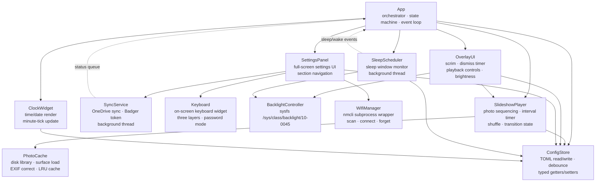
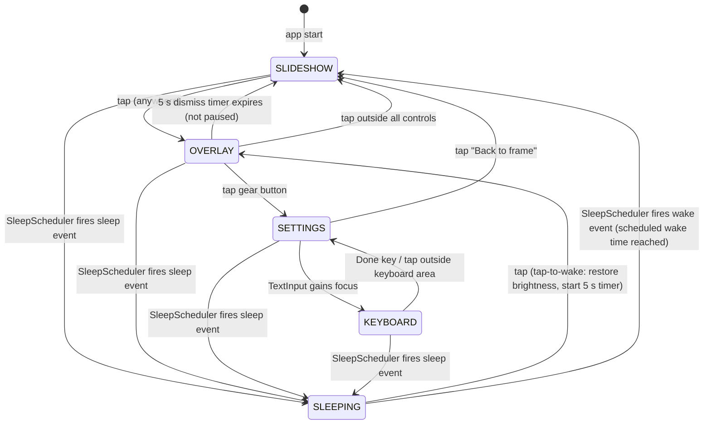

# Pi Frame — Design Specification & High-Level Design (HLD)

---

## Preamble

### Device findings

The following open items from requirements Section 8 were resolved by live SSH inspection
of the target device (`frame@10.1.7.58`) before design work began.

| Item | Finding | Design decision |
|---|---|---|
| **Backlight privilege** | `/sys/class/backlight/10-0045/brightness` is owned by `root:video`, permissions `-rw-rw-r--`. The `frame` user is a member of the `video` group. A write test executed as `frame` succeeded without sudo. Max brightness: 255. Type: `raw`. | `BacklightController` writes directly to the sysfs node as the `frame` user. No sudoers rule or privileged helper daemon is required. |
| **Wi-Fi backend** | NetworkManager is active; `nmcli` v1.52.1 is present. `wpa_supplicant` is running as an NM backend but `wpa_cli` is absent. Polkit reports `auth` required for `wifi.scan` and `network-control` operations. The `frame` user has `NOPASSWD: ALL` sudo. Existing sudoers entries cover `nmcli dev wifi connect *` and `nmcli dev disconnect *`. | `WifiManager` wraps `nmcli` via `subprocess`, prefixing all calls with `sudo` to bypass polkit. The existing `framesync-wifi.sudoers` file is extended to add `nmcli dev wifi list` and `nmcli -t -f ...` status queries. |
| **Touch controller state during sleep** | Goodix Capacitive TouchScreen at `/dev/input/event1` (I²C address `10-0014`). `runtime_status` reports `unsupported` — the controller has no independent runtime power management and remains powered at all times. Touch events arrive in pygame regardless of backlight state. | The `SLEEPING` state polls for `MOUSEBUTTONDOWN` events via the normal pygame event loop (at a reduced rate). No separate evdev thread or polling daemon is required for tap-to-wake. |
| **Timezone manual entry UX** | No device-specific constraint (this is a UX design decision deferred by the requirements spec). The device has Python `zoneinfo` available (system Python 3.11). | Use a scrollable picker widget populated from `zoneinfo.available_timezones()`. This avoids requiring the on-screen keyboard for a field that has a finite set of valid values and is more reliable on a touch display. Free-text `TextInput` with the keyboard is kept as a fallback but is not the primary UX. |
| **Brightness slider widgets** | pygame has no native slider widgets. No system widget library is in scope (all UI is custom pygame). | Custom widgets are required: `VerticalSlider` for overlay brightness and `HorizontalSlider` for Display section brightness. Both use a circular draggable thumb with internal value range 0–100 mapped to sysfs 0–255. |

---

### Document scope

This document covers the architecture, module decomposition, rendering pipeline, state
machine, widget system, configuration schema, hardware interfaces, and implementation
staging for the Pi Frame pygame application. It is intended as a complete input to a
Low-Level Design agent that will produce per-module class designs, data-structure
definitions, and a stage-by-stage implementation plan. This document explicitly defers
all of the following to the LLD: class hierarchies and method signatures, function-level
pseudocode, exact byte layouts of cache files, specific regex or parsing logic for TOML
validation, and the detailed scrollable-picker widget layout algorithm.

---

### Revision history

| Version | Date | Change |
|---|---|---|
| 1.0 | 2026-05-15 | Initial release — device findings resolved via SSH, full design drafted |

---

## 1. System overview

### 1.1 Architecture summary

Pi Frame is a single Python 3 / pygame process that runs fullscreen under the labwc
Wayland compositor on a Raspberry Pi 3A+. The process is launched at login via
`/etc/xdg/labwc/autostart` and owns the entire display. All UI — slideshow, overlay
controls, settings panel, and on-screen keyboard — is rendered by pygame onto a single
fullscreen surface. There is no web stack, GTK layer, or DBus UI toolkit.

The application is structured around a central `App` orchestrator that owns the main
event loop and a five-state state machine. `App` drives a set of collaborating modules:
`SlideshowPlayer` manages photo sequencing and transitions; `OverlayUI` and
`SettingsPanel` render the interactive layers; `BacklightController` and `WifiManager`
encapsulate hardware operations; `ConfigStore` owns TOML persistence; and
`SleepScheduler`, `SyncService`, and a clock ticker run as background threads that
communicate back to the main loop via thread-safe queues or shared state. The existing
`framesync.py` sync logic is absorbed into `SyncService` and run in-process.

### 1.2 Component map



### 1.3 Technology decisions

| Area | Choice | Rationale |
|---|---|---|
| Language / runtime | Python 3.11 (system `/usr/bin/python3`), no venv | Matches existing PoC; all pygame/PIL packages are pre-built apt packages for aarch64; avoids pip dependency issues |
| UI framework | pygame (system `python3-pygame`) | Existing PoC uses pygame; fullscreen surface rendering model fits picture-frame use case; no toolkit overhead |
| Image loading | Pillow (system `python3-pil`) | EXIF orientation correction; existing PoC already depends on it |
| Config format | TOML via stdlib `tomllib` (read) + manual serialisation (write) | TOML is human-readable over SSH; `tomllib` is stdlib in Python 3.11; schema is shallow enough that manual write is tractable |
| Wi-Fi backend | `nmcli` via `subprocess` with `sudo` prefix | NetworkManager is active on the target device; `nmcli` v1.52.1 present; polkit requires `auth` for most operations; `frame` user has NOPASSWD: ALL sudo |
| Backlight interface | Direct sysfs write to `/sys/class/backlight/10-0045/brightness` | `frame` user is in the `video` group; node is group-writable; no privilege escalation needed |
| On-screen keyboard | Custom pygame widget | Requirements explicitly exclude wvkbd/Squeekboard; must integrate with pygame event loop; no system keyboard dependency |
| Inter-thread communication | `queue.SimpleQueue` for background → main thread; `threading.Event` for stop signals | Simple, stdlib, no external dependencies |
| Timezone picker | Scrollable picker from `zoneinfo.available_timezones()` | Touch-friendly; avoids full keyboard; zoneinfo is stdlib in Python 3.9+ |

---

## 2. Application state machine

### 2.1 States

| State | Description | Pygame surface(s) rendered |
|---|---|---|
| `SLIDESHOW` | Fullscreen photo cycling with transitions. No overlay chrome. Clock visible if configured. Paused-pip visible if playback is paused. | Photo layer, Clock layer (if enabled), Paused-pip layer (if paused) |
| `OVERLAY` | Slideshow continues beneath a semi-transparent scrim. Playback controls, brightness slider, settings gear, and dismiss progress bar rendered above scrim. Clock above scrim. | Photo layer, Clock layer (if enabled), Scrim layer, Dismiss-progress layer, Overlay-controls layer (the play/pause button icon conveys paused state; the paused pip is hidden while the overlay is active) |
| `SETTINGS` | Full-screen settings panel replaces the slideshow view. Slideshow rendering suspended (last photo surface held in memory). | Settings-panel layer |
| `KEYBOARD` | Settings panel visible with the on-screen keyboard slid up from the bottom. Sub-state of SETTINGS; settings panel remains beneath. | Settings-panel layer, Keyboard layer |
| `SLEEPING` | Backlight set to 0. Main loop runs at reduced poll rate (≤ 4 Hz) with no rendering. Touch events monitored for tap-to-wake. | None (display dark) |

### 2.2 Transition diagram



> **Note on swipe:** A horizontal swipe during `SLIDESHOW` or `OVERLAY` navigates
> photos but does not change application state. Swipe is detected at the event layer
> before state-specific dispatch (see Section 5.3).

> **Note on pause:** Pause is not an application state; it is a boolean flag owned by
> `SlideshowPlayer`. When paused and in `OVERLAY`, the dismiss timer is suspended
> (see Section 2.3). When paused and in `SLIDESHOW`, the paused-pip layer is visible.

### 2.3 Overlay dismiss logic

The 5-second auto-dismiss timer is owned by `OverlayUI`.

- **Started:** When the application enters `OVERLAY` state (from any predecessor).
- **Reset:** When any user interaction occurs while `OVERLAY` is active and the
  slideshow is not paused (tap, slider drag, button press). Each interaction restarts
  the 5-second countdown.
- **Suspended:** When playback is paused (`SlideshowPlayer.is_paused` is `True`).
  While suspended, the dismiss progress bar is hidden and the timer does not advance.
  The overlay remains visible indefinitely until the user explicitly acts (resumes
  playback or taps outside controls).
- **Cancelled:** When the application leaves `OVERLAY` state for any reason
  (auto-dismiss, tap-outside, gear button, sleep event).

The timer is implemented as a wall-clock timestamp (`time.monotonic()`) stored inside
`OverlayUI`. Each frame, `OverlayUI.update()` computes remaining time and drives the
progress bar width. When remaining time reaches zero and playback is not paused,
`OverlayUI` emits a dismiss event that `App` handles by transitioning to `SLIDESHOW`.

---

## 3. Rendering pipeline

### 3.1 Frame loop

The main loop targets **30 fps** during active states (`SLIDESHOW`, `OVERLAY`). During
the `SETTINGS` and `KEYBOARD` states the same 30 fps target applies (settings UI must
remain responsive). During `SLEEPING`, the loop runs at **≤ 4 Hz** by sleeping for
250 ms per iteration; no surfaces are rendered and no display flip is issued.

Each active frame follows this compositing order:

1. `SlideshowPlayer.draw(screen)` — blits the current photo layer (or crossfade blend).
2. `ClockWidget.draw(screen)` — draws time/date if `show_clock` is enabled and state is
   `SLIDESHOW` or `OVERLAY`.
3. `SlideshowPlayer.draw_pip(screen)` — draws the paused-pip if paused and in
   `SLIDESHOW` state only (pip is suppressed while overlay is active).
4. `OverlayUI.draw(screen)` — draws scrim, dismiss bar, and controls if state is
   `OVERLAY`.
5. `SettingsPanel.draw(screen)` — draws the full-screen settings panel if state is
   `SETTINGS` or `KEYBOARD`.
6. `Keyboard.draw(screen)` — draws the keyboard widget if state is `KEYBOARD`.
7. `App.draw_dialogs(screen)` — draws any active confirmation dialog on top.
8. `pygame.display.flip()`.

Steps 1–3 are skipped in `SETTINGS` and `KEYBOARD` (the settings panel is fullscreen).
Steps 1–4 are replaced by step 5 entirely in `SETTINGS`/`KEYBOARD`. The photo surface
is held in memory while in settings so the return-to-slideshow transition is smooth,
but it is not blitted.

### 3.2 Layer stack

| Layer | Z-order | Contents | Visible in states |
|---|---|---|---|
| Photo | 0 | Current photo surface; during crossfade, next surface blended on top | `SLIDESHOW`, `OVERLAY` |
| Clock | 1 | Time and date text with translucent rounded backing bubble | `SLIDESHOW`, `OVERLAY` (when `show_clock = true`) |
| Paused pip | 2 | Small semi-transparent pause icon in bottom-left corner | `SLIDESHOW` only (when `SlideshowPlayer.is_paused`; hidden when overlay is active) |
| Scrim | 3 | Full-screen semi-transparent black rect (`rgba(0,0,0,0.55)`) | `OVERLAY` |
| Dismiss progress bar | 4 | 3 px rect at top edge, width proportional to remaining dismiss time | `OVERLAY` (hidden when timer suspended / paused) |
| Overlay controls | 5 | Right column (gear icon button, brightness sun icons, vertical slider, percentage readout); bottom bar (Previous, Play/Pause, Next icon buttons) | `OVERLAY` |
| Settings panel | 6 | Full-screen dark UI: left sidebar (Back, Slideshow, Display, Wi-Fi, System nav) + content area | `SETTINGS`, `KEYBOARD` |
| Keyboard | 7 | On-screen keyboard widget sliding up from bottom edge | `KEYBOARD` |
| Dialog | 8 | Modal confirmation dialog (shutdown, reboot, forget network) | Any state (rendered on top of all other layers) |

### 3.3 Transition rendering

**Crossfade:** Requires two surfaces — `current_surface` and `next_surface` — and a
`progress` float in `[0.0, 1.0]`. Each frame, `SlideshowPlayer` blits `current_surface`
at full opacity, then blits `next_surface` with alpha set to `int(255 * progress)`.
Progress is advanced each frame by `frame_delta_seconds / transition_duration`. When
`progress >= 1.0`, the transition is complete and `next_surface` becomes
`current_surface`. The existing PoC's wall-clock self-correction approach (progress
derived from `time.monotonic()` elapsed, not frame count) is retained.

**Cut:** No blending. `next_surface` replaces `current_surface` in a single frame.
Progress is either 0.0 or 1.0 — no intermediate states.

**Slide:** Requires the same two surfaces and a `progress` float. `current_surface` is
drawn at x-offset `−progress × screen_width`; `next_surface` is drawn at x-offset
`(1.0 − progress) × screen_width`. The slide direction always matches the navigation
direction (left for next, right for previous).

All transitions are managed inside `SlideshowPlayer`. The transition type is read from
`ConfigStore` at the start of each transition, so changing the setting mid-run takes
effect on the next photo change.

### 3.4 Font and asset strategy

All fonts and icon assets are loaded once at **application startup** by a lightweight
`Assets` singleton (or module-level cache dict) and held in memory for the process
lifetime. Loading on demand is not used, as it would cause frame hitches on the Pi 3A+.

- **Fonts:** A single bundled TTF font file (e.g. a free system-weight sans-serif) is
  used for all UI text at multiple point sizes. The specific sizes (clock time, clock
  date, settings labels, keyboard keys, etc.) are pre-rendered or cached as
  `pygame.font.Font` instances keyed by point size.
- **Icons:** Icon glyphs (gear, sun-bright, sun-dim, play, pause, skip) are rendered at
  startup using either a bundled icon font (e.g. a subset of a Tabler/Material icon
  font) or small pre-rasterised PNG assets. The LLD must choose one approach and specify
  the asset pipeline. Pygame surfaces are stored in the `Assets` cache and reused each
  frame — no re-rasterisation per draw call.
- **Clock surface:** `ClockWidget` caches its rendered text surfaces and only
  re-renders when the displayed minute changes (driven by the clock ticker background
  service).

---

## 4. Module decomposition

### 4.1 `App`

**Responsibility:** Top-level orchestrator; owns the pygame display, the main event
loop, and the application state machine.

**Public interface:**
- `run()` — initialises pygame, starts all background services, enters the main loop, and blocks until quit.
- `request_state_change(new_state)` — called by sub-modules (e.g. `OverlayUI`, `SleepScheduler`) to request a state transition; `App` validates and applies it.
- `quit()` — signals the main loop to exit cleanly.

**Dependencies:** All other modules (creates and holds references to each).

**Owned state:** Current application state (`SLIDESHOW` / `OVERLAY` / `SETTINGS` /
`KEYBOARD` / `SLEEPING`); pygame display surface; the main event queue; the
active confirmation dialog reference.

---

### 4.2 `SlideshowPlayer`

**Responsibility:** Manages the ordered sequence of photos, shuffle state, per-photo
display interval, playback pause/resume, skip-forward/backward, and the in-progress
transition (type, surfaces, progress).

**Public interface:**
- `update(delta_seconds)` — advances the interval timer and transition progress; returns when a transition completes.
- `draw(surface)` — blits the current photo layer (or blended crossfade/slide pair) onto the given surface.
- `draw_pip(surface)` — blits the paused pip if playback is paused.
- `advance(direction=1)` — advances one photo in the given direction and starts transition work.
- `skip()` / `go_back()` — immediately advance or retreat one photo, aborting any in-progress transition.
- `is_paused` — read/write property used by `App` and `OverlayUI`.
- `rescan()` — re-reads the photo directory (triggered after a sync).

**Dependencies:** `PhotoCache`, `ConfigStore`.

**Owned state:** Current and next photo surfaces; current index in the photo list; the photo list itself; playback-paused flag; interval timer countdown; active transition type and progress float.

---

### 4.3 `PhotoCache`

**Responsibility:** Manages the local photo library on disk — enumerating files,
loading and compositing surfaces (blurred-background + fit/fill foreground per current
config), and maintaining a disk-backed LRU surface cache.

**Public interface:**
- `list_photos() -> list[Path]` — returns all supported image files in the photo directory; optionally shuffled.
- `get_surface(path, fit_mode) -> pygame.Surface` — returns a pre-composited full-screen surface; reads from disk cache if available, otherwise renders and caches.
- `prefetch(path, fit_mode)` — begins background loading of a surface into the cache.
- `invalidate(path)` — removes a specific path's cache entry (used after sync deletes a file).
- `cache_version` — class constant; bump when the compositing pipeline changes.

**Dependencies:** None (pure I/O and pygame operations).

**Owned state:** In-memory LRU map of `path → surface`; disk cache directory path; the set of known photo paths.

---

### 4.4 `SyncService`

**Responsibility:** Background thread that performs OneDrive sync via the existing
Badger token mechanism (absorbing the logic from `framesync.py`). Reports sync status
to the rest of the application without blocking the render loop.

**Public interface:**
- `start()` / `stop()` — start/stop the background thread.
- `trigger_sync()` — signal the thread to run an immediate sync (used by "Sync now" button).
- `get_status() -> SyncStatus` — returns a snapshot dataclass: `last_sync_time`, `photo_count`, `in_progress: bool`, `last_error: str | None`.

**Dependencies:** `ConfigStore` (for share URL, password, output dir, sync interval).

**Owned state:** Sync status dataclass (updated by the background thread, read by the main thread via a thread-safe copy); stop event; trigger event; next-scheduled-sync timestamp.

---

### 4.5 `OverlayUI`

**Responsibility:** Renders the transient overlay (scrim, dismiss progress bar, playback
controls, brightness slider, gear button) and manages the 5-second auto-dismiss timer.

**Public interface:**
- `show()` — makes the overlay visible and starts/restarts the dismiss timer.
- `hide()` — immediately hides the overlay.
- `update(delta_seconds)` — advances the dismiss timer; returns `True` if the timer has expired (signals `App` to transition to `SLIDESHOW`).
- `draw(surface)` — blits all overlay layers (scrim, progress bar, controls).
- `handle_event(event) -> bool` — processes touch events for overlay controls; returns `True` if the event was consumed.

**Dependencies:** `BacklightController`, `ConfigStore`, `SlideshowPlayer`.

**Owned state:** Dismiss timer (wall-clock start time + remaining seconds); all overlay widget instances (`VerticalSlider`, `IconButton` instances for gear/playback); current brightness display value.

---

### 4.6 `SettingsPanel`

**Responsibility:** Renders and handles input for the full-screen settings panel,
including the left navigation sidebar and all four content sections (Slideshow, Display,
Wi-Fi, System).

**Public interface:**
- `show(section)` — makes the panel visible, activating the given section.
- `hide()` — hides the panel.
- `draw(surface)` — blits the settings panel.
- `handle_event(event) -> bool` — routes events to the active section's widgets; returns `True` if consumed.
- `on_keyboard_result(text)` — called by `App` when the keyboard commits text for the focused field.

**Dependencies:** `WifiManager`, `ConfigStore`, `SyncService`, `Keyboard`.

**Owned state:** Active section identifier; per-section widget instances (`SegmentedControl`, `Toggle`, `TextInput`, `WifiListItem`, `IconButton`); focused `TextInput` reference; Wi-Fi scan results list.

---

### 4.7 `Keyboard`

**Responsibility:** Custom on-screen keyboard widget. Renders a QWERTY key grid in
three switchable layers (alpha / numeric-symbols / extended-symbols), handles all touch
input while active, and emits character and action events.

**Public interface:**
- `attach(text_input)` — binds the keyboard to the given `TextInput` widget; resets to alpha layer.
- `detach()` — unbinds and hides the keyboard.
- `draw(surface)` — renders the keyboard onto the surface while visible.
- `handle_event(event) -> bool` — handles keyboard touch events while attached; returns `True` when the event is consumed by a key interaction.
- `is_visible` — read-only property.

**Dependencies:** None (self-contained widget).

**Owned state:** Active layer (alpha / numeric / extended); current attached `TextInput`; key layout tables for all three layers; active pressed key.

---

### 4.8 `BacklightController`

**Responsibility:** Abstracts all backlight operations. Encapsulates the sysfs write
path and the 0–100 % → 0–255 mapping.

**Public interface:**
- `set_brightness(percent: int)` — writes the mapped value to `/sys/class/backlight/10-0045/brightness`; clamps input to `[0, 100]`.
- `get_brightness() -> int` — reads the current value from sysfs and returns it as a 0–100 % integer.
- `backlight_path` — class constant: `/sys/class/backlight/10-0045/brightness`.

**Dependencies:** None.

**Owned state:** None (stateless; all state is in sysfs). Optionally caches the last-written value to avoid redundant writes.

---

### 4.9 `WifiManager`

**Responsibility:** Abstracts all Wi-Fi operations behind a stable interface, hiding
the `nmcli` subprocess invocations and their output parsing.

**Public interface:**
- `scan() -> list[WifiNetwork]` — runs `sudo nmcli -t -f SSID,SECURITY,SIGNAL dev wifi list --rescan yes`; returns a list of network dataclasses sorted by signal strength.
- `connect(ssid, password=None)` — runs `sudo nmcli dev wifi connect <ssid> [password <pw>]`; raises `WifiError` on failure.
- `connect_open(ssid)` — shorthand for `connect(ssid, password=None)`.
- `forget(ssid)` — deletes the NM connection profile for the SSID via `sudo nmcli connection delete <ssid>`.
- `get_status() -> WifiStatus` — returns connection state, connected SSID, and IP address via `sudo nmcli -t -f DEVICE,STATE,CONNECTION,IP4.ADDRESS device show wlan0`.
- `disconnect()` — runs `sudo nmcli dev disconnect wlan0`.

**Dependencies:** None (pure subprocess).

**Owned state:** None (stateless; all state is in NetworkManager).

---

### 4.10 `ConfigStore`

**Responsibility:** Loads the TOML config file at startup, provides typed getters and
setters for all configurable values, and writes changes to disk with debouncing so
rapid slider changes do not thrash the filesystem.

**Public interface:**
- `get(section, key) -> value` — returns a typed config value.
- `set(section, key, value)` — updates an in-memory value and schedules a debounced disk write (500 ms window).
- `flush()` — forces an immediate disk write (used on clean shutdown).
- `reload()` — re-reads the config file from disk (used if edited over SSH while app runs — optional in v1).
- Typed convenience accessors for every setting (e.g. `brightness`, `interval_seconds`, `show_clock`, etc.).

**Dependencies:** None.

**Owned state:** The in-memory config dict; the pending-write timer; the config file path.

---

### 4.11 `ClockWidget`

**Responsibility:** Renders the always-visible clock and date overlay onto the photo
surface. Re-renders its text surfaces once per minute.

**Public interface:**
- `draw(surface)` — blits the current time and date text onto `surface` at the configured position (top-left, with a translucent rounded backing bubble).
- `tick()` — explicit invalidation API that queues a pending timestamp and marks the widget dirty so `update()` can re-render surfaces on the main thread.
- `set_visible(visible: bool)` — shows or hides the clock per `show_clock` config.
- `set_timezone(tz)` — updates the timezone used for time display.

**Dependencies:** `Assets`.

**Owned state:** Cached `(time, date)` surface tuple; pending timestamp queued by ticker/tick; dirty flag; current timezone; visibility flag.

---

### 4.12 `SleepScheduler`

**Responsibility:** Background thread that monitors wall-clock time against the
configured sleep window and issues sleep/wake commands to `BacklightController` via
`App`'s event queue. Handles tap-to-wake coordination.

**Public interface:**
- `start()` / `stop()` — start/stop the background thread.
- `notify_tap()` — called by `App` when a tap is received in `SLEEPING` state; the scheduler extends the wake-on-tap grace period.
- `is_sleep_time() -> bool` — returns whether the current wall-clock time falls within the configured sleep window (handles midnight crossing).

**Dependencies:** `BacklightController`, `ConfigStore`.

**Owned state:** Stop event; last-known sleep/wake state; grace-period timer for tap-to-wake; reference to `App`'s event queue for posting sleep/wake events.

---

## 5. Widget system

### 5.1 Base widget contract

All interactive pygame widgets in this application follow a common contract. The LLD
will formalise this as a base class, but the interface is defined here at the HLD level:

- **Touch input:** Each widget exposes a `handle_event(event) -> bool` method. It
  receives a raw pygame event (`MOUSEBUTTONDOWN`, `MOUSEBUTTONUP`, `MOUSEMOTION`) and
  returns `True` if the event was consumed (stopping further propagation up the layer
  stack) or `False` if it was not.
- **Drawing:** Each widget exposes a `draw(surface: pygame.Surface)` method that blits
  its contents at its current position. Widgets do not maintain their own off-screen
  surface; they draw directly onto the parent surface passed to `draw()`.
- **Positioning:** Each widget holds a `pygame.Rect` that defines its bounding box in
  screen coordinates. The rect is set by the parent at layout time via a `set_rect(rect)`
  method (or by passing rect at construction). Widgets do not move themselves.
- **Dirty flag:** Each widget tracks an internal dirty flag. When its state changes
  (value update, focus change, hover), it sets the flag. The parent queries `is_dirty`
  to decide whether to re-blit. The `draw()` call clears the dirty flag.
- **No redraw request callback:** Widgets do not call back to request a redraw. The
  parent (module) is responsible for calling `draw()` on every frame for which the
  widget is visible. This keeps the rendering model simple and consistent with pygame's
  imperative blit model.

### 5.2 Custom widgets inventory

| Widget | Used in | Key behaviours |
|---|---|---|
| `VerticalSlider` | `OverlayUI` — brightness | Tall thin track; circular draggable thumb; value 0–100; touch-drag updates value live; emits `on_change(value)` callback; bright-end at top |
| `SegmentedControl` | `SettingsPanel` — interval, fit mode, transition, timezone mode | Row of tappable segments; exactly one active at a time; active segment has filled background; emits `on_select(index, value)` |
| `Toggle` | `SettingsPanel` — shuffle, show clock, sleep schedule enable | Pill-shaped track + sliding thumb; `on` / `off` state; animated transition; emits `on_toggle(state)` |
| `IconButton` | `OverlayUI` — gear, playback controls; `SettingsPanel` — Sync now, action buttons | Fixed-size tap target; icon rendered at centre; press feedback (scale / highlight); emits `on_tap()` |
| `TextInput` | `SettingsPanel` — Wi-Fi password, timezone region | Single-line text display; focus ring when active; password mode (bullet masking + eye-icon toggle); eye toggle uses a 44×44 px minimum tap target with a 20 px rendered icon; tapping focuses and triggers `Keyboard.attach()` |
| `Keyboard` | Anywhere a `TextInput` is focused | Three switchable layers; QWERTY layout; 44 px minimum key tap target; `Done` key commits and calls `Keyboard.detach()`; slides up/down with animation |
| `WifiListItem` | `SettingsPanel` — Wi-Fi section | Displays SSID + signal-strength icon (3 levels); connected variant shows IP, "Connected" badge, "Forget" button; tapping an unconnected item triggers connect flow |
| `ConfirmDialog` | `SettingsPanel` — Shutdown, Reboot, Forget network | Modal overlay; title + body text; "Cancel" and "Confirm" buttons; confirm callback is destructive-styled (red); rendered in Dialog layer (z=8) |
| `DismissProgressBar` | `OverlayUI` — top edge of overlay | Full-width 3 px rect; width drains from 100 % to 0 % over 5 s; hidden when dismiss timer is suspended |
| `TimePicker` | `SettingsPanel` — Display section sleep window | Two time pills (sleep time, wake time); tapping opens a scroll-drum or increment/decrement picker for HH:MM; grayed out when sleep schedule disabled |
| `HorizontalSlider` | `SettingsPanel` — Display brightness | Wide horizontal drag control; value 0–100; touch-drag updates value live; emits `on_change(value)` callback |
| `ScrollPicker` | `SettingsPanel` — Timezone region (manual) | Vertically scrollable list of IANA timezone strings from `zoneinfo`; momentum scrolling; selected item centred and highlighted |

### 5.3 Touch event routing

Pygame maps touch events from the Goodix touchscreen to `MOUSEBUTTONDOWN`,
`MOUSEBUTTONUP`, and `MOUSEMOTION` events (button 1). The application does not use
multi-touch — only the first contact point is processed.

**Routing order (strict top-to-bottom, stops at first consumer):**

1. `ConfirmDialog` — if a dialog is active, it intercepts all events regardless of state.
2. `App` keyboard-state gate — if state is `KEYBOARD`, a `MOUSEBUTTONDOWN` outside the
   keyboard rect detaches keyboard and returns to `SETTINGS`.
3. `Keyboard` — while state is `KEYBOARD`, keyboard-targeted events are routed to
   `Keyboard.handle_event()`.
4. `SettingsPanel` — if state is `SETTINGS`, all remaining events go here.
5. `OverlayUI` — if state is `OVERLAY`, non-consumed events go here.
6. `App` (gesture detection) — all remaining events are inspected for tap vs swipe.

**Swipe vs tap detection** is performed in step 6 by tracking `MOUSEBUTTONDOWN`
position and comparing to `MOUSEBUTTONUP` position:
- If `|Δx| > 60 px` within a 400 ms window and vertical drift is shallow
  (`|Δy| <= |Δx| * 0.5`) → **swipe** (left = `skip()`, right = `go_back()`).
- Else if total pointer travel is short (`sqrt(Δx² + Δy²) <= 20 px`) → **tap**
  (triggers overlay show or dismiss depending on current state).
- Else → **drag/no-op** (suppresses tap dispatch so drags do not open/dismiss overlay).
- `MOUSEMOTION` with button held is dispatched to `OverlayUI` (for slider drag) during
  `OVERLAY` state.

**Keyboard intercept:** In `KEYBOARD` state, `App` first checks for
`MOUSEBUTTONDOWN` outside the keyboard rect and calls `detach()`, transitioning to
`SETTINGS`. Remaining keyboard-targeted events are then routed to
`Keyboard.handle_event()`.

---

## 6. Configuration & persistence

### 6.1 TOML schema

The config file lives at `~/framesync/config.toml` (same directory as the application
scripts) alongside the secrets keys `share_url` and `password` which are already in
that file.

```toml
# OneDrive credentials (existing — not modified by the UI)
share_url = "https://1drv.ms/f/..."   # string; OneDrive shared folder URL
password  = "..."                      # string; share password

# Local paths (existing — not modified by the UI)
output_dir = "/home/frame/Pictures/slideshow"   # string; photo cache directory
cache_dir  = "/home/frame/.cache/framesync"     # string; surface cache directory

[slideshow]
interval_seconds = 30     # int; valid: 5, 15, 30, 60, 300; default: 30
shuffle          = true   # bool; default: true
fit_mode         = "fit"  # str; "fit" | "fill"; default: "fit"
transition       = "crossfade"  # str; "crossfade" | "cut" | "slide"; default: "crossfade"

[display]
brightness       = 72     # int; 0–100; default: 72; written to sysfs as 0–255
show_clock       = true   # bool; default: true
timezone_auto    = true   # bool; default: true; if false, timezone_region is applied
timezone_region  = ""     # str; IANA tz string e.g. "America/Los_Angeles"; default: ""

[sleep]
enabled          = false  # bool; default: false
sleep_time       = "22:00"  # str; HH:MM 24-hour; default: "22:00"
wake_time        = "07:00"  # str; HH:MM 24-hour; default: "07:00"

[sync]
interval_hours   = 1      # int; 1–24; OneDrive sync polling interval; default: 1; not exposed in the UI — edit config.toml manually
```

All keys in `[slideshow]`, `[display]`, and `[sleep]` are read and written by the UI.
`[sync].interval_hours` is managed manually via `config.toml` (no settings-panel control
in v1). The top-level `share_url`, `password`, `output_dir`, and `cache_dir` keys are secrets
or paths managed manually and are never overwritten by `ConfigStore.flush()`.

### 6.2 Read/write lifecycle

- **Read:** The config file is read once at application startup. `ConfigStore` loads it
  into an in-memory dict. The app does not re-read the file during normal operation
  (changes made over SSH take effect after the next app restart).
- **Write trigger:** Any `ConfigStore.set()` call schedules a debounced write.
- **Debounce strategy:** `ConfigStore` records the wall-clock time of the most recent
  `set()` call. A lightweight timer (checked each frame by `App`) fires the actual
  TOML write 500 ms after the last `set()`. This collapses a rapid burst of slider-drag
  events (which may fire dozens per second) into a single disk write after the user
  releases the slider.
- **Shutdown write:** `App` calls `ConfigStore.flush()` on clean exit to ensure the
  final state is persisted even if the debounce window has not yet elapsed.

### 6.3 Config validation

- **Missing file:** If `config.toml` does not exist, `ConfigStore` applies all defaults
  silently and writes a new file on first flush. The app runs normally.
- **Malformed TOML:** If `tomllib.load()` raises a parse error, `ConfigStore` logs the
  error, applies all defaults, and continues. The app runs normally. The malformed file
  is backed up as `config.toml.bak` before being overwritten on next flush.
- **Out-of-range values:** Each setter clamps values to the valid range (e.g.
  `brightness` clamped to `[0, 100]`, `interval_seconds` snapped to the nearest valid
  value in `{5, 15, 30, 60, 300}`). No user-facing error notification is shown for
  out-of-range config values — the app silently applies the clamped value. This applies
  only at startup load; the UI widgets themselves enforce valid ranges at input time.
- **Unknown keys:** Unknown TOML keys are preserved in the in-memory dict and
  round-tripped unchanged on write, so manually added keys are not silently deleted.

---

## 7. Background services

### 7.1 Sync service

**Execution model:** A single `threading.Thread` (daemon=True) started by `App.run()`
after pygame initialisation. The thread owns a `threading.Event` for stop signalling
and a second `threading.Event` for immediate-sync triggering.

**Communication:** `SyncService` maintains a `SyncStatus` dataclass that is updated
under a `threading.Lock`. The main thread reads a snapshot via `get_status()` on every
settings-panel redraw (no queue needed — reads are non-blocking and the lock is held
briefly). When a sync completes and the photo count changes, the thread posts a
`SYNC_COMPLETE` custom pygame event to the main event queue (via
`pygame.event.post()`), which causes `App` to call `SlideshowPlayer.rescan()`.

**Start/stop:** Started in `App.run()` before the main loop. Stopped by setting the
stop event during `App` shutdown; the thread exits after its current sync operation
completes (no forced kill).

**Sync interval:** The thread sleeps in short increments (checking the stop event every
60 s) and tracks elapsed time against `config.sync.interval_hours`.

### 7.2 Sleep scheduler

**Execution model:** A single `threading.Thread` (daemon=True). Checks wall-clock time
against the configured sleep window at 30-second intervals.

**Communication:** When the scheduler determines the display should sleep or wake, it
posts a custom pygame event (`SLEEP_EVENT` or `WAKE_EVENT`) to the main queue via
`pygame.event.post()`. `App` handles these events in the main loop and calls
`request_state_change(SLEEPING)` or `request_state_change(SLIDESHOW)` accordingly.
This keeps all state-machine transitions on the main thread.

**Sleeping state behaviour:** The scheduler continues to run while the display is
sleeping. It monitors for the wake time and posts `WAKE_EVENT` when the configured wake
time is reached, restoring brightness and returning to slideshow. Tap-to-wake
(`App.notify_tap()`) sets a grace-period timer in the scheduler; during the grace period
the scheduler does not re-post `SLEEP_EVENT`.

**Midnight crossing:** `is_sleep_time()` handles the case where `sleep_time > wake_time`
(e.g. 22:00 → 07:00) by testing whether the current time is ≥ sleep_time OR
< wake_time.

### 7.3 Clock ticker

**Execution model:** A single `threading.Thread` (daemon=True) that sleeps until the
start of the next minute, then calls `ClockWidget.tick()` and loops.

**Communication:** Direct method call to `ClockWidget.tick()`. This is safe because
`tick()` only sets an internal dirty flag and updates cached text surfaces — it does
not call any pygame display functions. The actual blit happens on the main thread during
the next `ClockWidget.draw()` call.

**Sleep alignment:** The thread computes `seconds_until_next_minute` from
`time.localtime()` and sleeps exactly that long, so the clock display updates within
one second of the true minute boundary.

---

## 8. Hardware interfaces

### 8.1 Backlight

| Property | Value |
|---|---|
| Sysfs path | `/sys/class/backlight/10-0045/brightness` |
| Maximum brightness value | 255 |
| Minimum brightness value | 0 (display dark; touch controller remains active) |
| Node type | `raw` |
| Node permissions | `-rw-rw-r-- root video` |
| `frame` user access | Direct write (member of `video` group); no sudo required |
| Write frequency | No rate limit observed; however `BacklightController` debounces slider-drag writes to at most one write per rendered frame (30 Hz) to avoid filesystem overhead |
| Privilege escalation | None required |

`BacklightController.set_brightness(percent)` computes `sysfs_value = round(percent / 100 * 255)`, clamps to `[0, 255]`, and writes the integer as a decimal string followed by `\n` to the sysfs path.

The brightness node at `/sys/class/backlight/10-0045/` corresponds to the Waveshare
10.1" DSI LCD panel backlight controller (I²C address `10-0045`). Setting brightness
to 0 turns the backlight off but does **not** power-gate the Goodix touch controller
(`10-0014`), which is on a separate I²C address and has no runtime power management.

### 8.2 Wi-Fi

Backend: **NetworkManager** via `nmcli` subprocess calls. All calls are prefixed with
`sudo` because polkit requires `auth` for scan and network-control operations. The
`frame` user has `NOPASSWD: ALL` sudo configured.

The `framesync-wifi.sudoers` file is extended to explicitly enumerate all required nmcli
commands (good practice even though NOPASSWD: ALL covers them):

```
frame ALL=(ALL) NOPASSWD: /usr/bin/nmcli dev wifi list *
frame ALL=(ALL) NOPASSWD: /usr/bin/nmcli dev wifi connect *
frame ALL=(ALL) NOPASSWD: /usr/bin/nmcli dev disconnect *
frame ALL=(ALL) NOPASSWD: /usr/bin/nmcli connection delete *
frame ALL=(ALL) NOPASSWD: /usr/bin/nmcli -t -f * device show wlan0
```

| Operation | Command | Error handling |
|---|---|---|
| Scan | `sudo nmcli -t -f SSID,SECURITY,SIGNAL dev wifi list --rescan yes` | If exit code ≠ 0 or output is empty, surface "No networks found" empty state with "Scan again" button |
| Connect (password) | `sudo nmcli dev wifi connect <ssid> password <pw>` | Non-zero exit or output containing "Error" → surface inline error below SSID row, auto-clear after 4 s |
| Connect (open) | `sudo nmcli dev wifi connect <ssid>` | Same as above |
| Forget (delete profile) | `sudo nmcli connection delete <ssid>` | Non-zero exit → log warning; UI returns to available-networks list; this removes the saved credential and disconnects |
| Disconnect (no forget) | `sudo nmcli dev disconnect wlan0` | Used internally (e.g. before connecting to a new network); not directly exposed as a UI action |
| Get status | `sudo nmcli -t -f GENERAL.CONNECTION,IP4.ADDRESS device show wlan0` | Parse failure → report disconnected state |
| Get IP address | Parsed from `get_status()` output | Empty → show "—" in UI |

All nmcli calls are made from a short-lived thread spawned by `WifiManager` so the
result arrives back via a callback or `queue.SimpleQueue` without blocking the render
loop. Timeout: 15 s for connect operations, 10 s for scan, 5 s for all others.

---

## 9. Implementation stages

### Stage 1 — Fullscreen slideshow (refactored architecture)

**Goal:** Deliver a running fullscreen slideshow in the new multi-module architecture,
with crossfade transitions, clock overlay, and PID file, migrating the existing PoC
logic without regressions.

**Modules / components touched:** `App`, `SlideshowPlayer`, `PhotoCache`, `ClockWidget`
(clock display only, no toggle), `Assets` (font/icon loader)

**Acceptance criteria:**
1. App launches fullscreen under labwc with no visible window chrome.
2. Photos from `/home/frame/Pictures/slideshow/` cycle with crossfade transitions.
3. The time and date are visible in the top-left corner in `H:MM` and `Weekday, Month D`
   format.
4. Escape key exits the app cleanly.
5. PID is written to `/tmp/slideshow.pid` on startup and removed on exit.
6. After a full cycle the directory is rescanned; any new files added while the app runs
   appear in subsequent cycles.

**Deferred:** All UI overlays, touch interaction, TOML config, settings panel, background
services, brightness control, Wi-Fi.

---

### Stage 2 — Transient overlay (tap + playback + brightness)

**Goal:** Add the tap-to-show transient overlay with auto-dismiss, playback controls,
and live brightness slider.

**Modules / components touched:** `OverlayUI`, `BacklightController`, `SlideshowPlayer`
(pause/skip), `App` (tap/swipe gesture detection, OVERLAY state)

**Acceptance criteria:**
1. A single tap anywhere on the slideshow surface shows the overlay (scrim + controls).
2. The dismiss progress bar drains over 5 seconds; overlay auto-dismisses when it
   reaches zero.
3. Play/Pause button toggles playback; the icon reflects the current state.
4. Previous / Next buttons skip photos immediately.
5. When paused, the dismiss timer stops and the progress bar disappears; the overlay
   persists until the user resumes or taps outside controls.
6. After dismissal while paused, a pause pip is visible in the bottom-left corner.
7. Dragging the brightness slider changes the display brightness in real time and the
   numeric readout updates.
8. A horizontal swipe (left or right) during slideshow or overlay navigates photos
   without affecting overlay visibility.

**Deferred:** Settings panel, TOML persistence, clock visibility toggle, sleep schedule.

---

### Stage 3 — TOML config + clock toggle + brightness persistence

**Goal:** Add the TOML configuration layer so that brightness, clock visibility, and
slideshow settings survive restarts.

**Modules / components touched:** `ConfigStore`, `ClockWidget` (full, with toggle),
`SlideshowPlayer` (reads interval, shuffle, fit mode, transition from config), `App`
(config integration)

**Acceptance criteria:**
1. App reads `config.toml` on startup; all values default correctly if the file is
   absent.
2. Brightness set via the slider persists across app restarts.
3. Clock visibility setting persists across restarts.
4. Slideshow interval, shuffle, fit mode, and transition type are read from config on
   startup and take effect immediately.
5. Manual edits to `config.toml` over SSH take effect after the next restart.
6. A malformed or missing config does not crash the app.

**Deferred:** Settings UI, sleep schedule, Wi-Fi, sync status.

---

### Stage 4 — Settings panel shell + Slideshow section

**Goal:** Add the navigable settings panel with the Slideshow section fully functional.

**Modules / components touched:** `SettingsPanel` (shell + Slideshow section), `App`
(SETTINGS state, gear-button transition), `OverlayUI` (gear button tap)

**Acceptance criteria:**
1. Tapping the gear button in the overlay transitions to the full-screen settings panel.
2. The settings panel shows a left sidebar with Back, Slideshow, Display, Wi-Fi, and
   System navigation items; Slideshow is active by default.
3. Tapping "Back to frame" returns to the slideshow.
4. Interval segmented control changes the display interval immediately and persists
   after returning to slideshow.
5. Shuffle toggle changes shuffle state immediately.
6. Fit mode segmented control changes between Fit (letterbox) and Fill (crop) immediately.
7. Transition segmented control changes the active transition type; the next photo change
   uses the new type.
8. Sync status row shows "—" for last synced time and photo count (sync not yet wired).

**Deferred:** Keyboard widget, Display/Wi-Fi/System sections, sync integration.

---

### Stage 5 — Display section + sleep/wake schedule

**Goal:** Add the Display settings section and the sleep/wake schedule.

**Modules / components touched:** `SettingsPanel` (Display section), `SleepScheduler`,
`ClockWidget` (toggle wired to settings), `BacklightController`

**Acceptance criteria:**
1. Show clock toggle in Display settings updates clock visibility immediately and persists.
2. Sleep schedule toggle enables/disables the schedule; the sleep window time pickers
   are interactive only when the schedule is enabled.
3. Configuring a sleep window that includes the current time turns the display off
   within 30 seconds.
4. At the configured wake time, the display restores to the configured brightness and
   the slideshow resumes.
5. A tap during sleep wakes the display, shows the overlay, and auto-dismisses after
   5 s; the sleep schedule then re-activates if still within the sleep window.
6. Timezone Auto/Manual segmented control updates clock display; selecting Manual reveals
   the timezone region field (scroll picker) but the keyboard is not yet required.

**Deferred:** On-screen keyboard, Wi-Fi, sync integration.

---

### Stage 6 — On-screen keyboard widget

**Goal:** Deliver the custom on-screen keyboard widget and wire it to all text input
fields in the settings panel.

**Modules / components touched:** `Keyboard`, `SettingsPanel` (TextInput fields,
timezone region entry), `App` (KEYBOARD state)

**Acceptance criteria:**
1. Tapping a text input field in the settings panel causes the keyboard to slide up
   from the bottom of the screen.
2. The keyboard has three layers (alpha, numeric/symbols, extended) switchable via
   toggle keys.
3. All keys have a minimum tap target of 44 px.
4. Typed characters appear in the focused text field.
5. The `Done` key commits the input and dismisses the keyboard.
6. Tapping outside the keyboard area dismisses the keyboard.
7. The keyboard correctly handles a password-mode text field: characters are masked with `•` immediately after entry; a show/hide toggle in the input field reveals or obscures the plaintext with a minimum 44×44 px tap target and a 20 px icon.
8. The timezone region field accepts free-text input via the keyboard as an alternative
   to the scroll picker.

**Deferred:** Wi-Fi password entry (Stage 7).

---

### Stage 7 — Wi-Fi section (scan, connect, forget)

**Goal:** Add the Wi-Fi settings section with full scan/connect/forget functionality.

**Modules / components touched:** `WifiManager`, `SettingsPanel` (Wi-Fi section),
`Keyboard` (password mode, wired from Stage 6)

**Acceptance criteria:**
1. The Wi-Fi section shows the currently connected network (SSID, IP, "Connected" badge,
   "Forget" button) when connected.
2. Available networks are listed with signal-strength icons (3 levels).
3. Tapping an open network connects immediately; a spinner is shown during the attempt.
4. Tapping a secured network opens a password prompt using the on-screen keyboard in
   password mode.
5. While the password prompt is visible, the networks list does not overlap the password input area.
6. A failed connection shows an inline error message that auto-clears after 4 seconds.
7. The "Forget" button removes the network with a confirmation dialog; the device
   disconnects.
8. If no networks are found, an empty state with "Scan again" button is shown.

**Deferred:** System section, sync integration.

---

### Stage 8 — System section (device info, OTA, shutdown, reboot)

**Goal:** Add the System settings section with device information and system actions.

**Modules / components touched:** `SettingsPanel` (System section), `App` (restart
logic), `ConfirmDialog` widget

**Acceptance criteria:**
1. The System section displays app version, IP address, uptime, and storage used/total.
2. "Restart app" relaunches the pygame process without rebooting the Pi; the slideshow
   resumes within 5 seconds.
3. "Shutdown" shows a confirmation dialog; confirming executes `sudo shutdown now`.
4. "Reboot" shows a confirmation dialog; confirming executes `sudo reboot`.
5. "Check for updates" fetches the latest release tag from GitHub; if a newer version
   is available, the version comparison is displayed with a prompt to apply; if already
   up-to-date, a "You're up to date" message is shown.
6. Destructive actions (Shutdown, Reboot) are styled in red; Cancel aborts with no
   side effects.

**Deferred:** Sync status wiring in Slideshow section (Stage 9).

---

### Stage 9 — OneDrive sync integration + sync status UI

**Goal:** Absorb `framesync.py` sync logic into `SyncService` and wire sync status
to the Slideshow settings section.

**Modules / components touched:** `SyncService`, `SlideshowPlayer` (rescan on sync
complete), `SettingsPanel` (Slideshow section — sync status row)

**Acceptance criteria:**
1. The app performs an OneDrive sync in the background on startup and then on the
   configured interval.
2. The Slideshow section shows the timestamp of the last successful sync and the total
   photo count.
3. The "Sync now" button triggers an immediate sync; the row shows a spinner while in
   progress.
4. New photos synced while the app is running appear in the slideshow on the next photo
   cycle without restarting the app.
5. Photos deleted from OneDrive are removed from the local cache after the next sync
   and no longer appear in the slideshow.
6. If sync fails (network error, auth error), the last-synced timestamp is not updated
   and the slideshow continues from local cache without user-visible disruption.

**Deferred:** Nothing — this completes the v1 feature set.

---

## 10. Open items & risks

| ID | Item | Impact | Owner |
|---|---|---|---|
| OR-01 | **OTA update apply mechanism.** The System section's "Check for updates" UX is specified, but the mechanism for downloading and applying a new app version (git pull? tarball download? systemd service restart?) is unresolved. Must be specified in the LLD. | Stage 8 cannot be fully implemented without this decision. | LLD agent |
| OR-02 | **App restart after "Restart app."** Re-launching the pygame process under Wayland/labwc requires re-establishing the Wayland connection. `os.execv()` may not inherit the correct `XDG_RUNTIME_DIR`/`WAYLAND_DISPLAY` env if called from deep in the render loop. The LLD must validate the restart mechanism on-device. | Stage 8 acceptance criterion 2. | LLD agent / implementer |
| OR-03 | **Cache invalidation for fit_mode change.** The existing `PhotoCache` always renders blurred-background+fit composite. The new `fill` fit mode requires a different composited surface. Cache keys must include the fit mode to avoid stale cache hits after a mode switch. `_CACHE_VERSION` must be bumped when fit-mode support is added. | Stage 4 photo rendering correctness. | LLD agent |
| OR-04 | **Slide transition direction.** The spec defines "Slide" as a transition type but does not specify whether the slide direction follows the navigation direction (left for next, right for previous) or is always left-to-right. Decision affects `SlideshowPlayer` design. | Stage 1–3 transition implementation. | LLD agent |
| OR-05 | **Sleep window midnight crossing edge case.** `SleepScheduler.is_sleep_time()` must correctly handle `sleep_time > wake_time` (e.g. 22:00 → 07:00). Must also handle the case where `sleep_time == wake_time` (degenerate — should be treated as schedule disabled). | Stage 5 sleep schedule correctness. | LLD agent |
| OR-06 | **nmcli scan polkit on first launch.** Although `frame` has `NOPASSWD: ALL` sudo, polkit may still challenge on first run if no agent is running. The LLD should verify that `sudo nmcli` scan succeeds non-interactively in the labwc session without a polkit agent. | Stage 7 Wi-Fi scan. | Implementer (on-device test) |
| OR-07 | **Scrollable timezone picker performance.** `zoneinfo.available_timezones()` returns ~600 entries. Rendering a 600-item scrollable list on a Pi 3A+ with 512 MB RAM requires careful surface caching (render only visible rows). The LLD must specify the visible-row windowing strategy. | Stage 5 / Stage 6 Display section UX. | LLD agent |
| OR-08 | **Surface memory during crossfade.** Two full-screen 1280×800 pre-composited surfaces simultaneously consume ~6 MB each (24-bit RGB). With the photo directory cache and pygame's internal surfaces, peak RSS should be validated on-device during a crossfade. If memory pressure causes swapping, the LLD should reduce to 16-bit surfaces or limit the in-memory LRU cache size. | Stage 1 stability on 512 MB Pi. | Implementer (on-device profile) |
| OR-09 | **framesync systemd units vs. in-process SyncService.** Stage 9 absorbs `framesync.py` into the app process. The LLD must decide whether to retire `framesync.service` / `framesync.timer` at Stage 9, or keep them as a fallback, and update `install.sh` accordingly. | Stage 9 deployment. | LLD agent |
| OR-10 | **TimePicker widget design.** The sleep window time pickers (HH:MM) are listed in the widget inventory but their scroll-drum or increment/decrement UX is not detailed. The LLD must specify the interaction model and minimum tap-target sizes. | Stage 5 Display section UX. | LLD agent |
